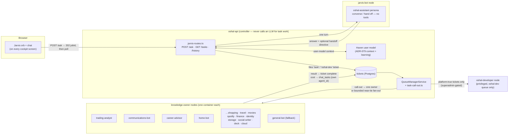
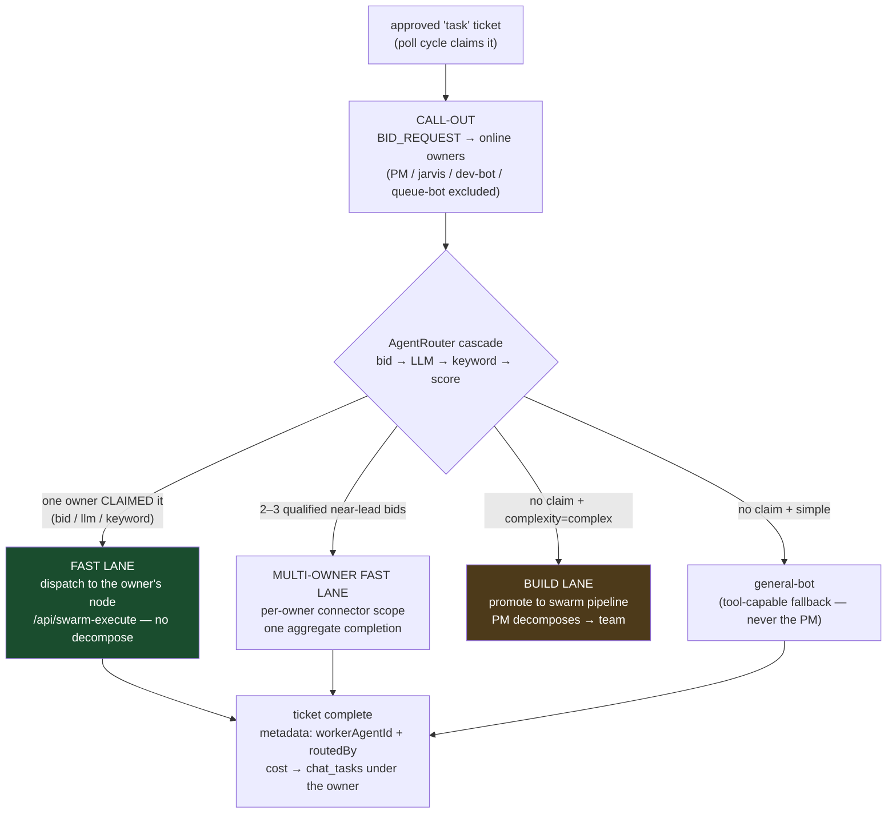
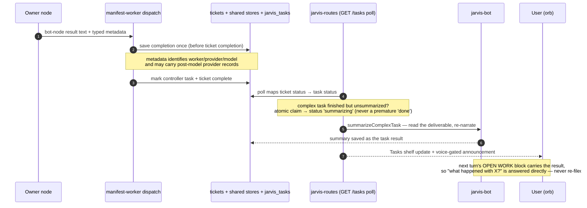

# Jarvis — architecture and flow (as-built)

The unified assistant: one conversation over every OSHAL app. This is the **as-built** picture after
[ADR-083](../adr/083-knowledge-owner-call-out-routing.md) (2026-07-09) and the voice/visual response
slice shipped 2026-07-10, with mobile containment, structural visuals, and image trust boundaries
extended 2026-07-11, and **media input** (attach photos/documents to a prompt — section 2) added
2026-07-18 ([ADR-110](../adr/110-jarvis-media-input-vision-as-transcription.md)). The design history lives in
[ADR-050](../adr/050-unified-assistant-route-orchestrator.md) (surface + hand-off), ADR-079 (Haven),
ADR-081 (platform-dev queue), and
[ADR-084](../adr/084-deterministic-speaker-diarization-and-voice-profiles.md) (ambient audio and
speaker attribution).

The one-sentence model: **Jarvis converses; the queue manager routes; knowledge owners execute.**
Jarvis never runs a tool, never picks a bot, and sometimes files no ticket at all.

> The Mermaid blocks below are the source of truth (they render on GitHub and in the cockpit).
> For a pan/zoom offline viewer, regenerate the local gallery at `diagrams/index.html` by feeding
> each block to the diagram-renderer MCP (`render_diagram`) — the gallery is gitignored.

## 1. Component architecture

Jarvis is three separate responsibilities in three places — the surface (every cockpit screen), the
route layer (api), and the conversational brain (its own bot node). Work is done by a fleet of
**knowledge-owner nodes**, each a classic any-bot container with declared capabilities.



Load-bearing boundaries:

- **jarvis-bot is purely conversational.** Running a tool would lock the single-threaded chat
  ([ADR-050 update 2026-06-20](../adr/050-unified-assistant-route-orchestrator.md)); anything that
  needs a tool or data becomes a ticket.
- **The controller orchestrates; owners execute.** Each owner runs in its own container with its own
  sandbox + CLIs (`requiresOwnNode` forces queue dispatch onto the node — the legacy prefer-inline
  codex rule is overridden per owner).
- **oshal-developer is not a call-out candidate.** It is reachable only through the `oshal-dev`
  ticketType (explicit `platform: true` from Jarvis, superadmin-gated at dispatch) and is hard-excluded
  from generic task call-outs ([task-call-out.ts](../../src/features/swarm-orchestration/services/task-call-out.ts)).

## 2. A Jarvis turn — converse, or file focused tickets

`POST /api/jarvis/ask` returns `202 {jobId}` immediately (Cloudflare 100s edge limit) and the surface
polls. The decision turn is raced against `DECISION_TIMEOUT_MS` (75s) so a grinding turn auto-files
instead of hanging.

```mermaid
sequenceDiagram
  autonumber
  participant U as User (orb)
  participant R as jarvis-routes (api)
  participant H as Haven
  participant J as jarvis-bot
  participant T as tickets

  U->>R: POST /ask {message, attachments?} → 202 jobId
  R->>H: withHavenContext(sub, message)
  H-->>R: message + hot core + OPEN WORK + YOUR TOOLS
  R->>J: one turn (raced vs 75s timeout)
  J-->>R: reply [+ one or more fenced handoff directives]
  alt conversational / reads an OPEN WORK result
    R-->>U: answer (no ticket)
  else needs a tool, data, or a build
    R->>T: one focused ticket per independent domain — status approved,<br/>type task|oshal-dev, metadata {complexity hint}; NO owner named
    R-->>U: short ack ("I'll report back")
    Note over R,T: durable jarvis_tasks row tracks it for the Tasks shelf
  end
```

The handoff directive is the entire routing contract Jarvis owns
([oshal-assistant.yaml](../../ai-lab/bot-personas/oshal-assistant.yaml)):

```json
{"action":"create", "complexity":"simple|complex", "platform":false,
 "title":"<short>", "description":"<self-contained task, domain stated plainly>"}
```

- `complexity` is a **lane hint** — the queue manager has final say.
- Independent provider domains become separate handoffs when Jarvis can identify them (for example,
  Uber Eats plus Walmart). A bounded queue-level near-tie fan-out protects the same case if the model
  still emits one combined ticket.
- `platform: true` is the only routing decision Jarvis makes: an explicit "this changes OSHAL itself"
  → `oshal-dev`. It is **never inferred from free text** (a URL containing "oshal" stays a plain task —
  the exact 2026-07-09 misroute class).

Before the conversational decision turn, the route has one deliberately bounded provider guard for
common weather reads and priority-inbox summaries. It recognizes a reviewed set of phrases, rejects
obvious code/product-building asks, and files the same delayed `task` handoff without asking a model
to invent live facts. This is **phrase routing, not general semantic intent detection**: wording
outside the bounded patterns continues through the normal Jarvis decision path.

### Media input — the visual analog of speech-to-text (ADR-110)

The `/ask` body also carries an optional `attachments` array, already reduced to **text** before it
reaches the route — because Jarvis's brain is the **text-only Codex CLI**, media is turned into text
the same way voice is (section 6): a controller-side transform, not a change to the reasoning brain.

- **Photos** (phone camera via `<input capture>`, or upload) are described by `POST /api/vision/describe`
  ([`src/features/vision-describe/`](../../src/features/vision-describe)) — the swarm's OpenRouter key
  driving a vision chat model — *before* `/ask`, exactly as speech is transcribed first. So base64
  pixels never ride the size-capped `/ask` body; the small description text does.
- **Documents** are text-based files read client-side (PDF/DOCX extraction is a
  [BACKLOG](../BACKLOG.md) follow-up — the repo has no binary extractor yet).
- `jarvis-attachments.ts` folds the image descriptions + doc text into an authoritative-context block
  prepended to the Codex turn. Reasoning + cost stay on the accountable Jarvis bot (ADR-036); the
  vision transform's cost is recorded to `chat_tasks` too.
- A media turn **bypasses the weather/inbox/recall guard above** and goes straight to an enriched
  Jarvis turn (so "what's in this photo?" is never mistaken for a weather read).

## 3. Ticket routing — the queue manager's call-out (ADR-083)

The ticket is the workflow trigger. For the generic `task` lane the queue manager broadcasts a
`BID_REQUEST` to every online owner, decides via the AgentRouter cascade, and picks the lane.
App-specific ticketTypes (`trading-decision`, education, …) keep their manifest-declared workerBot.



As-built notes (verified live 2026-07-09):

- **Tier-1 mesh bids are LIVE.** Every node's SwarmAgentWorker wires the shared
  [mesh-bid-responder](../../src/features/agent-management/services/mesh-bid-responder.ts): on a
  `BID_REQUEST` the bot self-scores the ticket text against its **own persona routing keywords**
  (3+ phrase hits = full claim; no free confidence baseline; a name-token match is only a 0.05
  tie-breaker) and answers over Redis. Live probe: 7 owners responded, trading-analyst claimed
  "audit why trading stopped near $20k" at 0.95, `strategy: bid`, executed on the trading-bot
  container — while shopping-concierge (the bot the old regex misrouted to) stayed silent.
  The LLM and keyword tiers remain as fallbacks when no bid clears the 0.5 auction threshold.
- Owners self-describe via three synchronized declarations: registry `capabilities`, compose
  `AGENT_CAPABILITIES`, and persona `selector_descriptor` + `routing_keywords` (seeded to the
  `agents` table; the AgentRouter's keyword/LLM tiers read them).
- The ticket is held in `activeTicketIds` for the whole bid window so a poll cycle can't
  double-dispatch it.
- Bid-tier near ties are bounded to qualified registry owners close to the lead. Each owner executes
  only its declared portion with credentials resolved separately; metadata records the actual owner
  names/ids instead of the generic task workflow's fallback label.

## 4. Result delivery — back to the user in Jarvis's voice



The manifest-worker path persists the bot-node completion in the shared message store before it
updates task completion bookkeeping. The write is deduplicated on retry and includes structured
`source: manifest-worker-bot-node` metadata, so the delayed summarizer can recover the same result
after a controller restart instead of depending on an in-memory response.

## 5. Response experience — the orb becomes the answer

Visual eligibility is server-owned and deliberately narrow. Completed delayed work may propose one
hidden visual directive. A direct `/ask` turn is orb + voice/text by default, with one structural
exception: the server may accept an exact `timeline` or `diagram` only when the original user turn
explicitly requests that kind and the answer passes the fact-lock and no-hand-off checks below. The
API strips directives from spoken text before it evaluates them. The eight supported kinds are
`weather`, `priority-email`, `table`, `chart`, `summary`, `timeline`, `diagram`, and provider-bound
`gallery`.

```mermaid
sequenceDiagram
  autonumber
  participant U as Orb response stage
  participant O as owner / deterministic provider node
  participant M as manifest-worker result store
  participant J as Jarvis result summarizer
  participant R as jarvis-routes
  participant G as provider grounding
  participant V as renderer + artifact service
  participant D as Postgres + Discussion

  U->>R: direct ask or delayed-result delivery
  alt direct ask
    R->>J: conversational turn
    J-->>R: answer + optional oshal:visual JSON
    R->>R: strip directive; evaluate original-turn intent
    alt exact explicit timeline/diagram with one fact-locked spec
      R->>R: require no handoff/source claim<br/>and every visible fact in authoritative answer
      R->>V: finalized answer + server-owned answer source
      V->>V: deterministic transparent SVG render
      V->>D: immutable owner-scoped artifact + answer reference
      R-->>U: text + authenticated visual metadata
      U->>U: cloud gathers → image materializes → narration → cloud
    else any other direct outcome
      R-->>U: authoritative text/voice answer only
    end
  else completed delayed work
    O->>M: completed work + optional out-of-model provider records
    M->>D: durable completion text + trusted metadata
    R->>D: claim completed task in its original session
    R->>J: deterministic provider summary or model summary of ordinary work
    J-->>R: authoritative summary + optional oshal:visual JSON
    R->>R: strip directive; require delayed-complete outcome
    alt one valid visual spec and source
      R->>G: typed spec + durable provider/ticket sources
      G->>G: rebuild NWS/Gmail/Walmart facts or validate ticket reference
      R->>V: finalized answer + grounded typed spec
      V->>V: receive/transcode approved gallery bytes if needed<br/>then render deterministic transparent SVG
      V->>D: immutable owner-scoped artifact + hashes/provenance
      R->>D: persist answer and exact visual reference in Discussion
      R-->>U: text + authenticated visual metadata
      U->>U: cloud gathers → image materializes → narration → cloud
    else invalid spec/source or unavailable artifact
      R-->>U: authoritative text/voice answer only
    end
  end
```

The user-facing contract is deliberately simple:

- **Direct defaults to text/orb-only.** Greetings, ordinary answers, acknowledgements,
  clarifications, errors, timeouts, hand-offs, implicit visual language, capability questions, and
  product/code requests cannot create an artifact. A model-authored visual block cannot bypass the
  server-owned outcome gate, and the client never manufactures a picture of prose.
- **The only direct exception is explicit structural presentation.** An original turn such as
  “show this as a timeline” or “draw a diagram” may materialize that exact kind only. There must be no
  hand-off, exactly one valid matching directive, no model-authored source references, and every
  displayed fact or relationship must already appear in the authoritative answer. Missing facts,
  negation, quoted/code examples, kind mismatches, or an attempted hand-off fail closed to text.
- **Completed work supports all 15 kinds.** Weather, priority-email, and Walmart-gallery values come
  from captured provider records; with exactly one recognized NWS, Gmail, or Walmart record, the
  server can derive the grounded visual even when the summarizer omits a directive. Table, chart,
  summary, timeline, diagram, map, gauge, checklist, agenda, comparison, profile, and image specs
  from delayed work must cite the completed ticket source; image specs resolve only through trusted
  local receipts, never model-authored URLs.
- **The cloud is the response surface.** There is no generic window or card around the answer. The
  particle field gathers into the supplied artifact, Jarvis narrates it, and the animation reverses
  after speech. Stop cancels the current transition.
- **Responsive containment is part of the contract.** On mobile, the center copy reserves one user
  line plus two answer lines, so reply arrival does not move the controls or grow the page. Center
  copy and visual captions hard-wrap long unbroken tokens without increasing document width.
  Incidental drawer overflow is clipped; wide tables and fenced code scroll only inside their own
  bounded elements.
- **Discussion is the durable record.** The authoritative answer and exact artifact reference are
  saved together. Reopening or rematerializing a response loads the same stored bytes instead of
  asking a model to recreate it. Completed background tasks use the original Jarvis session and are
  archived there as well.
- **Failure is non-blocking.** If validation, rendering, persistence, or image loading fails, the
  original text/voice answer remains usable and the stage returns to the orb.
- **The stage is domain-blind.** It can animate trusted artifact metadata supplied by the API; the
  server-side typed renderer currently produces the eight bounded kinds above.

### Trust, privacy, and persistence boundary

- `visual_response_artifacts` stores SVG bytes, dimensions, alt text, content hashes, source/session/job
  identifiers, and provenance. The owner-scoped unique source-job key makes a retry reuse identical
  bytes and reject a conflicting rewrite of an archived URL.
- Artifact reads require the authenticated owner (or the existing trusted-service identity), use
  `private, no-store`, and send same-origin, no-sniff, no-referrer, and sandboxed SVG headers.
- Provider gallery images are fetched only from an exact allowlisted Walmart CDN host, checked for
  public resolution, read without redirects under time/byte/pixel limits, MIME/magic verified, and
  transcoded to metadata-free PNG. Only the resulting bytes are embedded as `data:` in the sandboxed
  SVG; HTTP(S) nested images remain disallowed. Hash-only image receipts are retained in provenance.
  Fetch/decode work is processed in batches of two, decode concurrency is globally bounded, each
  source is limited to eight million pixels, each transcoded PNG to 900 KB, and the complete gallery
  artifact to 5.5 MB.
- The renderer escapes all display text. Arbitrary model-authored HTML, JavaScript, Mermaid, raw SVG,
  and executable diagram content are not accepted by the typed visual schemas.
- Model-authored Markdown image syntax never auto-loads a URL. The conversation shows an inert
  image-link notice instead; ordinary links remain click-only. Only trusted visual metadata can enter
  the automatic image path.
- At initial materialization and Discussion replay, the client requires an image/SVG descriptor with
  a recognized server visual kind, non-empty alt text, bounded integer dimensions, a valid artifact
  UUID, and the exact same-origin
  `/api/jarvis/visuals/<artifactId>` URL with no query, fragment, or credentials. Remote, `data:`, and
  other root-relative image URLs fail closed to the authoritative text/orb response.
- Privacy export includes the owner's visual artifacts; account deletion removes them and clears the
  owner-scoped in-memory Jarvis answer cache.
- NWS weather, Gmail priority-email, and Walmart gallery specs require non-empty provider source references. The
  renderer rebuilds temperature, periods, sender, subject, receive time, unread state, and provider
  `IMPORTANT`/`STARRED` semantics from the captured record, ignoring conflicting model values. Gmail
  judgment may survive only as an explicitly labelled Jarvis suggestion tied to a real message ID.
- Provider records are typed, bounded objects constructed outside model text. For explicit live
  weather, priority-inbox, and read-only Walmart catalog asks, the authenticated Jarvis route creates
  a strict server-owned provider intent, pins the dedicated worker, grants only that owner's
  request-scoped connector credential, and the bot node executes the exact provider helper with
  provider `deterministic-provider` / model `none`. The Walmart query and result count are bounded;
  cart, checkout, order, mixed-retailer, and implementation asks are not intercepted. Exact
  allowlisted command-event capture remains a compatibility path. Demo/provider-fallback Walmart
  results are rejected in both paths. The signed catalog read is fixed to the Walmart API origin,
  never follows redirects, has a bounded timeout, accepts JSON only, and caps both declared and
  streamed response bytes before parsing.
  Only records carrying the matching controller-persisted provider intent may trigger an automatic
  deterministic summary or provider visual; command-captured records from ordinary/mixed work remain
  evidence for the normal summarizer and cannot overwrite the task outcome.
  Model-authored `oshal:provider-record` fences are stripped and never become records. The records
  travel with the durable bot-node completion in manifest-worker metadata.
- This is a control-plane trust boundary, **not cryptographic attestation**. The controller trusts
  metadata constructed on its bot-node/manifest-worker path; the record is not signed by NWS or
  Gmail/Walmart and does not defend against a compromised worker or controller.
- The grounded input-spec digest is stored independently of mutable image receipts. A retry with the
  same owner/surface/job reuses the immutable artifact before any CDN request; a different grounded
  spec under that job id fails with an immutability conflict.

### Portable response registry boundary

The shared response-renderer package now includes a DOM-free component registry. It dispatches only
exact normalized keys (`markdown`, `code`, `mermaid`, `artifact:image`, or a bounded
`oshal:<kind>`), rejects duplicate/wildcard-like registrations, validates runtime blocks, filters by
surface capabilities, preserves source order across asynchronous handlers, isolates failures, and
returns an explicit safe-fallback descriptor on unsupported, invalid, failed, or cancelled blocks.

This registry is a portability mechanism, not an eligibility or trust authority. The server-owned
visual gate, typed schemas, provider grounding, and artifact service remain authoritative. The
current Jarvis DOM path and non-Jarvis cockpit/native/TV surfaces have not yet been adapted to consume
the registry; that cross-surface adoption remains JVV-007.

The live data owners wired for the first acceptance path are:

- `weather-bot`: dedicated Codex node using the NWS forecast path, with US place geocoding when a
  location is not already coordinates;
- `communications-bot`: dedicated Codex node using Gmail message IDs, receive times, unread state,
  and provider `IMPORTANT`/`STARRED` flags for priority-email answers.

The demo weather/email screenshots are local, untracked artifacts unless they are explicitly staged
later; they are not live-provider release evidence. The NWS worker has a separate live CLI smoke. A
read-only authenticated Gmail connector probe verified the metadata shape and priority flags without
publishing mailbox content, but the OSHAL test tenant still has no linked Gmail connection. A seeded
Gmail account completing worker → visual → Discussion in the product remains open acceptance work.

Current provider-proof limits are intentionally explicit:

- Weather automation proves the named-US-location/NWS path both inline and after Jarvis asks for a
  missing city and receives it on the next turn. It does not prove implicit device geolocation,
  international weather, or every weather phrasing.
- Gmail requests query `newer_than:1d` with `maxResults=25`. The delayed visual receives at most six
  provider-priority (`IMPORTANT`/`STARRED`) rows; this is not a complete mailbox view.
- The OSHAL test tenant has no seeded Gmail account, so there is no seeded communications-worker →
  visual → Discussion Gmail E2E.

> **LIVE WEATHER E2E: PASSED (2026-07-10).** Redacted runs proved both a named-US-location request
> and “weather where I live” → city on the next turn: clarification/acknowledgement (no visual) →
> dedicated weather worker → deterministic NWS read → one `nws-weather` record → fact-locked SVG →
> plain-yes reveal/Discussion replay. Owner reads returned 200 with `private, no-store`; another
> owner received 404 and an anonymous caller received 401.

## 6. Ambient listening, wake names, and daily review

Ambient mode is opt-in and visually belongs to the orb: the halo and the compact
`Always listening: ON/OFF` control show its current state. The assistant name and wake phrases are
configurable, so the same surface can respond to “Hey Jarvis,” “Hey Computer,” or a tenant-selected
name.

While enabled, the browser saves finalized transcript text, recognizes a wake phrase only at the
start of an utterance, and dispatches the trailing command through the normal Jarvis route. Listening
pauses during Jarvis speech, push-to-talk, page hiding, sign-out, and explicit opt-out. This is not an
OS-level background daemon: the Jarvis page must remain open and visible.

Windows has a separate wake-only path in OSHAL Node for when that page is closed. After explicit
microphone opt-in, the tray process runs one exact local `System.Speech` grammar (`Hey <name>`), emits
only a short-lived wake event, releases the microphone, opens the existing OIDC Jarvis surface, and
lets that page record the bounded command through the normal voice route. It does not save room audio
or build background transcripts. macOS and Linux fail closed until approved signed/entitled local
helpers exist. See [Jarvis native background wake word](./jarvis-native-background-wake.md).

The owner can enable a local-time daily transcript review. Reviews are extractive and may place
reminder/task/follow-up **proposals** in Haven, but they never create a calendar event, reminder, or
task without a later confirmation path. Raw audio is never stored. When speaker recognition is
enabled, bounded chunks are processed ephemerally by the local diarization service and voiced chunks
may be sent to the configured timestamp-capable speech-to-text provider; retained voice profiles are
encrypted and owner-scoped. Voice matching is descriptive attribution, never authentication. When the
Person Model (ADR-100) is enabled, OSHAL additionally derives per-person inferences (topics, tone/intent,
follow-up asks) from consented voices and stores them as **deletable inferences** labeled "OSHAL's read,"
never fact; modeling is per-person opt-in (own voice implicit), declining a voice stops and purges its
inferences, and minors' utterances are not modeled. Raw audio remains unstored. See
[ADR-084](../adr/084-deterministic-speaker-diarization-and-voice-profiles.md) for the diarization
boundary and [ADR-100](../adr/100-ambient-person-model.md) for the Person Model + consent model.
The deterministic diarization/profile path is not a calibrated production claim: labeled testing
across microphones, rooms, overlapping speech, short turns, and accents—and reported false-match and
false-split rates—remains open in JVV-010.

### Verification snapshot (2026-07-11)

- TypeScript typecheck passed.
- The current change-set verification passed 248 Vitest tests across 15 focused files covering
  visual schemas/rendering/persistence, secure image receipt and immutable replay, deterministic
  Walmart intent/execution, signed-provider transport limits, provider grounding/routing, mixed-task
  suppression, delayed lifecycle, manifest persistence, privacy behavior, schema validation, and the
  portable response registry.
- 34 Playwright tests passed across 3 files: rich-response, response-stage, and audio-lifecycle,
  including keyboard/focus, reduced motion, text/alt equivalence, narrow layout, 200%-equivalent text
  sizing, interruption races, archive replay, no-visual fallback, inert hostile Markdown images, and
  rejection of non-owner-route visual URLs. The `320x568` regressions also pin stable reply geometry
  and hard-token containment for both center copy and visual captions.
- The earlier broader 219-test baseline, OSHAL Node package build, and in-memory Windows exact-phrase
  wake smoke remain historical evidence; they were not rerun for this focused visual change set.
- Physical microphone/device, sleep/network, battery/false-wake, Windows signing/SmartScreen, real
  NVDA/JAWS/VoiceOver, native 200% zoom/forced colors, physical mobile touch, and speaker-attribution
  calibration remain open/manual release gates. Browser automation is not assistive-technology or
  device sign-off.
- Docker Compose validation and JavaScript syntax checks passed.
- The final named-US live journeys persisted `nws-weather` records with provider
  `deterministic-provider`/model `none`, created delayed visuals, and proved the city-follow-up plus
  immediate plain-yes reveal on the active visual plane.
- The final live Walmart acceptance journey passed on 2026-07-12: session
  `walmart-gallery-final-1783867639546`, work item `4b551f81-d50f-4a27-a112-5590852179a2`, ticket
  `910b03ec-6219-43ad-8a5d-ff008fa23070`, and artifact
  `2fd7643a-3009-4717-9007-dcd542bf01bf`. The worker persisted provider
  `deterministic-provider` / model `none`, one `walmart-catalog` intent and record, two direct
  `walmart.com` links, a two-row durable Markdown table, and two hash-receipted embedded PNGs. The
  saved SVG had no remote image href and no cart/order action occurred.
- Full in-product Gmail acceptance remains open until a seeded test mailbox is linked to OSHAL.

The next acceptance and expansion work is kept in
[Jarvis voice and visuals — next steps](../backlog/jarvis-voice-and-visuals.md).

## 7. Knowledge-owner roster (the call-out candidates)

| Owner | Container | Domain (one line) |
|---|---|---|
| trading-analyst | trading-bot | trading desk: signal→decision trees, P&L/order/risk-gate audits (read-only forensics) |
| finance-analyst | finance-bot | personal finance: net worth, balances, spending (Plaid, read-only) |
| communications-bot | email-bot | email + calendar + inbox social signals; approval-gated publishing |
| weather-bot | weather-bot | current conditions + local NWS forecast (separate from the severe-weather trading feed) |
| social-writer | social-writer-bot | draft/refine social posts in the user's voice (never publishes) |
| career-advisor | career-advisor-bot | the user's job hunt: matches, strategy, resume tailoring |
| home-bot | home-bot | SmartThings devices + scenes |
| cloud-ops-bot | cloud-ops-bot | the user's GCP: inventory + cost/health/IAM diagnostics |
| shopping-concierge | shopping-bot | retail search/compare/cart (Walmart/Amazon), checkout handoff |
| eats-concierge | eats-bot | Uber Eats: restaurants, menus, order build, checkout handoff |
| rides-concierge | rides-bot | Uber rides: fare estimates, options, booking handoff |
| travel-concierge | travel-bot | flights/hotels/cars, fare watches, booking handoff |
| movies-concierge | movies-bot | titles, where-to-watch, watchlist (TMDb) |
| spotify-concierge | spotify-bot | music search, playlists, now-playing |
| storage-assistant | storage-bot | storage targets, GitHub repos, file listing |
| deck-builder | deck-builder-bot | presentation outlines + templates |
| identity-advisor | identity-bot | connected-account access health (metadata only) |
| general-bot | general-bot | **fallback** — unclaimed simple tasks |

(oshal-developer is deliberately absent: privileged `oshal-dev` queue only.)
