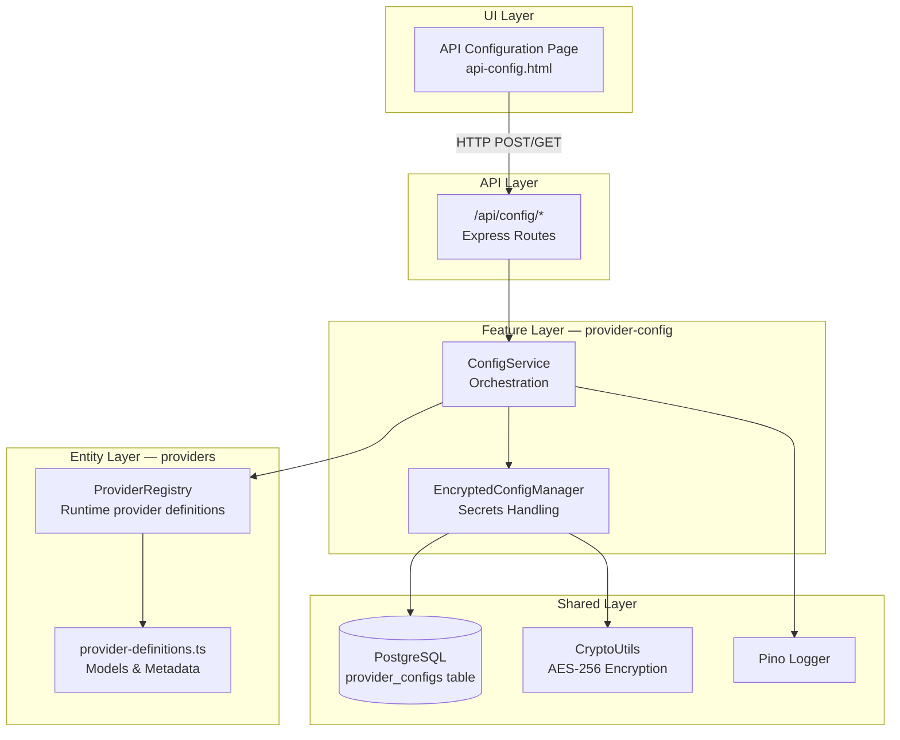
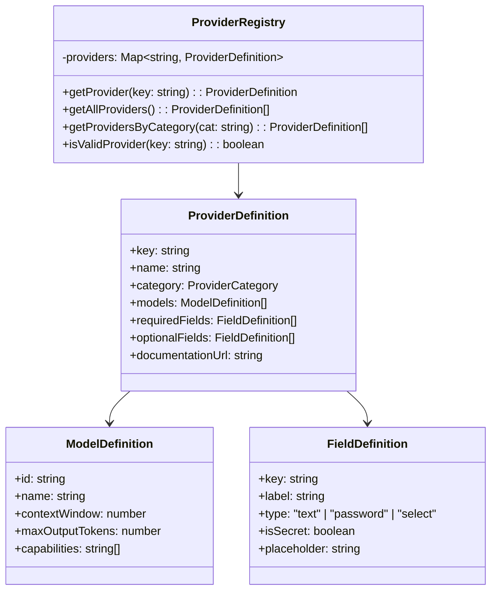
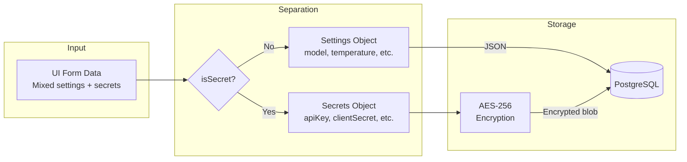
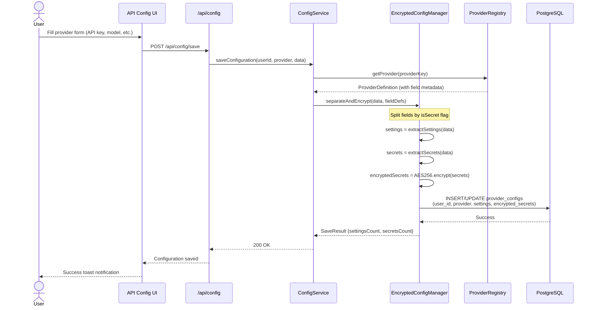
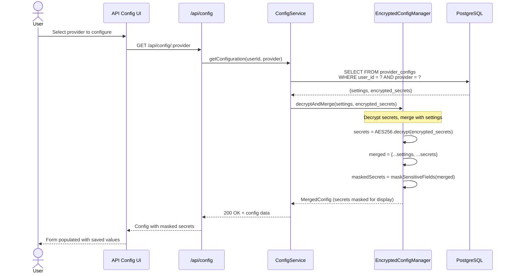
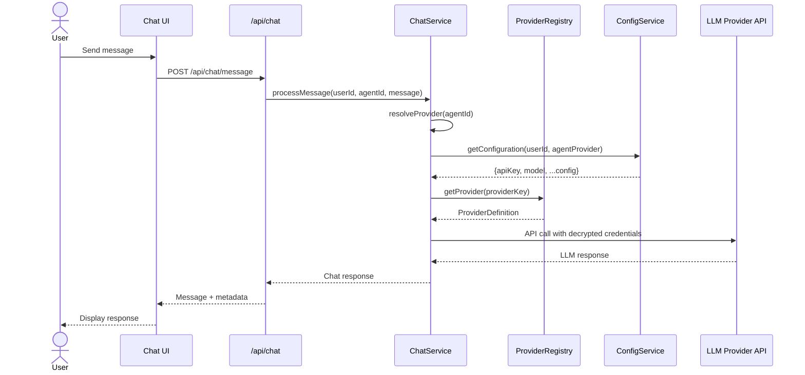
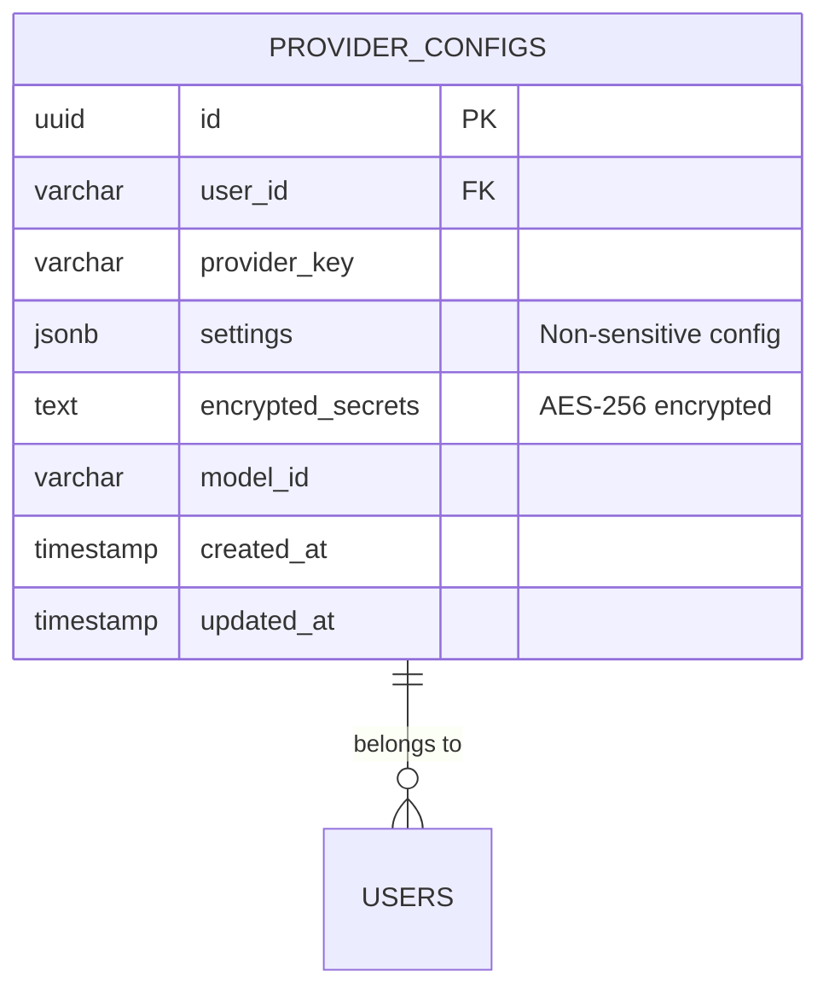
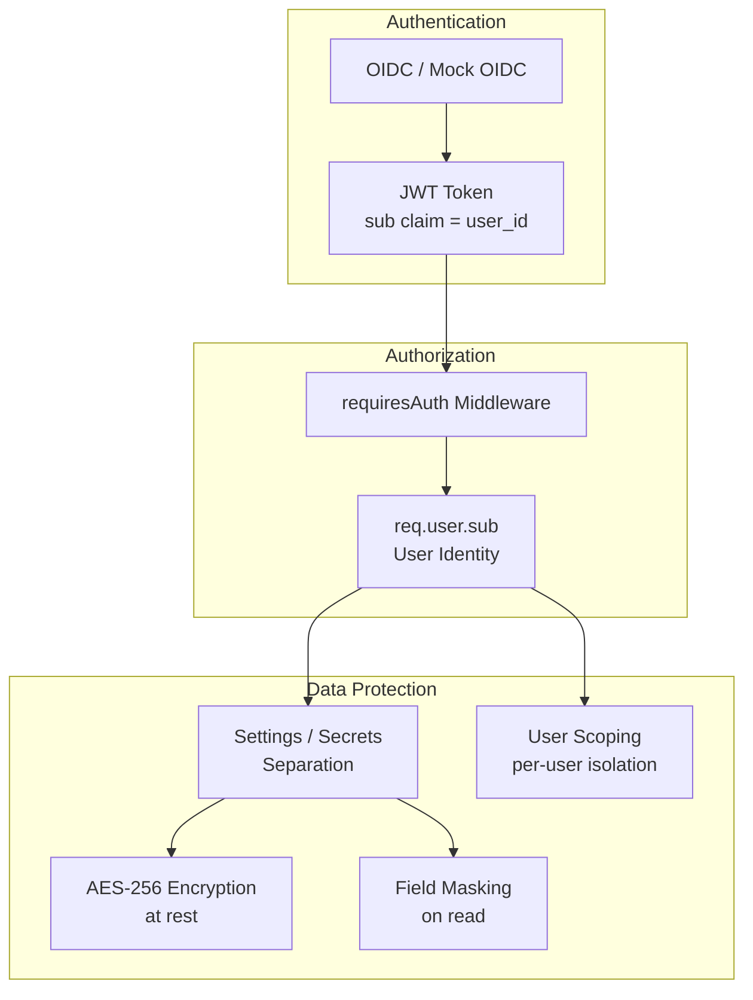

<!--
CHANGE LOG
-----------------------------------------------------------------------------
SEQ                 | AUTHOR                      | DESCRIPTION
-----------------------------------------------------------------------------
1 | maintainer@emeraldcoastsystemsgroup.com   | Initial Layer 0 architecture documentation
-->

# Layer 0: Provider Framework Architecture

## Overview

Layer 0 is the **Provider Framework** — the foundational abstraction that exposes the runtime's registered LLM providers through a unified configuration and execution interface. It handles provider registration, encrypted credential storage, model selection, and runtime provider resolution. The registry is authoritative; the 2026-07-23 unit run initialized 42 definitions.

## High-Level Architecture



## Component Details

### 1. Provider Registry (`src/entities/providers/`)

The **ProviderRegistry** is the central catalog of all supported LLM providers. It is a static, read-only registry that maps provider keys to their definitions.



**Registered providers** across categories:
| Category | Examples |
|----------|----------|
| Cloud AI | Anthropic, OpenAI, Google AI, AWS Bedrock, Azure OpenAI, GCP Vertex |
| Open Source | Ollama, LM Studio, vLLM, Hugging Face |
| Specialized | Cohere, Mistral, Groq, Together AI, Fireworks AI |
| Enterprise | IBM watsonx, Oracle GenAI |

### 2. Encrypted Config Manager (`src/features/provider-config/`)

The **EncryptedConfigManager** handles the separation and encryption of configuration data:

- **Settings** (non-sensitive): model selection, temperature, base URLs → stored as plaintext JSON
- **Secrets** (sensitive): API keys, client secrets, tokens → encrypted with AES-256 before storage



### 3. Configuration Service (`src/features/provider-config/`)

The **ConfigService** orchestrates all provider configuration operations:

| Operation | Method | Description |
|-----------|--------|-------------|
| Save Config | `saveConfiguration()` | Split settings/secrets, encrypt, persist |
| Load Config | `getConfiguration()` | Fetch from DB, decrypt secrets, merge |
| List Configs | `getUserConfigurations()` | Get all configs for a user (no secrets) |
| Delete Config | `deleteConfiguration()` | Remove config and secrets |
| Test Connection | `testProviderConnection()` | Validate credentials against provider API |

## Process Flows

### Configuration Save Flow



### Configuration Load Flow



### Provider Selection in Chat



## Database Schema



**Key columns:**
- `user_id` — JWT `sub` claim from OIDC token
- `provider_key` — Maps to `ProviderRegistry` (e.g., `anthropic`, `openai`)
- `settings` — JSONB with non-sensitive config (model, temperature, base URL)
- `encrypted_secrets` — AES-256 encrypted blob containing API keys and tokens

## API Endpoints

| Method | Endpoint | Description |
|--------|----------|-------------|
| `GET` | `/api/config/providers` | List all currently registered providers |
| `GET` | `/api/config/providers/:key` | Get provider definition with fields |
| `GET` | `/api/config/:provider` | Get user's config for provider (masked secrets) |
| `POST` | `/api/config/save` | Save/update provider configuration |
| `DELETE` | `/api/config/:provider` | Delete provider configuration |
| `POST` | `/api/config/test` | Test provider connection with credentials |
| `GET` | `/api/config/active` | Get user's active/configured providers |

## Security Model



**Security guarantees:**
1. **Authentication required** — All config endpoints require valid OIDC/mock JWT
2. **User isolation** — Configs scoped by `user_id`; users cannot access other users' configs
3. **Encryption at rest** — Secrets encrypted with AES-256 before database storage
4. **Masked on read** — API keys shown as `****...last4` in UI responses
5. **No logging of secrets** — Pino redact rules strip sensitive fields from logs

## File Map

```
src/
├── entities/
│   └── providers/
│       ├── index.ts                  # Barrel export
│       ├── provider-registry.ts      # ProviderRegistry class
│       ├── provider-definitions.ts   # runtime provider definitions
│       └── types.ts                  # ProviderDefinition, ModelDefinition types
├── features/
│   └── provider-config/
│       ├── index.ts                  # Barrel export
│       ├── services/
│       │   ├── config-service.ts     # ConfigService orchestration
│       │   └── encrypted-config-manager.ts  # Encryption/separation
│       └── types.ts                  # SaveResult, ConfigData types
├── app/
│   └── routes/
│       └── config-routes.ts          # Express route handlers
└── shared/
    ├── db/
    │   └── postgres.ts               # Database connection pool
    └── utils/
        └── crypto.ts                 # AES-256 utilities
