<!--
CHANGE LOG
-----------------------------------------------------------------------------
SEQ                 | AUTHOR                      | DESCRIPTION
-----------------------------------------------------------------------------
1 | maintainer@emeraldcoastsystemsgroup.com   | Initial Layer 1 architecture documentation
-->

# Layer 1: Tools Framework Architecture

## Overview

Layer 1 is the **Tools Framework** — the system that enables AI agents to discover, authorize, execute, and verify external tools. It comprises four major subsystems: **Tool Registry**, **Switch Framework**, **Selector Composition**, and **Tool Verification**.

## High-Level Architecture

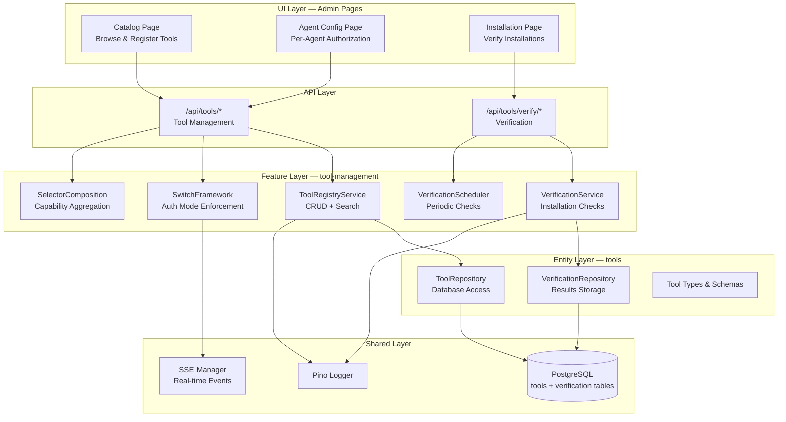

## Subsystem 1: Tool Registry

The **Tool Registry** is the central catalog of all tools available in the system. It stores tool metadata, capabilities, categories, and installation status.

### Tool Lifecycle

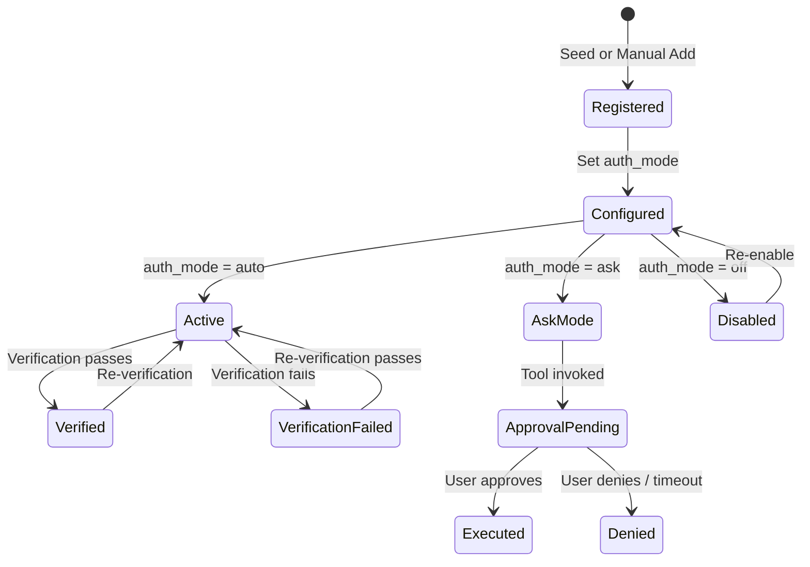

### Tool Data Model

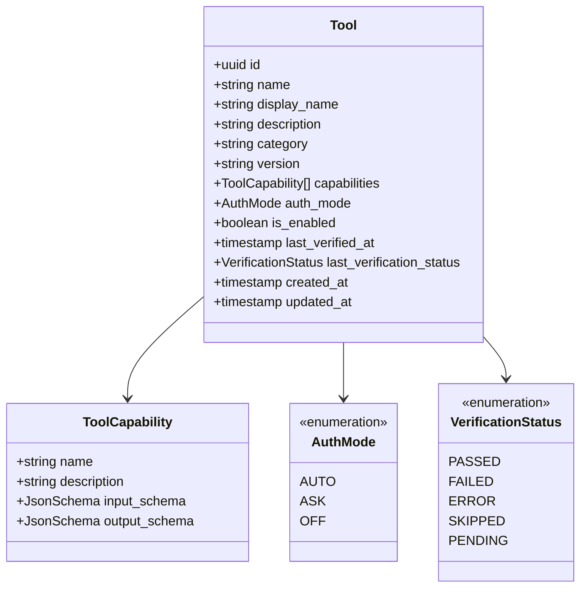

### Registry API Endpoints

| Method | Endpoint | Description |
|--------|----------|-------------|
| `GET` | `/api/tools` | List all tools (filterable by category, status) |
| `GET` | `/api/tools/:id` | Get tool details |
| `POST` | `/api/tools` | Register a new tool |
| `PUT` | `/api/tools/:id` | Update tool metadata |
| `DELETE` | `/api/tools/:id` | Remove tool from registry |
| `PUT` | `/api/tools/:id/auth-mode` | Change tool auth mode |
| `GET` | `/api/tools/categories` | List tool categories |
| `GET` | `/api/tools/search` | Search tools by name/capability |

## Subsystem 2: Switch Framework

The **Switch Framework** controls how tools are authorized for execution during chat sessions. Each tool has an `auth_mode` that determines the authorization flow.

### Auth Modes

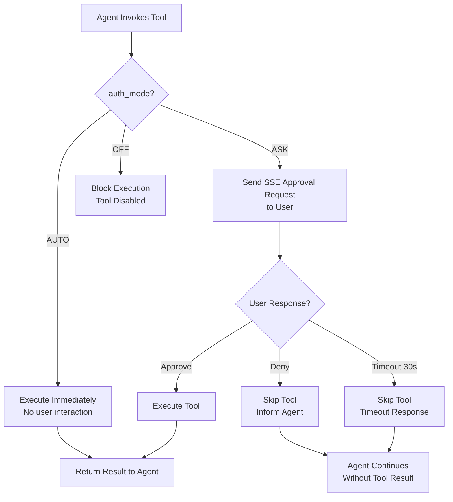

### SSE Approval Flow (ASK Mode)

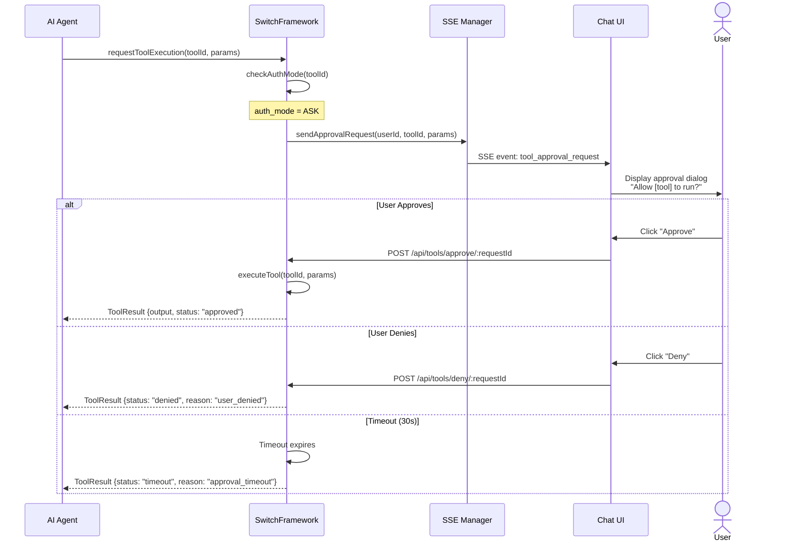

## Subsystem 3: Selector Composition

The **Selector Composition** engine aggregates tool capabilities into a unified tool manifest that is provided to the LLM at chat time. It determines which tools are available to each agent based on auth mode and configuration.

### Composition Flow

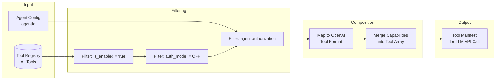

### Tool Manifest Format

The composed tool manifest follows the OpenAI function-calling schema:

```json
{
  "tools": [
    {
      "type": "function",
      "function": {
        "name": "web_search",
        "description": "Search the web for information",
        "parameters": {
          "type": "object",
          "properties": {
            "query": { "type": "string", "description": "Search query" }
          },
          "required": ["query"]
        }
      }
    }
  ]
}
```

## Subsystem 4: Tool Verification

The **Verification System** (Sprint 4) validates that tools are properly installed and functional. It supports single-tool verification, batch verification, scheduled checks, and historical tracking.

### Verification Architecture

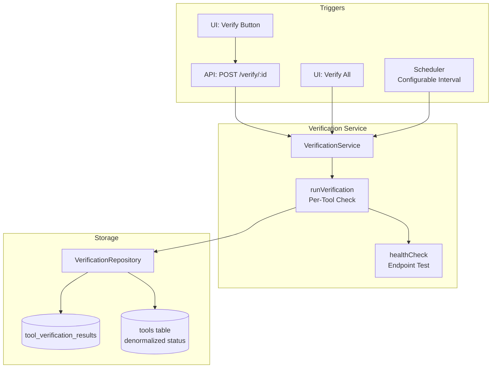

### Single Tool Verification Flow

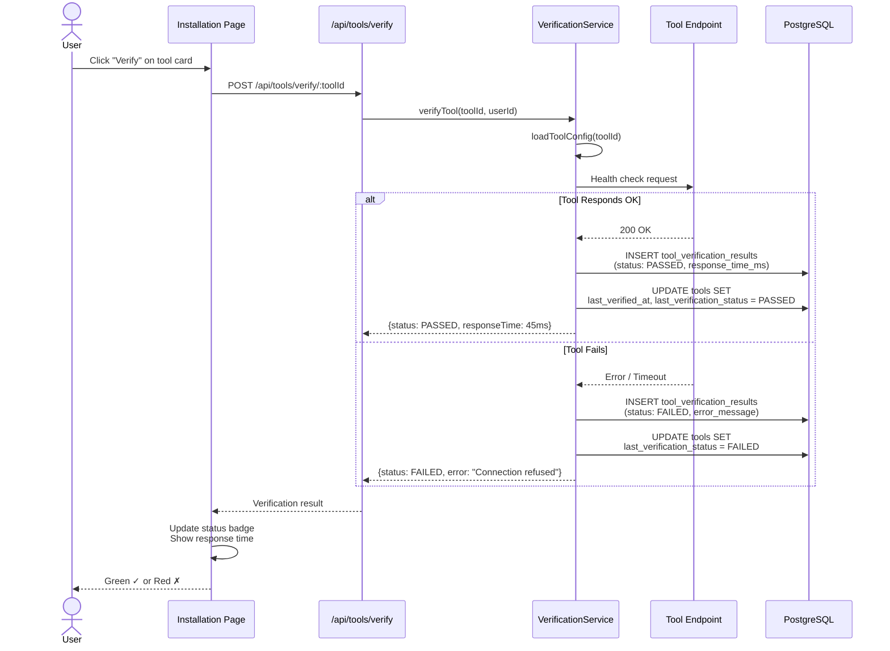

### Batch Verification Flow

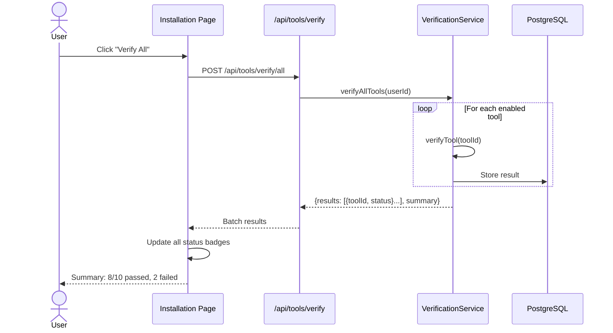

### Scheduler Operation

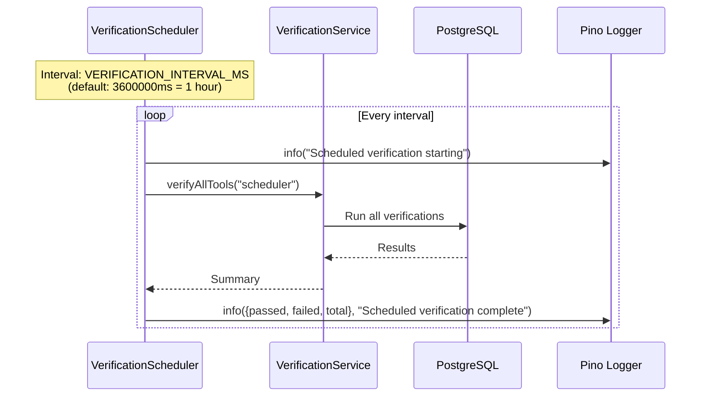

### Verification API Endpoints

| Method | Endpoint | Description |
|--------|----------|-------------|
| `POST` | `/api/tools/verify/:id` | Verify single tool |
| `POST` | `/api/tools/verify/all` | Verify all enabled tools |
| `GET` | `/api/tools/verify/:id/history` | Get verification history for tool |
| `GET` | `/api/tools/verify/:id/latest` | Get latest verification result |
| `GET` | `/api/tools/verify/summary` | Get verification summary stats |
| `POST` | `/api/tools/verify/scheduler/start` | Start verification scheduler |
| `POST` | `/api/tools/verify/scheduler/stop` | Stop verification scheduler |
| `POST` | `/api/tools/verify/scheduler/run-now` | Run scheduler immediately |
| `GET` | `/api/tools/verify/scheduler/status` | Get scheduler status |
| `GET` | `/api/tools/verify/config` | Get verification configuration |

## Database Schema

```mermaid
erDiagram
    TOOLS {
        uuid id PK
        varchar name UK
        varchar display_name
        text description
        varchar category
        varchar version
        jsonb capabilities
        varchar auth_mode "auto|ask|off"
        boolean is_enabled
        timestamp last_verified_at "Denormalized"
        varchar last_verification_status "Denormalized"
        timestamp created_at
        timestamp updated_at
    }

    TOOL_AGENT_CONFIG {
        uuid id PK
        uuid tool_id FK
        varchar agent_id
        varchar auth_mode_override
        boolean is_authorized
        timestamp created_at
        timestamp updated_at
    }

    TOOL_APPROVAL_REQUESTS {
        uuid id PK
        uuid tool_id FK
        varchar user_id
        varchar agent_id
        varchar session_id
        jsonb tool_params
        varchar status "pending|approved|denied|timeout"
        timestamp requested_at
        timestamp resolved_at
        varchar resolved_by
    }

    TOOL_VERIFICATION_RESULTS {
        uuid id PK
        uuid tool_id FK
        varchar status "PASSED|FAILED|ERROR|SKIPPED|PENDING"
        integer response_time_ms
        text error_message
        jsonb metadata
        varchar triggered_by "user|scheduler|api"
        varchar triggered_by_user_id
        timestamp created_at
    }

    TOOLS ||--o{ TOOL_AGENT_CONFIG : "configured for"
    TOOLS ||--o{ TOOL_APPROVAL_REQUESTS : "approval requests"
    TOOLS ||--o{ TOOL_VERIFICATION_RESULTS : "verification history"
```

## UI Pages

### Catalog Page (`catalog.html`)

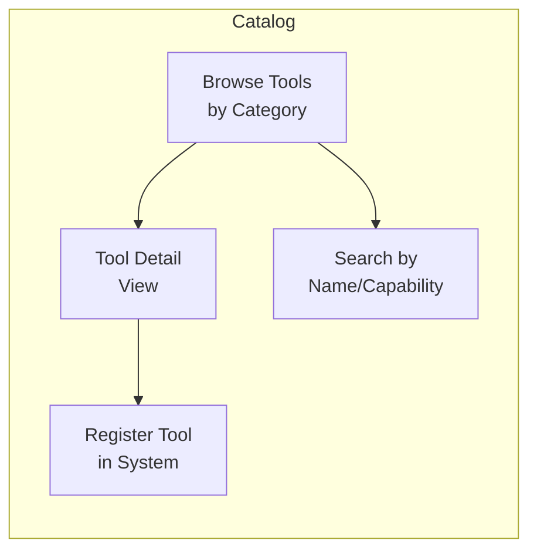

**Features:** Tool cards with category badges, capability list, registration button, search/filter

### Agent Config Page (`agent-tools.html`)

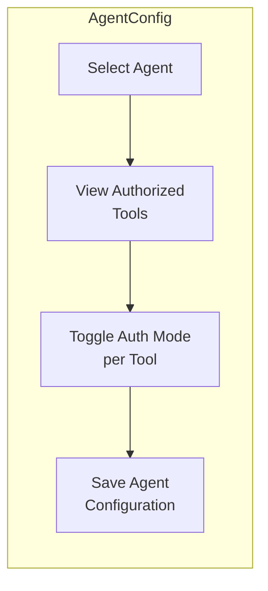

**Features:** Agent selector dropdown, tool authorization toggles (auto/ask/off), bulk actions

### Installation Page (`installation.html`)

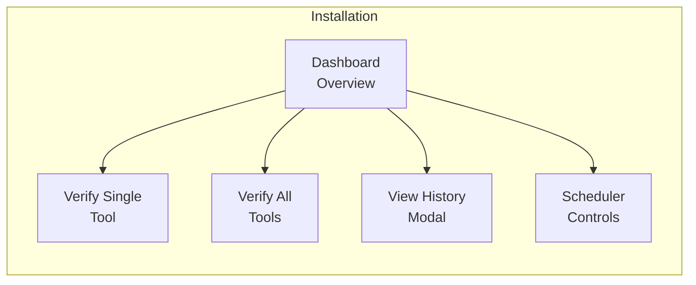

**Features:** Status badges (PASSED/FAILED/PENDING), verify buttons, history modal with timeline, scheduler start/stop/run-now

## File Map

```
src/
├── entities/
│   └── tools/
│       ├── index.ts                    # Barrel export
│       ├── tool-repository.ts          # CRUD operations
│       ├── verification-repository.ts  # Verification results
│       └── types.ts                    # Tool, ToolCapability types
├── features/
│   └── tool-management/
│       ├── index.ts                    # Barrel export
│       ├── services/
│       │   ├── tool-registry-service.ts     # Registry orchestration
│       │   ├── switch-framework.ts          # Auth mode enforcement
│       │   ├── selector-composition.ts      # Tool manifest building
│       │   ├── verification-service.ts      # Verification logic
│       │   └── verification-scheduler.ts    # Periodic scheduler
│       └── types.ts                    # Service-level types
├── app/
│   └── routes/
│       ├── tool-routes.ts              # Tool CRUD routes
│       └── tool-verification-routes.ts # Verification routes
├── pages/
│   └── tools-admin/
│       ├── catalog.html                # Tool catalog page
│       ├── agent-tools.html            # Agent config page
│       ├── installation.html           # Installation dashboard
│       └── js/
│           ├── catalog.js              # Catalog page logic
│           ├── agent-tools.js          # Agent config logic
│           └── installation.js         # Installation + verification logic
└── shared/
    ├── db/
    │   └── postgres.ts                 # Database pool
    └── utils/
        └── sse-manager.ts              # Server-Sent Events
```

## Integration with Layer 0

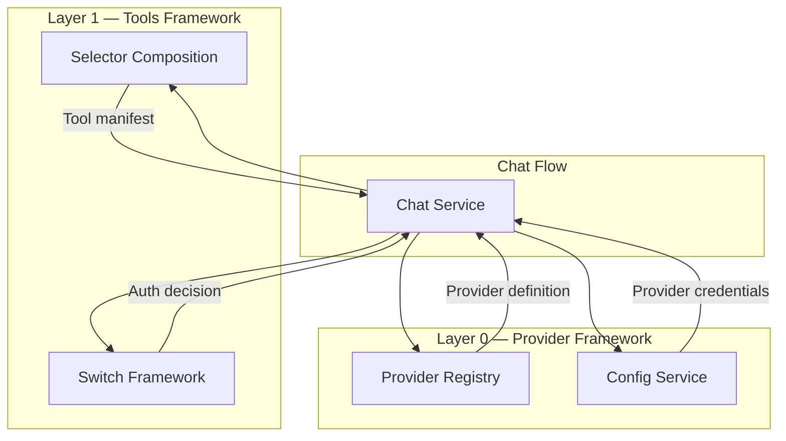

Layer 1 provides the **tool capabilities** that are sent alongside the user's message to the LLM provider (resolved by Layer 0). When the LLM responds with a tool call, the Switch Framework (Layer 1) enforces authorization before execution.