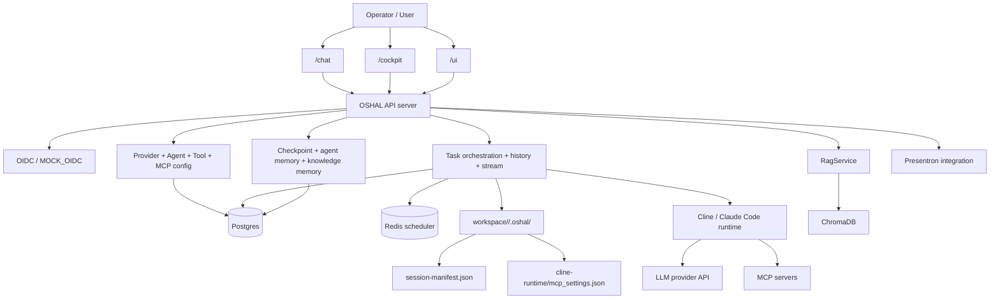
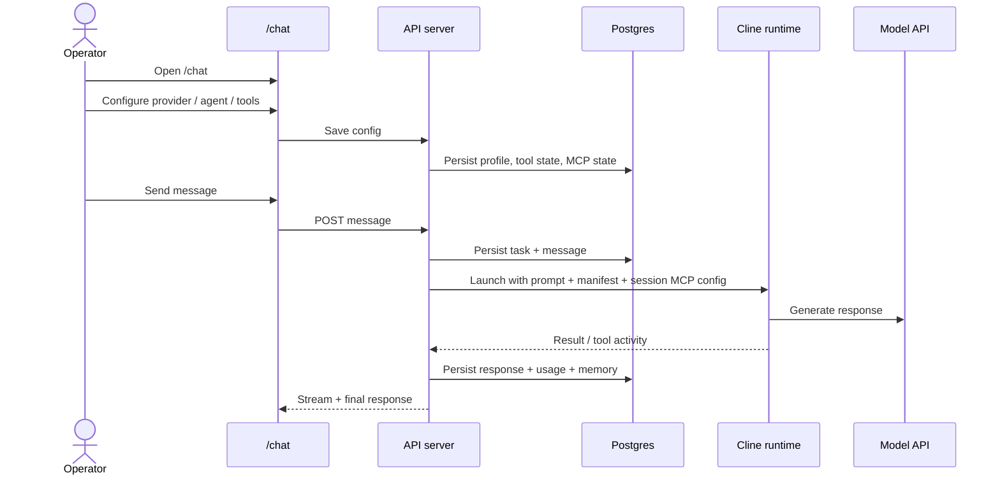

<!--
CHANGE LOG
-----------------------------------------------------------------------------
SEQ                 | AUTHOR                      | DESCRIPTION
-----------------------------------------------------------------------------
1 | maintainer@emeraldcoastsystemsgroup.com   | Added operator-facing runtime architecture view for OSHAL using any-bot-style control-plane framing
-->

# Operator Runtime View

## Purpose

This is the shortest architecture document for someone operating or testing OSHAL.

It answers:
- what the main moving parts are
- what data is persisted
- what happens when a user changes settings or sends a message
- where to look when something fails

## One-Page View

## Main Responsibilities

### `/chat`
- send messages
- open settings
- show history and costs
- open RAG and Presentron workspaces

### API server
- authenticates requests
- persists config and task state
- assembles prompt and manifest
- starts the runtime adapter
- records memory and telemetry

### Postgres
- agents
- tools and per-agent tool config
- tasks and messages
- checkpoints
- per-agent memory
- knowledge-memory metadata

### Redis
- self-scheduling runtime support

### Workspace artifacts
For each live task:
- `workspace/<taskId>/.oshal/session-manifest.json`
- `workspace/<taskId>/.oshal/cline-runtime/`

These are the runtime handoff files.

## Most Important Current Runtime Paths

### 1. Provider configuration
- configured through `/ui`
- persisted by the control plane
- used when runtime provider/model is resolved

### 2. Agent profile
- configured through `/chat` gear modal
- persisted through `GET/PUT /api/agents/:agentId/profile`
- affects:
  - bot name
  - theme
  - project URL
  - avatar
  - selector skills

### 3. Tool + MCP policy
- configured through the gear modal
- persisted per agent/tool and in MCP config
- affects what the runtime is allowed to see and use

### 4. Memory
- task/message history survives restart when Postgres is present
- checkpoints and per-agent memory are persisted
- RAG knowledge metadata is persisted and Chroma-backed

## Operator Testing Flow

## If Something Breaks, Check Here First

### UI looks wrong or settings not reflected
- `/chat`
- `docs/architecture/chat-agent-profile-runtime-architecture.md`

### provider/model mismatch
- `/ui`
- `output/global-config.json`
- `~/.cline` / session runtime files

### tool or MCP behavior mismatch
- `/api/agents/:agentId/tools/*`
- `/api/config/mcp`
- task workspace `.oshal/cline-runtime/mcp_settings.json`

### memory/history mismatch
- Postgres availability
- `/api/tasks`
- `/api/checkpoints`
- `/api/memory`

### RAG mismatch
- ChromaDB availability
- `/api/rag/*`
- MCP `chroma-mcp` settings if applicable

### Remote endpoint client mismatch
- `docs/architecture/remote-client-architecture.md`
- `/api/remote-clients`
- `src/features/remote-client/`
- control-plane secret/header configuration for the endpoint daemon
