# Platform Capability Flows

## Scope and evidence standard

This is an **as-built map**, not a roadmap. Every solid arrow below has a corresponding
runtime route, schema, or service implementation in the repository. A diagram does not
claim that every deployment enables the feature, that an external provider is configured,
or that device-only code has passed physical-device validation.

Use this guide to understand the main control and data flows; use the linked source paths
as the contract when details differ from older design documents.

## Ticket execution and dead-letter recovery

The ticket state model separates the generic `in_process` state used by chat tickets from
the phase-specific states used by swarm execution. The queue manager pulls `approved`
tickets. A poison ticket can be quarantined as `dead_letter`, which is terminal, requires
human review, and is grouped under `escalated` for existing board/report compatibility.

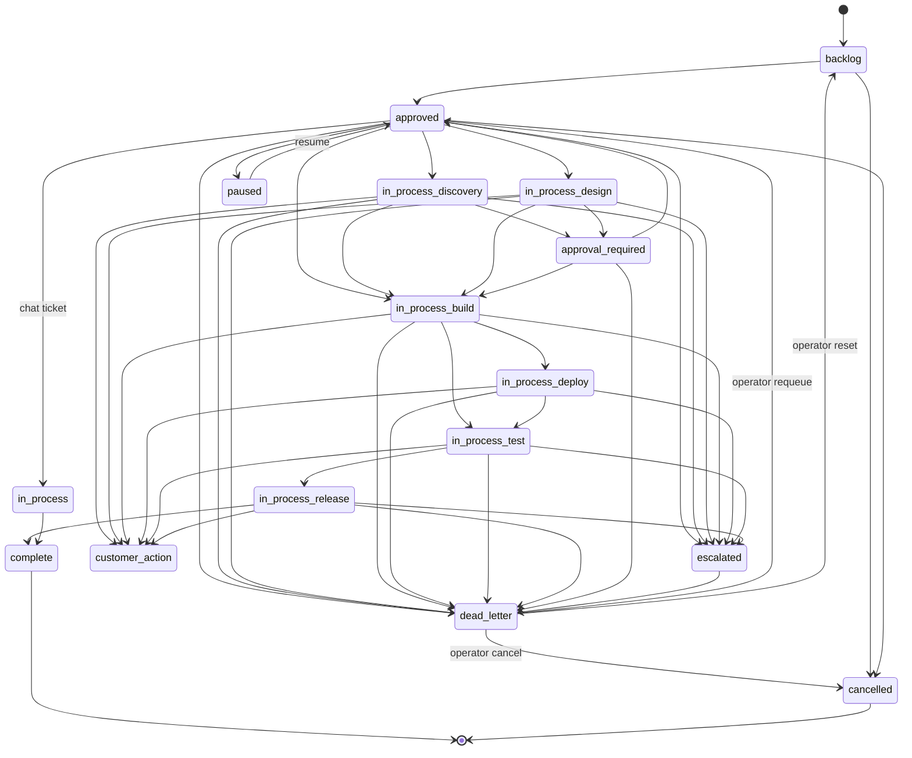

The service enforces a larger set of recovery transitions than the primary path shows
(for example, build can return to discovery and test can return to build). The canonical
transition table, rather than this readability-focused diagram, is authoritative.

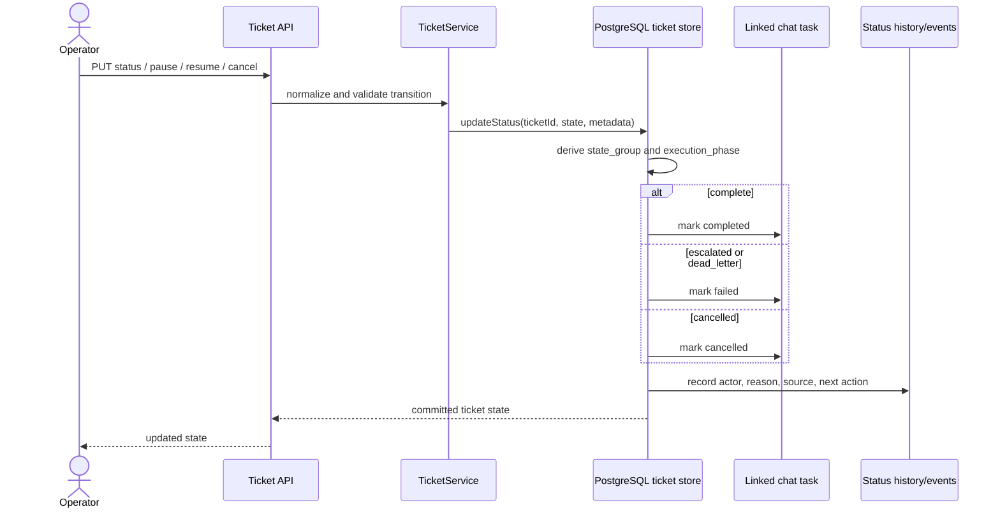

Evidence:

- `src/entities/ticket/types.ts` — canonical states, groups, execution phases, aliases,
  and `dead_letter` semantics.
- `src/features/ticketing/services/ticket-service.ts` — complete valid-transition table
  and required quarantine/escalation metadata.
- `src/features/ticketing/services/ticket-store-postgres.ts` — transactional persistence
  and linked-chat-task terminal-state projection.
- `src/app/routes/ticket-routes.ts` and `src/app/routes/queue-dlq-routes.ts` — operator
  lifecycle, status history, DLQ list/export/requeue, task/workspace links, and sync.

## Workflow Studio: design to executable process

Workflow Studio persists versioned definitions and compiles them into executable process
definitions. Compilation covers phase order, routing, planning, handovers, retries,
conditional edges, error branches, output bindings, and an optional executable DAG.

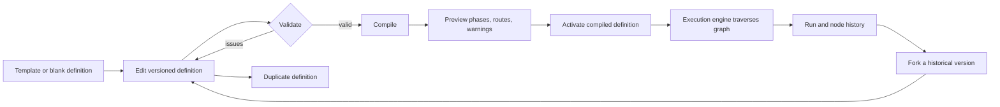

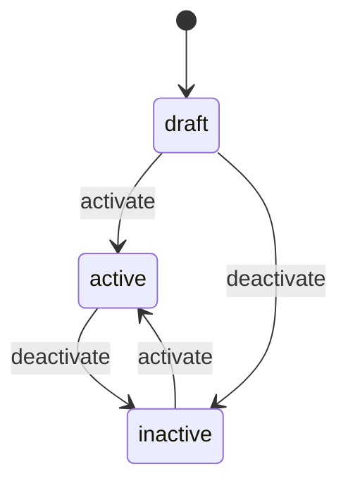

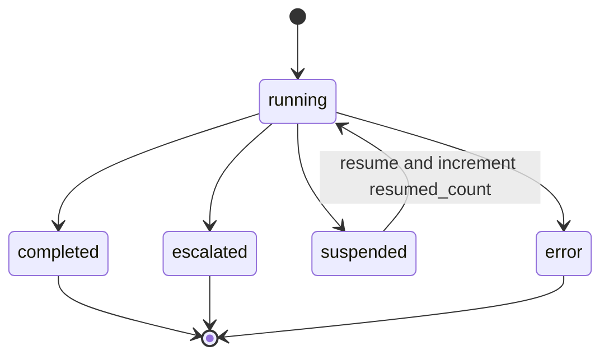

Evidence:

- `src/app/routes/workflow-studio-routes.ts` — catalog/templates, version CRUD,
  validation, compile, duplicate, and fork endpoints.
- `src/features/workflow-studio/schemas/process-definition-schema.ts` — executable
  definition contract and `draft` / `active` / `inactive` lifecycle.
- `src/features/workflow-studio/engine/process-definition-execution-engine.ts` —
  executable traversal.
- `src/features/workflow-studio/services/workflow-run-history-store.ts` — persisted
  run/node history, suspension, completion, and resume accounting.

Caveat: a successfully compiled definition is not proof that its selected agents,
providers, or connector credentials are healthy in a particular deployment.

## Remote node and desktop execution mesh

The control plane can register remote clients, monitor health, queue and claim work,
exchange swarm messages, conduct chat turns, and expose only the held task's workspace.
The desktop worker mirrors that workspace locally and pushes changed files additively.

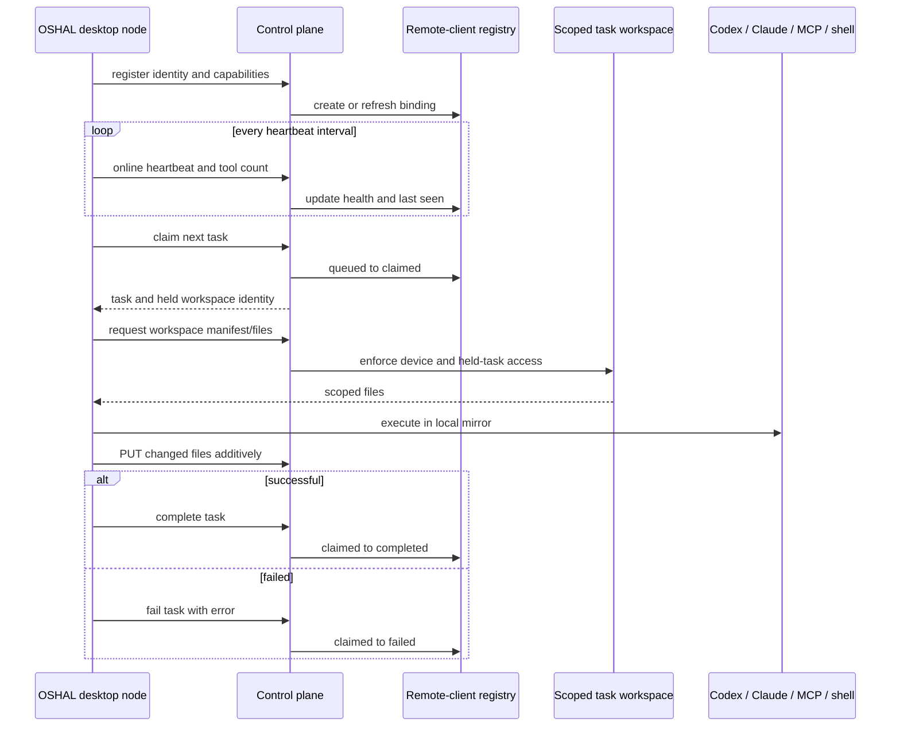

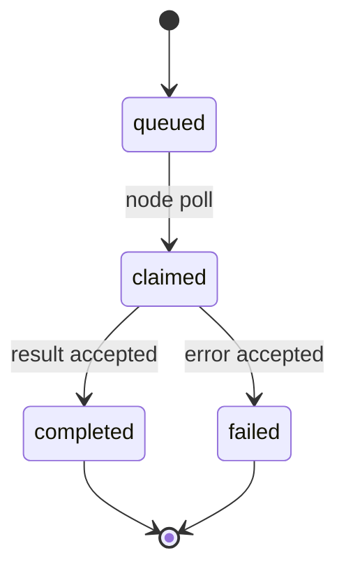

Evidence:

- `src/app/routes/remote-client-routes.ts` — registration, heartbeat, task, swarm,
  chat, owner, and workspace APIs.
- `src/features/remote-client/services/remote-client-registry.ts` — queue and result
  lifecycle.
- `packages/oshal-chat/src/main/mesh-client.ts` — heartbeat/poll loops and automatic
  re-registration after a missing binding.
- `packages/oshal-chat/src/main/worker.ts`, `local-tools.ts`, and `workspace-sync.ts`
  — execution gate, held-workspace pull, and additive push.

Caveat: the registry shown here is an in-process implementation. Availability across
control-plane restarts or multiple replicas depends on the deployment's surrounding
runtime design; do not infer durable queueing from this diagram alone.

## Connector marketplace, OAuth, actions, and webhooks

The repository contains 308 connector YAML specifications. A specification is catalog
coverage, not evidence that a user has enabled it or supplied valid credentials.

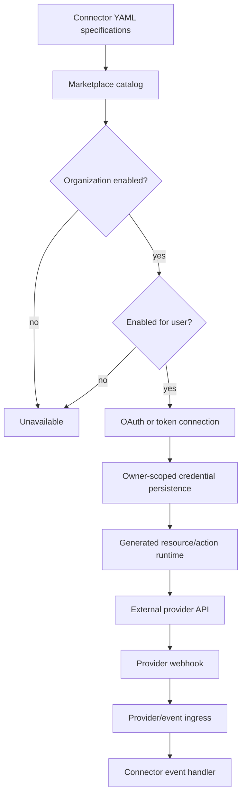

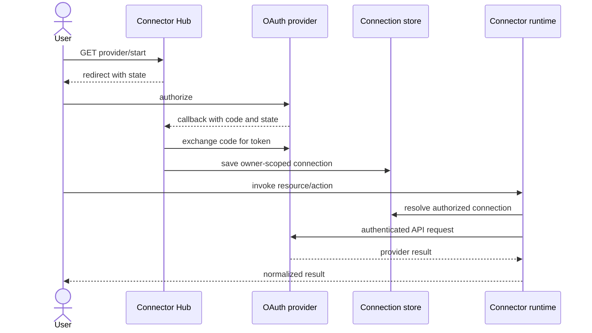

Evidence:

- `swarm-apps/connectors/*.yaml` — 307 declarative specifications at this audit.
- `src/app/routes/connector-marketplace-routes.ts` — organization and per-user
  enablement, remove, audit refresh, and audit export.
- `src/app/routes/connectors-routes.ts` — OAuth callback/token connection lifecycle,
  multiple connections, labels, and disconnect.
- `src/app/connectors/runtime/spec-routes.ts`,
  `src/app/routes/connector-action-routes.ts`, and
  `src/app/connectors/webhooks/webhook-ingress.ts` — resource/action execution and
  provider webhook ingress.
- `src/app/routes/connector-plaid-link.ts` — Plaid Link token and exchange flow.

Caveat: connector count is repository-state evidence and can change as manifests are
added or removed. Provider availability also depends on credentials, scopes, network,
and provider API behavior.

## Standards-facing A2A gateway

The inbound gateway advertises A2A protocol version `0.3.0`, publishes an agent card at
the standard well-known path, and accepts JSON-RPC task operations at the gateway
boundary. Internal ticket states are mapped to the A2A task-state vocabulary.

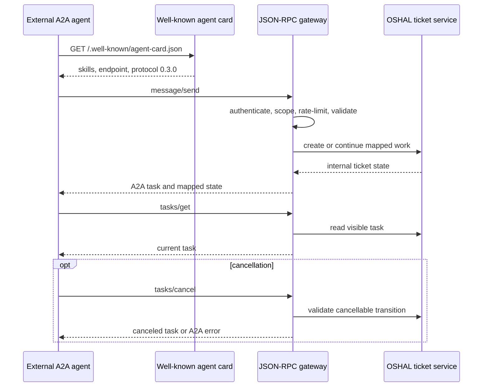

Evidence:

- `src/features/a2a-gateway/types.ts` — protocol pin, discovery path, JSON-RPC
  envelope, task states, and standard/A2A error codes.
- `src/features/a2a-gateway` — gateway controller/service and internal state mapping.

Caveat: this is the non-streaming JSON-RPC boundary implemented by the current gateway;
it does not imply support for every optional transport or feature in later A2A versions.

## Authenticated local speaker diarization

Speaker diarization runs as a separate FastAPI service using pinned local models. It
accepts only allowlisted raw-audio content types, bounds the request, performs inference
off the event loop, and wipes the encoded audio buffer afterward. A single inference
gate returns `429` before reading a concurrent request body.

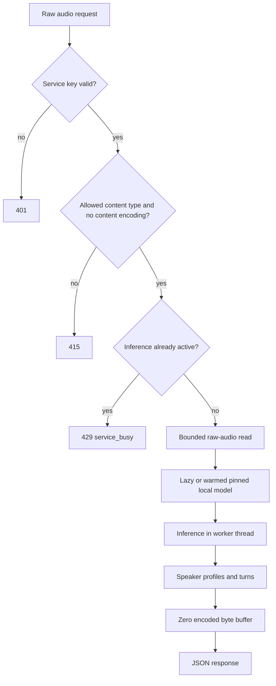

Evidence:

- `services/speaker-diarization/speaker_service/api.py` — authentication, validation,
  concurrency admission, inference, error mapping, safe logging, and wiping.
- `services/speaker-diarization/speaker_service/audio.py` and `engine.py` — bounded
  input and local processing.
- `services/speaker-diarization/tests` — API, contract, and engine coverage.

Caveat: health/readiness proves that configured models load; accuracy for a particular
room, microphone, language, or speaker set still requires representative audio testing.

## Security findings, alerts, RCA, and operator recovery

Security scans persist findings that can be reviewed, assessed, and promoted into
tickets. Separately, signed Alertmanager ingress can feed incident handling and RCA.
Generated remediation remains subject to the ticket lifecycle and human controls.

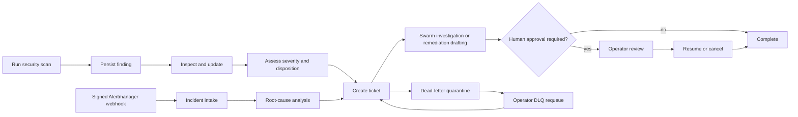

Evidence:

- `src/app/routes/security-routes.ts` — status, scan, findings, assess, and
  finding-to-ticket routes.
- `src/app/routes/alertmanager-routes.ts` — guarded/HMAC-validated webhook ingress.
- `src/app/routes/rca-routes.ts` — RCA analysis API.
- `src/app/routes/queue-dlq-routes.ts` — operator-only list/export/requeue.
- `src/app/routes/devops-routes.ts` — super-admin trace stream and Vault broker
  status/KV/policy/issue/revoke/setup operations.

Caveat: these APIs implement the control flow. They do not authorize unattended
production changes, and provider-specific scanning or remediation quality depends on
the configured tools and access.

## Scheduling and tool verification

Schedules have an explicit active/paused lifecycle and can also be triggered manually.
The verification scheduler is separately controllable and retains per-tool latest and
historical results.

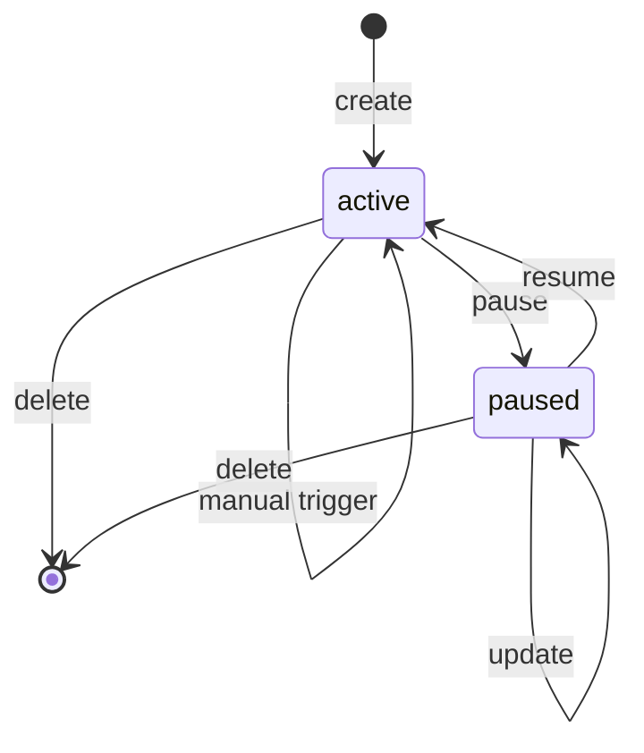

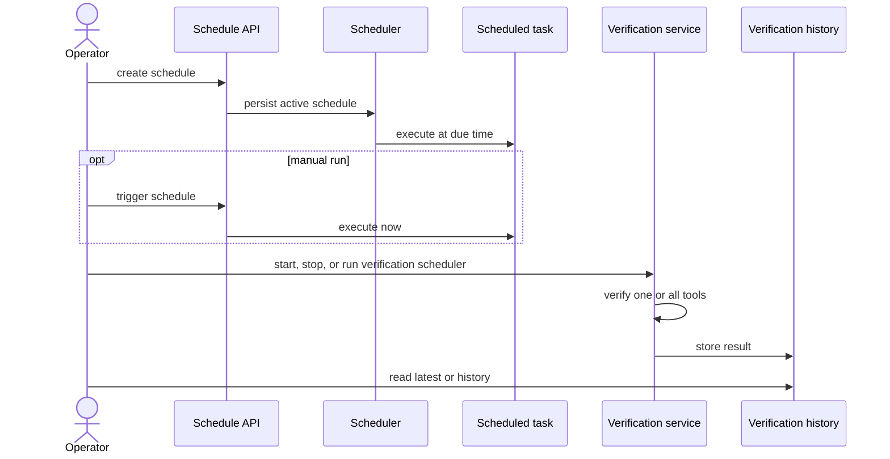

Evidence:

- `src/features/scheduling/types/schedule.ts` — `active` / `paused` contract.
- `src/app/routes/schedule-routes.ts` — CRUD, pause, resume, trigger, and execution.
- `src/app/routes/verification-routes.ts` — verification scheduler controls and
  single/all/latest/history result APIs.

## Adjacent implemented flows and validation boundaries

These additional source-backed capabilities merit their own focused guides or diagrams:

- RAG upload/ingest, collections, retrieval, deletion, health, and embedding-model
  catalog: `src/app/routes/rag-routes.ts`.
- Knowledge graph node/edge writes, query, neighbors, and path traversal:
  `src/app/routes/graph-routes.ts`.
- Per-agent and shared memory remember/recall/bootstrap/context:
  `src/app/extensions/swarm/routes/memory-routes.ts`.
- Ambient transcript settings, segments, day review, and deletion, plus speaker
  assignment/merge/delete/audio processing:
  `src/app/routes/ambient-listening-routes.ts` and `ambient-speaker-routes.ts`.
- User-taught facts and suggestion resolution: `src/app/routes/user-model-routes.ts`.
- The Windows installer presents two explicit roles — run the swarm or join a swarm —
  then launches the corresponding child installer and streams its log:
  `installer/install.ps1`, `installer/lib/install-swarm.ps1`,
  `installer/lib/install-node.ps1`, and `installer/lib/connect-ai.ps1`.

The native iOS Spaces scanner is deliberately **not** labeled production-validated here.
Its source implements QR/PAT pairing, Keychain storage, ARKit LiDAR capture, PLY and pose
sidecar export, and multipart upload, but `clients/ios-spaces-scanner/README.md` states
that it is a buildable scaffold not compiled in this Windows repository. It still needs
Mac/Xcode signing and real-device validation. Fire TV, Roku, and Samsung TV source
packages likewise should not be described as shipped binaries without build/release
evidence.

