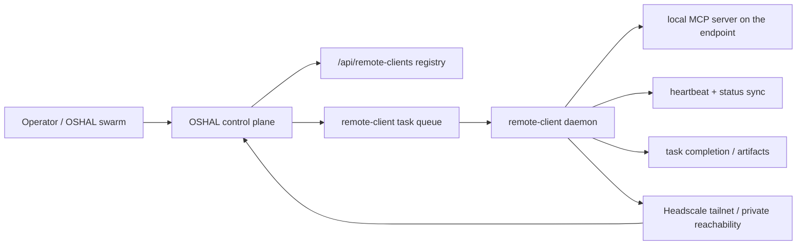

<!--
CHANGE LOG
-----------------------------------------------------------------------------
SEQ                 | AUTHOR                      | DESCRIPTION
-----------------------------------------------------------------------------
1 | maintainer@emeraldcoastsystemsgroup.com   | Added remote-client architecture document for endpoint MCP bridge and swarm integration
-->

# Remote Client Architecture

## Purpose

This document describes the OSHAL remote-client pattern for controlling a PC or Mac that runs its own local MCP server.

The key idea is:

- OSHAL remains the control plane
- the remote endpoint runs a trusted client daemon
- that daemon launches or connects to a local MCP server on the endpoint machine
- the client registers itself back to OSHAL over a private network
- swarm can dispatch work to the remote endpoint through a simple task queue and A2A-style envelope

## Why this exists

Local stdio MCP servers can only control the machine on which they are launched.

That means the remote-control problem has two parts:

1. **local machine automation** on the endpoint
2. **private network reachability** back to OSHAL

This implementation uses:

- **MCP** for local OS/tool execution on the endpoint
- **Headscale** for private overlay reachability
- **A2A-style envelopes** for agent-to-agent and control-plane-to-client task exchange

## Runtime Topology



## Request Flow

### 1. Registration

The endpoint daemon starts on the user machine and registers itself with OSHAL.

Registration includes:

- client identity
- host platform
- tailnet hostname, if available
- local MCP launch command
- discovered MCP capabilities

### 2. Heartbeats

The client emits a heartbeat on a timer.

The heartbeat reports:

- client health
- active task
- MCP readiness
- tool count
- last-seen time

### 3. Task dispatch (swarm -> remote)

OSHAL can enqueue a task for the client directly, and swarm bots can also send direct mesh envelopes to the remote agent channel.

When a direct mesh envelope contains an A2A task payload, the bridge converts it into a remote-client queue item.

Typical intents:

- `mcp.initialize`
- `mcp.list-tools`
- `mcp.call-tool`
- `mcp.shutdown`
- `status.sync`

### 4. Local execution

The remote-client daemon launches the local MCP server process and talks to it over stdio JSON-RPC.

This keeps the actual OS control local to the endpoint while the control plane remains remote.

### 5. Completion (remote -> swarm/control plane)

The client posts the result back to OSHAL with:

- success or failure
- output payload
- artifacts, if any
- completion timestamp

If the task originated from a swarm direct-channel envelope, OSHAL forwards the completion back to the original sender as a mesh reply.

### 6. Remote-initiated swarm messages

The remote client can publish outbound swarm messages through:

- `POST /api/remote-clients/:clientId/swarm/send` (direct or broadcast)

This is the reverse direction that makes the channel fully bidirectional.

## Security Model

The remote client is intentionally not a blind open relay.

Current guardrails:

- private-network reachability is expected through Headscale or an equivalent private overlay
- control-plane access is gated by either an authenticated session or a shared secret header
- local MCP execution stays on the endpoint machine
- the client only runs the MCP process explicitly configured on that machine

Planned hardening:

- explicit allowlists for approved local MCP commands
- richer audit logging for tool calls
- emergency stop / kill switch
- per-endpoint policy profiles

## Environment Variables

Remote-client daemon:

- `REMOTE_CLIENT_ID`
- `REMOTE_CLIENT_NAME`
- `REMOTE_CLIENT_CONTROL_PLANE_URL`
- `REMOTE_CLIENT_CONTROL_PLANE_TOKEN`
- `REMOTE_CLIENT_SHARED_SECRET`
- `REMOTE_CLIENT_AUTH_HEADER`
- `REMOTE_CLIENT_PLATFORM`
- `REMOTE_CLIENT_TRANSPORT`
- `REMOTE_CLIENT_TAILNET_HOSTNAME`
- `REMOTE_CLIENT_AGENT_ID`
- `REMOTE_CLIENT_MCP_COMMAND`
- `REMOTE_CLIENT_MCP_ARGS`
- `REMOTE_CLIENT_MCP_CWD`
- `REMOTE_CLIENT_HEARTBEAT_INTERVAL_MS`
- `REMOTE_CLIENT_POLL_INTERVAL_MS`
- `REMOTE_CLIENT_DISABLE_POLLING`

Recommended starting shape for macOS:

```bash
export REMOTE_CLIENT_CONTROL_PLANE_URL="http://localhost:3456"
export REMOTE_CLIENT_SHARED_SECRET="replace-me"
export REMOTE_CLIENT_MCP_COMMAND="mcp-server-macos-use"
export REMOTE_CLIENT_PLATFORM="macos"
```

Starting shape for a Windows Unreal Engine worker (see [ADR-051](../adr/051-unreal-engine-mcp-worker.md)). The endpoint must have Unreal Engine 5.5+ installed with the `UnrealMCP` editor plugin built and the project open; the Python server bridges to the editor over TCP `55557`:

```bash
export REMOTE_CLIENT_CONTROL_PLANE_URL="http://localhost:3456"
export REMOTE_CLIENT_SHARED_SECRET="replace-me"
export REMOTE_CLIENT_PLATFORM="windows"
export REMOTE_CLIENT_NAME="unreal-worker"
export REMOTE_CLIENT_MCP_COMMAND="uv"
export REMOTE_CLIENT_MCP_ARGS='["--directory","./unreal-mcp/Python","run","unreal_mcp_server.py"]'
# REMOTE_CLIENT_MCP_CWD defaults to the repo root; set it if the daemon runs elsewhere.
```

## Current Implementation Files

- [`src/shared/types/a2a.ts`](../../src/shared/types/a2a.ts)
- [`src/features/remote-client/types.ts`](../../src/features/remote-client/types.ts)
- [`src/features/remote-client/services/remote-client-config.ts`](../../src/features/remote-client/services/remote-client-config.ts)
- [`src/features/remote-client/services/mcp-stdio-client.ts`](../../src/features/remote-client/services/mcp-stdio-client.ts)
- [`src/features/remote-client/services/remote-client-control-plane-client.ts`](../../src/features/remote-client/services/remote-client-control-plane-client.ts)
- [`src/features/remote-client/services/remote-client-service.ts`](../../src/features/remote-client/services/remote-client-service.ts)
- [`src/app/routes/remote-client-routes.ts`](../../src/app/routes/remote-client-routes.ts)
- [`scripts/remote-client.ts`](../../scripts/remote-client.ts)

## Operational Notes

- If the endpoint machine is macOS, the underlying MCP still needs the relevant Accessibility and Input Monitoring permissions.
- If the endpoint machine is Windows or Linux, the actual MCP command should match the OS-specific server you want to run locally.
- The remote client does not replace MCP. It gives OSHAL a networked way to reach the local MCP on the endpoint machine.
- For an Unreal Engine worker, the Unreal Editor must be running with the `UnrealMCP` plugin enabled before tasks dispatch; the `uv`-launched Python server connects to the editor on TCP `55557` and tool calls fail if the editor is closed.
