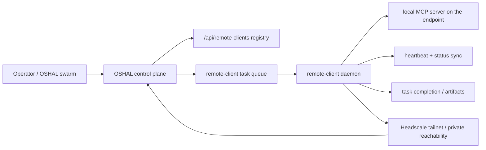

<!--
CHANGE LOG
-----------------------------------------------------------------------------
SEQ                 | AUTHOR                      | DESCRIPTION
-----------------------------------------------------------------------------
1 | maintainer@emeraldcoastsystemsgroup.com   | Added remote-client architecture document for endpoint MCP bridge and swarm integration
-->

# Remote Client Architecture

## Purpose

This document describes the OSHAL remote-client pattern for controlling a PC or Mac that runs its own local MCP server.

The key idea is:

- OSHAL remains the control plane
- the remote endpoint runs a trusted client daemon
- that daemon launches or connects to a local MCP server on the endpoint machine
- the client registers itself back to OSHAL over a private network
- swarm can dispatch work to the remote endpoint through a simple task queue and A2A-style envelope

## Why this exists

Local stdio MCP servers can only control the machine on which they are launched.

That means the remote-control problem has two parts:

1. **local machine automation** on the endpoint
2. **private network reachability** back to OSHAL

This implementation uses:

- **MCP** for local OS/tool execution on the endpoint
- **Headscale** for private overlay reachability
- **A2A-style envelopes** for agent-to-agent and control-plane-to-client task exchange

## Runtime Topology


```mermaid
flowchart LR
    OP["Operator / OSHAL swarm"] --> CP["OSHAL control plane"]
    CP --> REG["/api/remote-clients registry"]
    CP --> TASKS["remote-client task queue"]

    TASKS --> CLIENT["remote-client daemon"]
    CLIENT --> MCP["local MCP server on the endpoint"]
    CLIENT --> HEART["heartbeat + status sync"]
    CLIENT --> RESULT["task completion / artifacts"]

    CLIENT --> HEADSCALE["Headscale tailnet / private reachability"]
    HEADSCALE --> CP
```

## Request Flow

### 1. Registration

The endpoint daemon starts on the user machine and registers itself with OSHAL.

Registration includes:

- client identity
- host platform
- tailnet hostname, if available
- local MCP launch command
- discovered MCP capabilities

### 2. Heartbeats

The client emits a heartbeat on a timer.

The heartbeat reports:

- client health
- active task
- MCP readiness
- tool count
- last-seen time

### 3. Task dispatch (swarm -> remote)

OSHAL can enqueue a task for the client directly, and swarm bots can also send direct mesh envelopes to the remote agent channel.

When a direct mesh envelope contains an A2A task payload, the bridge converts it into a remote-client queue item.

Typical intents:

- `mcp.initialize`
- `mcp.list-tools`
- `mcp.call-tool`
- `mcp.shutdown`
- `status.sync`

### 4. Local execution

The remote-client daemon launches the local MCP server process and talks to it over stdio JSON-RPC.

This keeps the actual OS control local to the endpoint while the control plane remains remote.

### 5. Completion (remote -> swarm/control plane)

The client posts the result back to OSHAL with:

- success or failure
- output payload
- artifacts, if any
- completion timestamp

If the task originated from a swarm direct-channel envelope, OSHAL forwards the completion back to the original sender as a mesh reply.

### 6. Remote-initiated swarm messages

The remote client can publish outbound swarm messages through:

- `POST /api/remote-clients/:clientId/swarm/send` (direct or broadcast)

This is the reverse direction that makes the channel fully bidirectional.

### 7. The node's own chat runs on the node

`POST /api/remote-clients/:clientId/chat` runs a node's chat turn through the controller's `TaskOrchestrator`, which keeps the
conversation (history, persistence, usage). When the bot behind that chat resolves to a CLI harness the controller refuses to run
unattended (`harness:antigravity-cli`, `codex-cli` or `claude-code`), and the requesting node advertises the matching local
executor (`antigravity.exec`, `codex.exec`, `claude.exec`), only the model call is handed back to that node: one `mcp.call-tool`
task with `input.origin: "node-chat"` is queued on the node's own durable task queue, the node runs it with the person's own CLI
sign-in, and its `output.response` becomes the reply (`src/app/routes/remote-client-node-chat.ts`). No other node is ever asked. A
node without the executor, or a bot on a hosted provider, keeps the controller path unchanged. A failed or late node run is said in
the reply's `error`.

### 8. Two kinds of node

Two programs register as remote clients, and they reach a PC in different ways:

- **The remote-client daemon** ([`scripts/remote-client.ts`](../../scripts/remote-client.ts), run from a checkout of this repo)
  hosts one stdio MCP server, chosen on the PC at launch by `REMOTE_CLIENT_MCP_COMMAND` / `_ARGS` / `_CWD`, and runs
  `mcp.call-tool` for any tool that server lists. Nothing restarts the server if it exits.
- **The OSHAL Node app** ([`packages/oshal-chat`](../../packages/oshal-chat)) has no MCP client. Its tools are a fixed list built
  into the app ([`local-tools.ts`](../../packages/oshal-chat/src/main/local-tools.ts)). With worker mode on (the default) it offers
  `swarm.exec`, plus `codex.exec`, `claude.exec` and `antigravity.exec` when the matching CLI is set up on the PC. Its "Allow this
  machine to be controlled" checkbox (`allowSystemControl`, off by default, set in the app's Config after install) adds
  `screen.capture`, `shell.exec`, `desktop.control` and `app.open`. Any other tool name fails on the node.

A `task` ticket whose `metadata.targetRemoteClientId` names a node runs `codex.exec` on it at `sandbox: danger-full-access`
([`explicit-remote-ticket-dispatch.ts`](../../src/app/explicit-remote-ticket-dispatch.ts)). Neither program accepts an MCP server
pushed from the swarm: the intents in section 3 are the whole list.

## Security Model

The remote client is intentionally not a blind open relay.

Current guardrails:

- private-network reachability is expected through Headscale or an equivalent private overlay
- control-plane access is gated by either an authenticated session or a shared secret header
- local MCP execution stays on the endpoint machine
- the client only runs the MCP process explicitly configured on that machine

Planned hardening:

- explicit allowlists for approved local MCP commands
- richer audit logging for tool calls
- emergency stop / kill switch
- per-endpoint policy profiles

## Environment Variables

Remote-client daemon:

- `REMOTE_CLIENT_ID`
- `REMOTE_CLIENT_NAME`
- `REMOTE_CLIENT_CONTROL_PLANE_URL`
- `REMOTE_CLIENT_CONTROL_PLANE_TOKEN`
- `REMOTE_CLIENT_SHARED_SECRET`
- `REMOTE_CLIENT_AUTH_HEADER`
- `REMOTE_CLIENT_PLATFORM`
- `REMOTE_CLIENT_TRANSPORT`
- `REMOTE_CLIENT_TAILNET_HOSTNAME`
- `REMOTE_CLIENT_AGENT_ID`
- `REMOTE_CLIENT_MCP_COMMAND`
- `REMOTE_CLIENT_MCP_ARGS`
- `REMOTE_CLIENT_MCP_CWD`
- `REMOTE_CLIENT_HEARTBEAT_INTERVAL_MS`
- `REMOTE_CLIENT_POLL_INTERVAL_MS`
- `REMOTE_CLIENT_DISABLE_POLLING`

Recommended starting shape for macOS:

```bash
export REMOTE_CLIENT_CONTROL_PLANE_URL="http://localhost:3456"
export REMOTE_CLIENT_SHARED_SECRET="replace-me"
export REMOTE_CLIENT_MCP_COMMAND="mcp-server-macos-use"
export REMOTE_CLIENT_PLATFORM="macos"
```

Starting shape for a Windows Unreal Engine worker (see [ADR-051](../adr/051-unreal-engine-mcp-worker.md) Amendment 1 and the
[live checklist](../apps/unreal-mcp-worker-next-steps.md)). The satellite PC runs UE 5.x with the ChiR24 *McpAutomationBridge*
plugin enabled and the project open; the stdio server `unreal-engine-mcp-server` reaches the plugin on `127.0.0.1:8090` and
finds its capability token through `UE_PROJECT_PATH`. Pin the server and the plugin to the same release. The daemon starts the
MCP command without a shell and passes it only an allowlisted environment (`REMOTE_MCP_PROCESS_ENV_KEYS`), so `npx` cannot start
directly and `UE_PROJECT_PATH` would be dropped. A `cmd.exe` wrapper handles both: `C:\oshal\unreal-mcp.cmd` contains `@echo off`,
`set "UE_PROJECT_PATH=C:\Path\To\YourProject"` and `npx -y unreal-engine-mcp-server@0.5.30`.

```powershell
$env:REMOTE_CLIENT_CONTROL_PLANE_URL = "https://<control-plane>"
$env:REMOTE_CLIENT_CONTROL_PLANE_TOKEN = "<device token from POST /api/join/enroll>"
$env:REMOTE_CLIENT_ID = "<the enrollment's nodeClientId>"
$env:REMOTE_CLIENT_PLATFORM = "windows"
$env:REMOTE_CLIENT_NAME = "unreal-worker"
$env:REMOTE_CLIENT_MCP_COMMAND = "C:\Windows\System32\cmd.exe"
$env:REMOTE_CLIENT_MCP_ARGS = '["/c","C:\\oshal\\unreal-mcp.cmd"]'
```

## Current Implementation Files

- [`src/shared/types/a2a.ts`](../../src/shared/types/a2a.ts)
- [`src/features/remote-client/types.ts`](../../src/features/remote-client/types.ts)
- [`src/features/remote-client/services/remote-client-config.ts`](../../src/features/remote-client/services/remote-client-config.ts)
- [`src/features/remote-client/services/mcp-stdio-client.ts`](../../src/features/remote-client/services/mcp-stdio-client.ts)
- [`src/features/remote-client/services/remote-client-control-plane-client.ts`](../../src/features/remote-client/services/remote-client-control-plane-client.ts)
- [`src/features/remote-client/services/remote-client-service.ts`](../../src/features/remote-client/services/remote-client-service.ts)
- [`src/app/routes/remote-client-routes.ts`](../../src/app/routes/remote-client-routes.ts)
- [`scripts/remote-client.ts`](../../scripts/remote-client.ts)

## Operational Notes

- If the endpoint machine is macOS, the underlying MCP still needs the relevant Accessibility and Input Monitoring permissions.
- If the endpoint machine is Windows or Linux, the actual MCP command should match the OS-specific server you want to run locally.
- The remote client does not replace MCP. It gives OSHAL a networked way to reach the local MCP on the endpoint machine.
- For an Unreal Engine worker, the Unreal Editor must be running with the ChiR24 `McpAutomationBridge` plugin enabled before tasks dispatch; the stdio server reaches the plugin on `127.0.0.1:8090`, and tool calls fail closed while the editor is closed.
