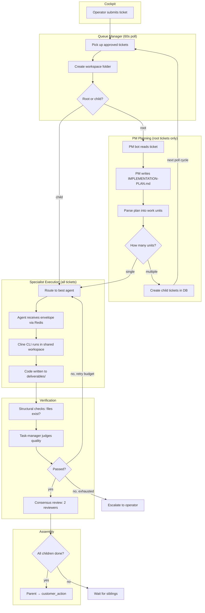
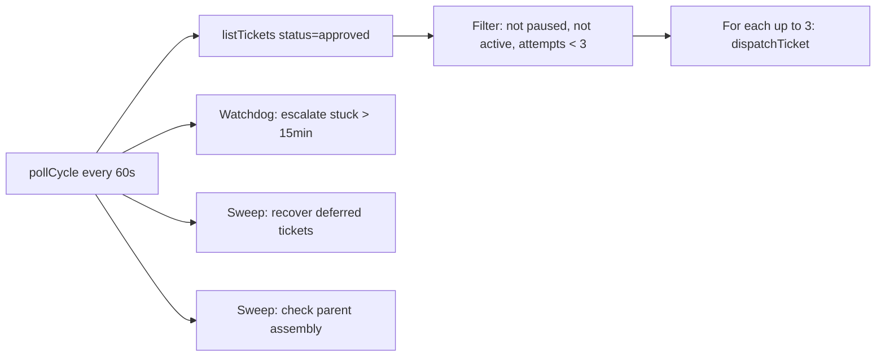
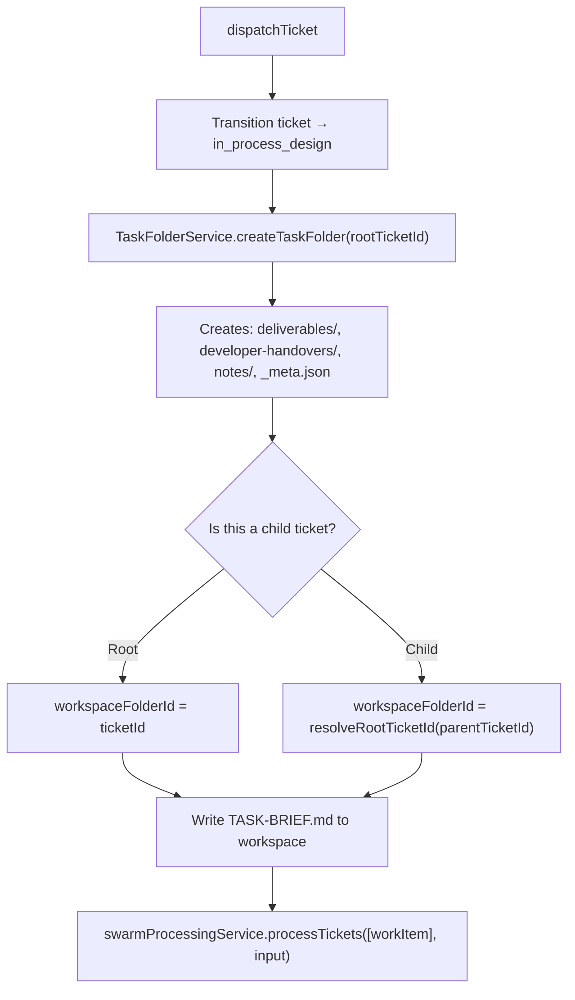
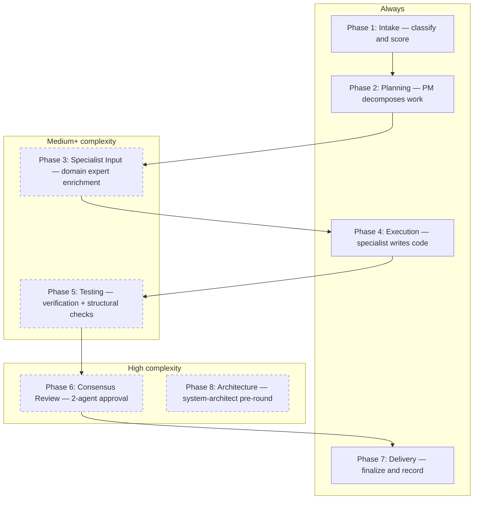
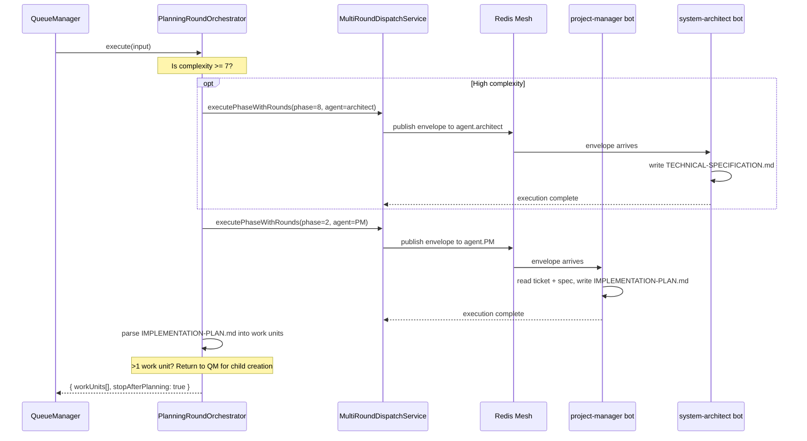
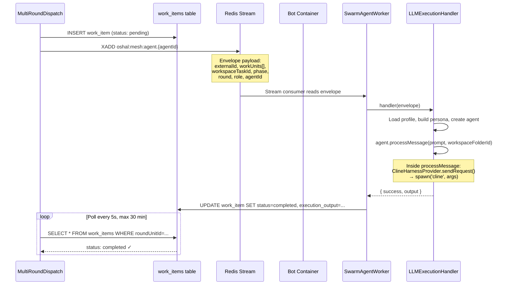
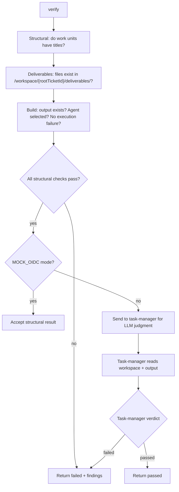
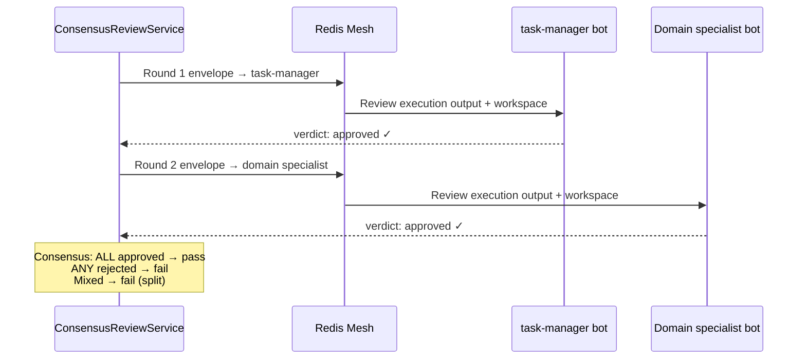
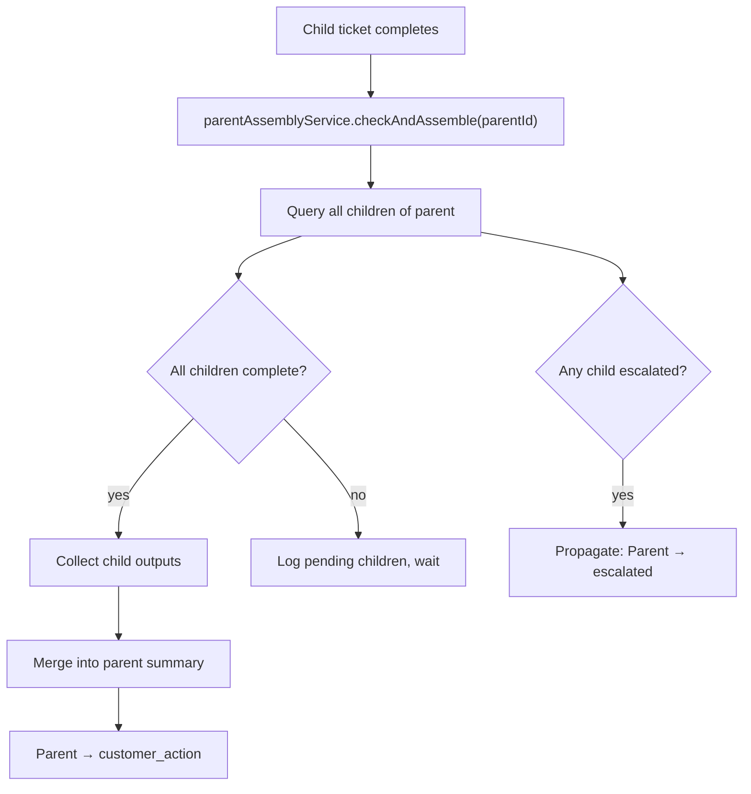

# Swarm Execution Pipeline

**Updated:** 2026-04-01 | **Verified:** 3 live E2E tickets, 6 child completions, 0 workspace leaks

---

## How a Ticket Becomes Working Software

An operator types "Build a string reverser in TypeScript" into the cockpit. Seventeen minutes later, `deliverables/src/reverser.ts` exists with passing tests. This document explains every step in between — what calls what, who decides what, and where the work product lives.

The pipeline has two modes that share the same infrastructure:

- **Root tickets** go through PM planning, get decomposed into children, and wait for assembly.
- **Child tickets** skip planning entirely and execute directly via a specialist bot.

Both modes share a single workspace folder. Every bot that touches a ticket reads and writes to the same directory. There are no per-agent silos.

---

## The Big Picture



---

## Step 1: Ticket Enters the System

**Where:** [cockpit-routes.ts:548](../../src/app/routes/cockpit-routes.ts#L548) — `POST /api/v1/tickets`

The cockpit creates tickets with `status: 'approved'`, which makes them immediately eligible for the queue manager. There is no approval gate — the operator's submit *is* the approval.

```typescript
// cockpit-routes.ts:562
const ticket = await ctx.ticketService.createTicket({
  title: trimmedTitle,
  description: trimmedDescription,
  status: 'approved',   // <-- goes straight into the queue
  metadata: { projectId, projectName },
});
```

The ticket sits in Postgres until the queue manager's next poll cycle picks it up.

---

## Step 2: Queue Manager Claims the Ticket

**Where:** [queue-manager-service.ts:226](../../src/features/swarm-orchestration/services/queue-manager-service.ts#L226) — `pollCycle()`

Every 60 seconds, the PM bot's queue manager queries for approved tickets and dispatches up to 3 concurrently. The poll cycle also runs housekeeping: a stuck-slot watchdog (kills tickets hung > 15 min), a deferred-ticket sweeper, and a parent assembly check.



When a ticket is claimed, it transitions to `in_process_design` so no other poll cycle grabs it.

---

## Step 3: Workspace and Routing Setup

**Where:** [queue-manager-service.ts:412](../../src/features/swarm-orchestration/services/queue-manager-service.ts#L412) — `dispatchTicket()`

Before any bot touches the ticket, the queue manager sets up the workspace and resolves routing:



The critical routing decision:

```
Root:  workspace = /app/workspace/{ownTicketId}/
Child: workspace = /app/workspace/{rootParentTicketId}/   ← shares parent's folder
```

Child tickets inherit the root ticket's workspace so every bot — PM, architect, developer, tester — reads and writes to the same directory. This is how the tester bot can see the developer bot's code.

---

## Step 4: Multi-Phase Processing

**Where:** [swarm-ticket-processing-service.ts:576](../../src/features/swarm-orchestration/services/swarm-ticket-processing-service.ts#L576) — `processOneTicket()`

The ticket now enters a phased pipeline. Which phases run depends on the ticket's complexity score:



| Complexity | Score | Phases Skipped |
|-----------|-------|----------------|
| Low | 0–3 | 3, 5, 6, 8 |
| Medium | 4–6 | 6, 8 |
| High | 7–10 | None |

**The regression loop:** If testing (Phase 5) or review (Phase 6) fails, the ticket loops back to Phase 4 with the failure feedback injected into the next execution prompt. This repeats up to 3 times before escalating to the operator.

---

## Step 5: PM Planning and Decomposition

**Where:** [planning-round-orchestrator.ts:128](../../src/features/swarm-orchestration/services/planning-round-orchestrator.ts#L128) — `PlanningRoundOrchestrator.execute()`

Root tickets go through PM planning. Child tickets skip this entirely.



The PM bot is always `a0000000-0000-0000-0000-000000000001` — planning never goes through routing. This prevents a keyword-match from accidentally assigning planning to a specialist.

When the PM produces multiple work units, `processOneTicket` returns with `stopAfterPlanning: true`. The queue manager then creates child tickets:

```typescript
// queue-manager-service.ts:740-783
for (const unit of planningUnits) {
  const childTicket = await ticketService.createTicket({
    title: unit.title,
    description: unit.description,
    status: 'approved',           // immediately queue-eligible
    parentTicketId: parentTicket.ticketId,
    metadata: {
      depth: 1,
      workType: unit.workType,    // 'implementation', 'testing', etc.
      acceptanceCriteria: unit.acceptanceCriteria,
      pmAssignedRole: assignment?.suggestedRole,
    },
  });
}
```

These children appear as `approved` tickets and get picked up on the next poll cycle — entering Step 2 again, but this time taking the child path (skip planning, route to specialist).

---

## Step 6: How an Envelope Reaches a Bot

**Where:** [multi-round-dispatch-service.ts:270](../../src/features/swarm-orchestration/services/multi-round-dispatch-service.ts#L270) — `executeOneRound()`

Every phase uses the same dispatch mechanism. The service builds an envelope, publishes it to a Redis Stream, and polls for the bot's output.



The envelope payload contains everything the bot needs:

```typescript
{
  correlationId: "{runId}:{ticketExternalId}",
  toAgentId: "a0000000-0000-0000-0000-00000000000e",  // code-developer
  payload: {
    externalId: "child-ticket-uuid",
    workUnits: [{
      title: "Build the core FizzBuzz function",
      description: "...",
      acceptanceCriteria: ["function returns correct array", "tests pass"],
      workType: "implementation",
    }],
    workspaceTaskId: "root-ticket-uuid",   // shared workspace folder
    phase: 4,                               // execution
    round: 1,
    role: "primary",
    previousRoundOutput: null,              // or feedback from prior attempt
  }
}
```

---

## Step 7: Inside the Bot — From Envelope to Code

**Where:** [llm-execution-handler.ts:128](../../src/features/swarm-orchestration/services/llm-execution-handler.ts#L128) — `createLLMExecutionHandler()`

This runs inside each bot container. It transforms the envelope into an LLM call that produces real files.

```mermaid
flowchart TD
    A[Envelope arrives] --> B[Extract: agentId, workspaceTaskId, executionScopeId]
    B --> C["workspaceFolderId = baseTaskId (root ticket ID)"]
    C --> D["taskId = baseTaskId::agentId (cost tracking only, NEVER a path)"]
    D --> E[Load agent profile from DB]
    E --> F[Build persona layers]

    subgraph Persona["Persona Layer Stack (highest priority first)"]
        F1["5: File persona — bot-personas/*.yaml identity"]
        F2["3: Swarm memory — cross-ticket learnings"]
        F3["2: RALF handovers — prior round context"]
        F4["1: Swarm awareness — phase, role, colleagues"]
    end

    F --> F1 --> F2 --> F3 --> F4
    F4 --> G["createAgent(profile, provider, personaLayers)"]
    G --> H["agent.processMessage(prompt, workspaceFolderId, scopeId)"]
    H --> I["ClineHarnessProvider.sendRequest()"]

    subgraph Cline["Cline CLI Subprocess"]
        I1["Resolve provider + model from config"]
        I2["Write context file: {scopeId}--{agentId}-context.md"]
        I3["Prepare per-agent config: .oshal/cline-runtime/{agentId}/"]
        I4["spawn cline --json -y --cwd /app/workspace/{rootTicketId}"]
        I5["Bot reads context file, sees existing code, writes deliverables"]
        I6["Parse JSON-line stdout → LLMResponse"]
    end

    I --> I1 --> I2 --> I3 --> I4 --> I5 --> I6
    I6 --> J[Capture token usage from Cline session]
    J --> K[Record cost event + link task to ticket]
    K --> L["Return { success: true, content }"]
```



The bot starts in the shared workspace and can see everything other bots have written. When the code-developer runs after the PM, it reads `IMPLEMENTATION-PLAN.md` and `ARCHITECTURE.md`. When the tester runs after the developer, it reads `deliverables/src/reverser.ts` and writes `deliverables/tests/reverser.test.ts`.

---

## Step 8: Verification — Did the Bot Actually Produce Anything?

**Where:** [swarm-verification-service.ts:76](../../src/features/swarm-orchestration/services/swarm-verification-service.ts#L76) — `verify()`

Verification runs in two layers: fast structural checks (deterministic, no LLM), then optional task-manager judgment (LLM-based).



The deliverables check uses the root workspace — not the child ticket ID. This is why `workspaceTaskId` gets threaded through from the queue manager all the way down to verification.

---

## Step 9: Consensus Review — Two Agents Must Agree

**Where:** [consensus-review-service.ts:104](../../src/features/swarm-orchestration/services/consensus-review-service.ts#L104) — `review()`

Only runs for high-complexity tickets. Two reviewers independently judge the work:



Each reviewer writes a scoped handover: `review:{childTicketId}:r{round}`. This prevents review artifacts from bleeding into sibling ticket contexts.

---

## Step 10: Parent Assembly — Children Recombine

**Where:** [queue-manager-service.ts:633](../../src/features/swarm-orchestration/services/queue-manager-service.ts#L633)

After each child completes, the queue manager checks whether all siblings are done:



`customer_action` is the terminal success state. The operator can review the workspace in the cockpit code-server viewer and see everything the bots produced.

---

## Agent Selection Reference

Not every agent is selected the same way. Some are hardcoded, some go through routing.

| Phase | Role | Agent | How Selected |
|-------|------|-------|-------------|
| 2 | Planner | project-manager (`...0001`) | **Fixed** — always PM, bypasses routing |
| 8 | Architect | system-architect (`...0018`) | **Fixed** — only runs for high complexity |
| 3 | Domain expert | varies | **Routed** — keyword + capability match against ticket labels |
| 4 | Executor | varies | **Routed** — capability match + PM's `suggestedRole` hint |
| 5 | Verifier | task-manager (`...000a`) | **Fixed** — structural checks + LLM judgment |
| 6, Round 1 | Reviewer | task-manager (`...000a`) | **Fixed** — QA gatekeeper |
| 6, Round 2 | Reviewer | domain specialist | **Routed** — same agent type that executed |

Routing works in three tiers, tried in order:
1. **Mesh bid** — broadcast to all online agents, highest bidder wins (not yet active)
2. **Capability match** — compare `requiredCapabilities` against agent capability lists
3. **Keyword match** — scan ticket title/description for agent-registered keywords

---

## Workspace Layout

Every bot for one ticket tree writes to a single folder:

```
workspace-shared/{rootTicketId}/
│
├── _meta.json                          # Task metadata (agents, status)
├── TASK-BRIEF.md                       # QM-written ticket summary
├── ROUTING-DECISIONS.md                # Agent selection audit trail
├── ARCHITECTURE.md                     # Architect bot output (Phase 8)
├── IMPLEMENTATION-PLAN.md              # PM decomposition plan (Phase 2)
├── README.md                           # Bot-generated project readme
├── package.json / tsconfig.json        # Bot-created project scaffolding
│
├── {agentId}-context.md                # Persona identity file per agent
├── {scopeId}--{agentId}-context.md     # Scoped context (child/review isolation)
│
├── .oshal/cline-runtime/{agentId}/      # Per-agent Cline config (isolated)
│   ├── config.json
│   ├── data/globalState.json
│   └── mcp_settings.json
│
├── deliverables/                       # THE ACTUAL WORK PRODUCT
│   ├── src/reverser.ts                 # Source code
│   ├── tests/reverser.test.ts          # Tests
│   └── docs/                           # Documentation
│
├── developer-handovers/                # Inter-agent context transfer
│   └── {agentId}_PHASE_{N}_ROUND_{R}.md
│
└── notes/                              # Agent working notes
```

---

## Rules That Must Not Be Broken

These were learned through bugs that caused every ticket to escalate. They are load-bearing.

1. **Workspace path = root ticket ID only.** `resolveRootTicketId()` walks up the parent chain. A child ticket's own ID is never used as a directory name.

2. **`taskId` with `::agentId` is never a filesystem path.** The format `{ticketId}::a0000000-...` exists for per-agent cost attribution. The `::` gets sanitized to `__` by path normalizers, creating phantom directories. Use `workspaceFolderId` for files.

3. **Bot containers run compiled JavaScript.** They execute `node dist/app/server.js`, not ts-node. A TypeScript fix requires: `npx tsc --project tsconfig.server.json` → Docker rebuild → container restart. The API server uses ts-node and picks up source changes on restart alone.

4. **Cline config must be per-agent.** Multiple bots executing on the same ticket at the same time will stomp each other's provider/model settings if they share a config directory. Each bot gets `.oshal/cline-runtime/{agentId}/`.

5. **Post-pipeline enrichment targets the root workspace.** `writeTaskBrief()`, `enrichWorkspaceAfterPipeline()`, and `extractAndWriteDeliverables()` all receive `rootWorkspaceId` — not the child ticket ID. Without this, the enrichment step throws ENOENT and the circuit breaker escalates an otherwise healthy ticket.

6. **DB schema migrations must be idempotent across containers.** Multiple bot containers run the same migration SQL on startup. `CREATE TABLE IF NOT EXISTS` is fine. `ALTER TABLE ADD CONSTRAINT` is not — it races. Wrap in `DO $$ BEGIN ... EXCEPTION WHEN duplicate_object THEN NULL; END $$`.
