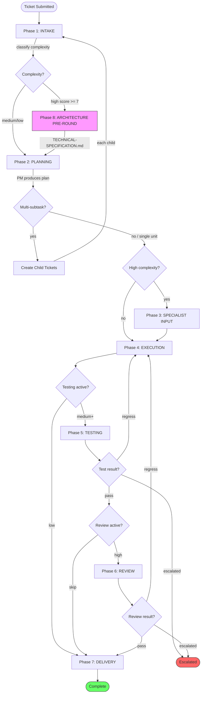
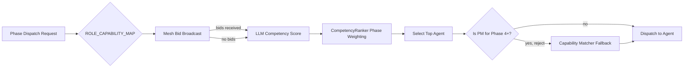
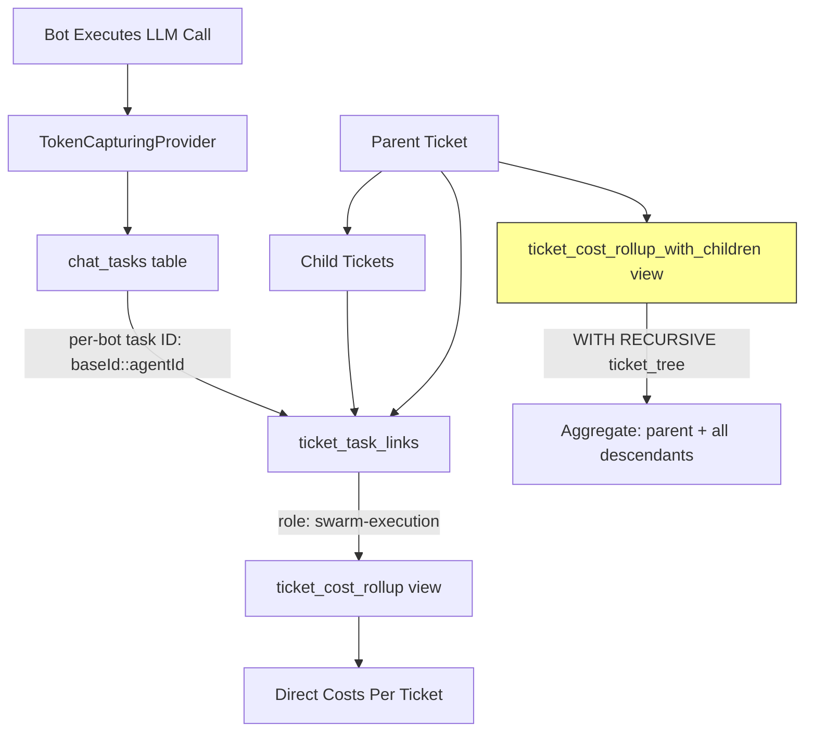
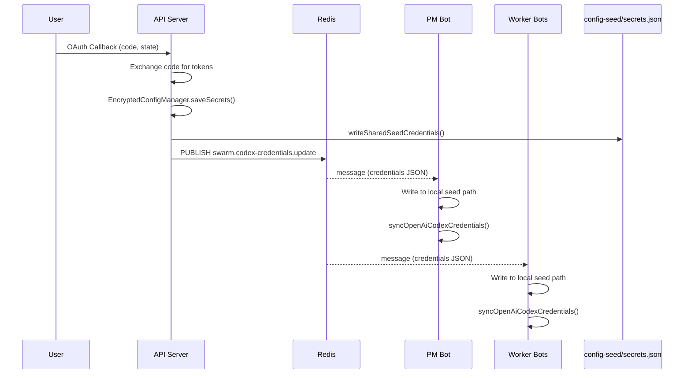
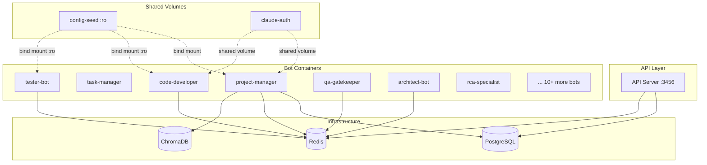
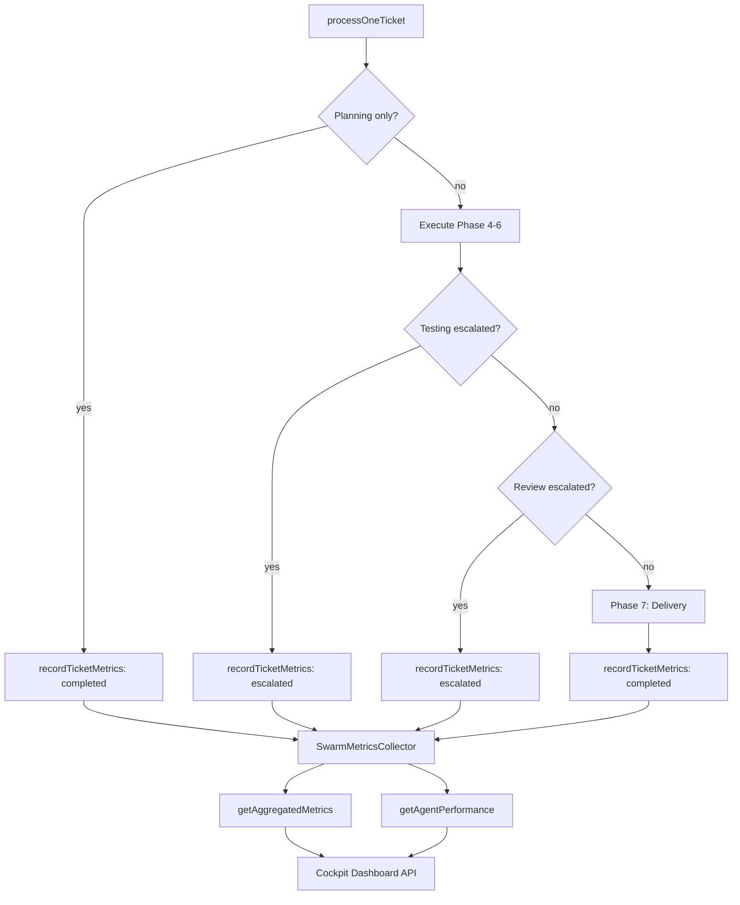

# Swarm Pipeline Architecture Diagrams

Updated: 2026-03-30 (Session 18)

## 1. Phase Lifecycle Flow

## 2. Agent Routing Decision Tree

## 3. Cost Rollup Architecture

## 4. Credential Propagation Flow

## 5. Docker Container Topology (Swarm)

## 6. Metrics Collection Flow

