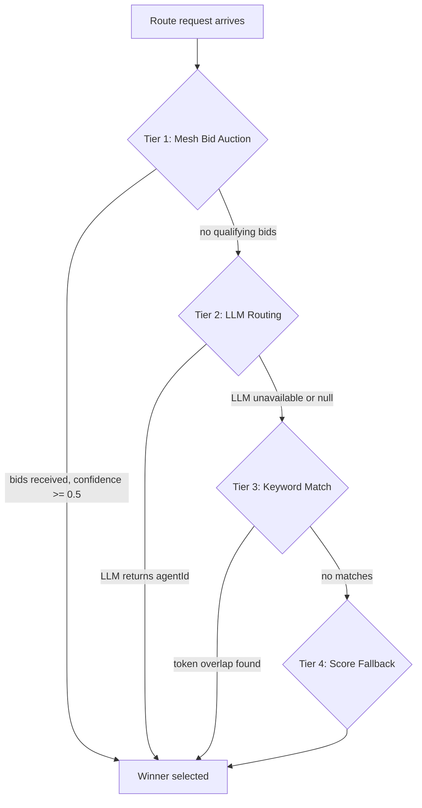
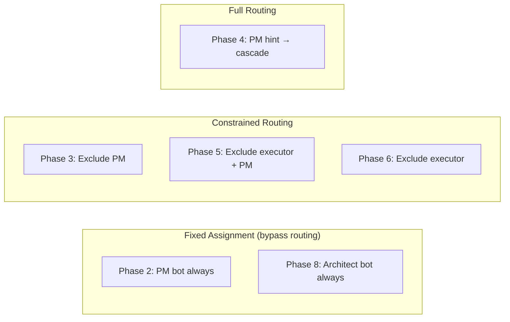
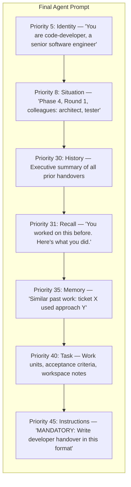
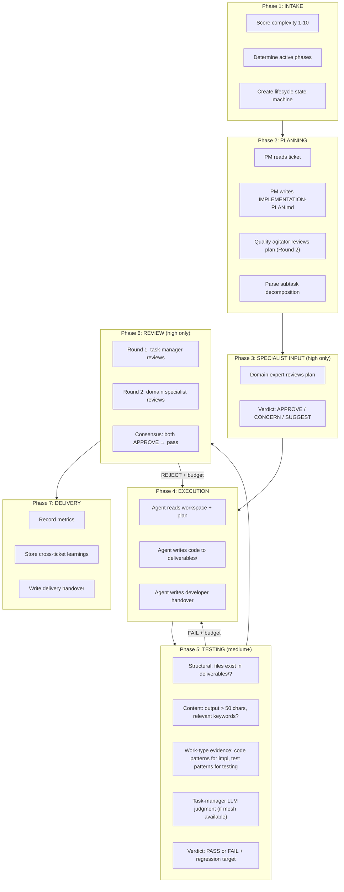
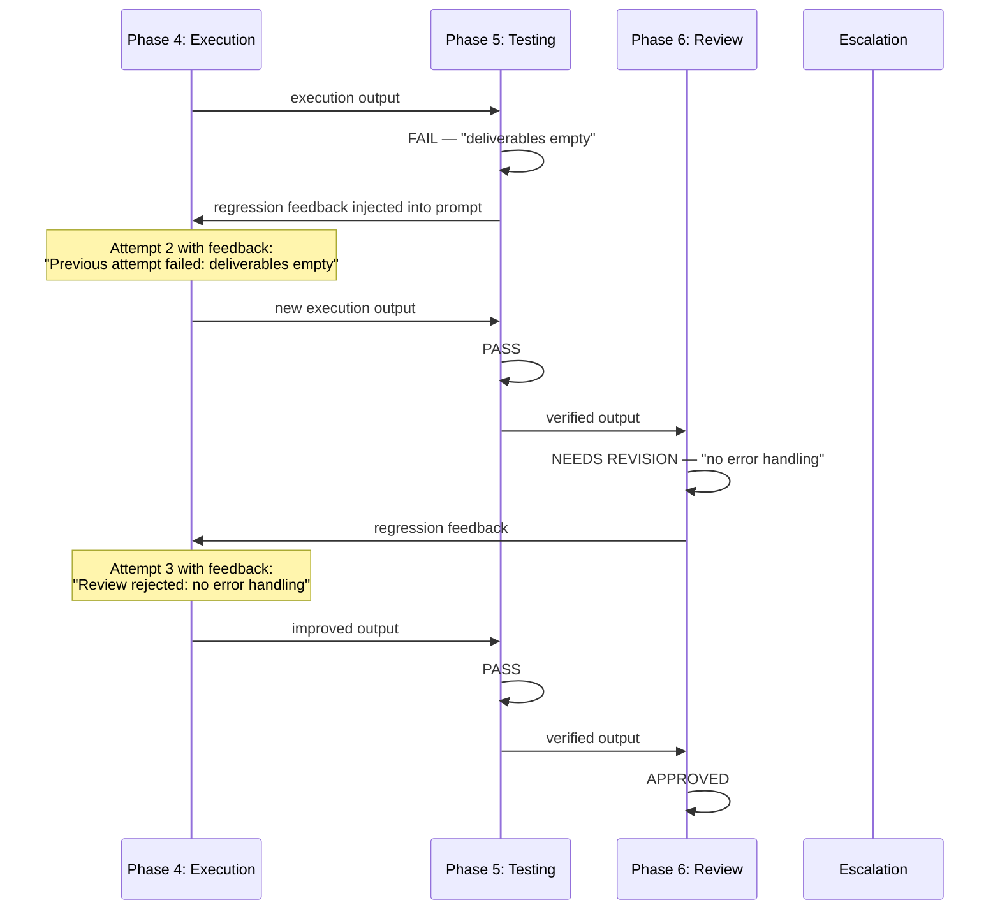
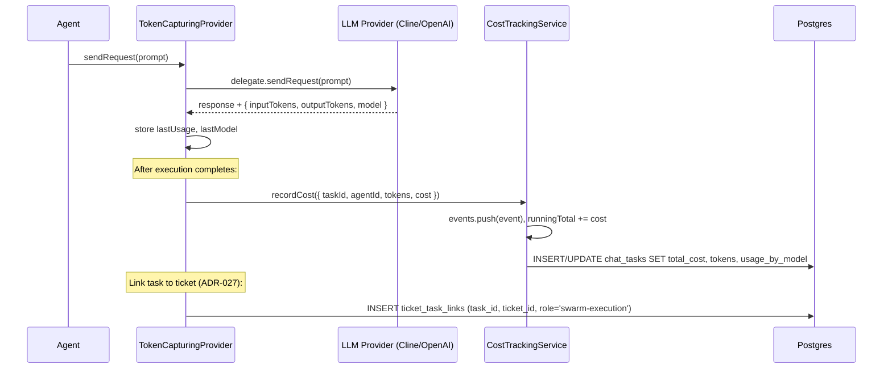

# Swarm Subsystems — Deep Reference

**Updated:** 2026-04-01 | **Companion to:** [swarm-execution-pipeline.md](swarm-execution-pipeline.md)

The pipeline doc covers the end-to-end ticket lifecycle. This doc goes deeper into the subsystems that make each step work: how agents are selected, how context flows between phases, how cost is tracked, and what each phase actually evaluates.

---

## 1. Agent Routing and the Bid Process

Not all agents are selected the same way. The system uses a 4-tier routing cascade, with phase-specific overrides for critical roles.

### The 4-Tier Cascade

When a ticket needs an agent, the router tries each tier in order and stops at the first match:



**Where:** [agent-router.ts:79](../../src/features/agent-management/services/agent-router.ts#L79)

**Tier 1 — Mesh Bid Auction.** The controller broadcasts a `BID_REQUEST` signal to all online agents via Redis. Each agent has 10 seconds to respond with a confidence score (0.0–1.0). Bids below 0.5 are discarded. The winner is chosen by: highest confidence, then lowest cost, then lowest latency. This tier is wired but not yet active in production — most agents don't implement bid responses yet.

**Tier 2 — LLM Routing.** An optional LLM function receives the ticket context and candidate list, and returns the best agent ID. Skipped if no LLM routing function is configured.

**Tier 3 — Keyword Match.** The router tokenizes the ticket title, labels, required capabilities, and work unit descriptions. It compares these tokens against each candidate's registered capabilities and keywords. Tokens shorter than 3 characters and stop words ("the", "and", "for") are removed. The agent with the most token overlaps wins.

**Tier 4 — Score Fallback.** Uses pre-ranked base scores:

| Agent | Base Score |
|-------|-----------|
| project-manager | 0.95 |
| code-developer | 0.90 |
| documentation-writer | 0.80 |
| test-engineer | 0.78 |
| code-reviewer | 0.72 |
| task-manager | 0.58 |
| agent-factory | 0.20 |
| all others | 0.68 |

### Phase-Specific Routing Overrides

The 4-tier cascade is the generic path. Each phase applies its own rules on top:



**Where:** [phase-routing-service.ts:64](../../src/features/swarm-orchestration/services/phase-routing-service.ts#L64)

| Phase | Routing Rule | Why |
|-------|-------------|-----|
| 2 (Planning) | **Fixed:** PM (`...0001`) | PM owns decomposition. Keyword match would send planning to a specialist. |
| 8 (Architecture) | **Fixed:** Architect (`...0018`) | Technical specification requires system-design expertise. |
| 3 (Specialist Input) | **Exclude PM**, then cascade | PM wrote the plan — a different expert should review it. |
| 4 (Execution) | **PM hint first**, then cascade | If the PM suggested an agent during planning, try that agent first. Fall through to full routing if unavailable. |
| 5 (Testing) | **Exclude executor + PM** | Fresh eyes. The bot that wrote the code shouldn't test it. |
| 6 (Review) | **Exclude executor** | Round 1: task-manager (QA gatekeeper). Round 2: domain specialist. |
| 7 (Delivery) | **No routing** | Auto-completes. |

### Capability Gap Detection

Before routing, the handler checks whether ANY online agent has the required capabilities. If not:

1. Log the gap: `missingCapabilities: ["python", "cli"]`
2. If `AgentFactoryService` is available: auto-create a specialist agent with the missing capabilities
3. Continue routing — the new agent is registered but existing agents still compete

**Where:** [swarm-routing-handler.ts:110](../../src/features/swarm-orchestration/services/swarm-routing-handler.ts#L110)

### Adaptive Rerouting

When routing fails (agent offline, channel dead, timeout), the system classifies the failure and decides whether to reroute or escalate:

**Where:** [adaptive-reroute-service.ts:67](../../src/features/swarm-orchestration/services/adaptive-reroute-service.ts#L67)

| Failure Type | Reroutable? | Action |
|-------------|------------|--------|
| bot_unavailable | Yes | Select next-best eligible agent |
| runtime_channel_dead | Yes | Reroute to different agent |
| timeout | Yes | Reroute with fresh attempt |
| capacity_exhausted | Yes | Reroute to less-loaded agent |
| missing_required_capability | Yes | Reroute or auto-create specialist |
| policy_rejected | Yes | Reroute to eligible agent |
| no_online_candidates | **No** | Escalate to operator |
| malformed_task_context | **No** | Escalate to operator |

### Routing Audit Trail

Every routing decision is dual-written to memory and Postgres (`routing_audit_log` table):

```
{ taskId, ticketExternalId, swarmRunId,
  winnerAgentId, strategy, winnerScore, winnerConfidence,
  candidateCount, candidates[], tiersAttempted[],
  requiredCapabilities[], durationMs }
```

**Where:** [routing-audit-log.ts:52](../../src/features/operational-intelligence/services/routing-audit-log.ts#L52)

---

## 2. Context Handover System

Agents don't have memory between invocations. Every piece of context an agent needs must be explicitly injected into its prompt. The handover system manages this.

### What Gets Injected Into Every Agent

Each agent receives a **persona layer stack** — multiple prompt fragments merged by priority (lowest number = highest priority):



**Where:** [llm-execution-handler.ts:160](../../src/features/swarm-orchestration/services/llm-execution-handler.ts#L160)

### Layer Details

**Identity (Priority 5)** — File persona loaded from `ai-lab/bot-personas/{agentName}.yaml`. Written to `{agentId}-context.md` in workspace. The agent is instructed to read this file first. For review tasks, a phase override replaces the file persona to prevent planning-SOP misbinding.

**Situation (Priority 8)** — Swarm awareness prompt with:
- Phase position: "You are in Phase 4 of 7" with ASCII timeline
- Role: "executor", "plan-reviewer", "quality agitator"
- Round context: "Round 1 = primary, Round 2 = quality check"
- Colleagues working on the same ticket
- Escalation protocol: REQUEST_EXTRA_ROUND, REGRESS_TO_PHASE, REQUEST_HUMAN_REVIEW

**Where:** [swarm-awareness-prompt.ts:76](../../src/features/swarm-orchestration/services/swarm-awareness-prompt.ts#L76)

**History (Priority 30)** — Executive summary generated by the RALF handover manager. Reads all handover docs from `developer-handovers/`, groups by phase, extracts "What I Did", "What's Left", "Key Context" sections. Truncated to 3KB for the most recent entry.

**Recall (Priority 31)** — If this agent previously worked on the same ticket, its prior handover is formatted as "You worked on this before" context. Truncated to 2KB.

**Memory (Priority 35)** — Cross-ticket organizational learnings from ChromaDB. Queries the `swarm-memory` collection for similar past work by title/description. Returns up to 3 relevant past experiences with "What Worked" and "Challenges" sections.

**Where:** [swarm-memory-service.ts:207](../../src/features/agent-management/services/swarm-memory-service.ts#L207)

**Task (Priority 40)** — The actual work to do: ticket external ID, decomposed work units, acceptance criteria.

**Instructions (Priority 45)** — Mandatory RALF handover format. Every agent must write a developer handover document when it finishes.

### Developer Handover Format

Agents write handovers to `developer-handovers/` using this naming convention:

```
Parent ticket:  {agentId}_PHASE_{n}_ROUND_{n}.md
Child ticket:   {scopeId}--{agentId}_PHASE_{n}_ROUND_{n}.md
Review ticket:  review-{externalId}-r{n}--{agentId}_PHASE_{n}_ROUND_{n}.md
```

Required sections:

```markdown
# Developer Handover — {agentId}
**Phase:** 4 | **Round:** 1 | **Status:** Complete

## What I Did
- Built deliverables/src/reverser.ts with reverse() function
- Added 7 unit tests covering edge cases

## What I Produced
- deliverables/src/reverser.ts (239 bytes)
- deliverables/tests/reverser.test.ts (822 bytes)

## Decisions Made
- Used split/reverse/join instead of loop for clarity

## Open Concerns
- No Unicode surrogate pair handling

## What's Left To Do
- Nothing — fully complete

## Key Context for Next Agent
- Tests use vitest, config at vitest.config.ts
```

**Where:** [ralf-handover-manager.ts:207](../../src/features/swarm-orchestration/services/ralf-handover-manager.ts#L207)

### Scope Isolation (IMP-2)

When multiple child tickets share a workspace, their handovers must not bleed into each other. The execution scope service derives a scope ID for each execution:

```
Parent ticket → scopeId = "" (unscoped, reads all handovers)
Child "build-auth" → scopeId = "build-auth" (reads only "build-auth--*" files)
Review round 2 → scopeId = "review-{ticketId}-r2" (reads only review-scoped files)
```

When reading handovers, `readScopedHandovers(workspaceTaskId, scopePrefix)` filters by filename prefix. This prevents the tester for child A from reading developer handovers written by child B's executor.

**Where:** [execution-artifact-scope-service.ts:32](../../src/features/swarm-orchestration/services/execution-artifact-scope-service.ts#L32)

### Cross-Ticket Memory

After a ticket completes, the swarm memory service extracts learnings from the agent's output:

1. Parse "What Worked", "Challenges", "Key Learnings" sections from the execution output
2. Store in ChromaDB `swarm-memory` collection with metadata (agent, complexity, failure history)
3. On future tickets, `queryRelevantContext()` searches for similar past work
4. Top 3 results injected as "Organizational Memory" in the agent's prompt

This is how the system learns — not by modifying agent code, but by giving future agents access to past experiences.

**Where:** [swarm-memory-service.ts:137](../../src/features/agent-management/services/swarm-memory-service.ts#L137)

---

## 3. Phase Details — What Each Phase Actually Evaluates

### Complexity Scoring

Before any phase runs, the intake phase scores the ticket's complexity on a 1–10 scale:

| Signal | Points |
|--------|--------|
| 1+ work units | +1 |
| 2+ work units | +2 |
| 4+ work units | +3 |
| Description > 500 chars | +1 |
| Description > 2000 chars | +2 |
| 2+ acceptance criteria | +1 |
| 5+ acceptance criteria | +2 |
| Labels: complex, architecture, security, migration | +2–3 |
| 3+ labels | +1 |
| 5+ labels | +2 |

Score 0–3 = Low, 4–6 = Medium, 7–10 = High. The score determines which phases run.

**Where:** [phase-gate-config.ts:68](../../src/features/swarm-orchestration/services/phase-gate-config.ts#L68)

### Phase-by-Phase



### Phase 4: Execution — What the Agent Is Told

The execution prompt includes explicit constraints:

1. **Read the workspace first.** README, ARCHITECTURE, PROJECT-PLAN, existing deliverables.
2. **Follow the plan.** The PM's IMPLEMENTATION-PLAN.md is the spec.
3. **No mock builds.** Stub code, placeholder functions, or "TODO: implement" = automatic failure in Phase 5.
4. **Stay in your lane.** Write to `deliverables/` only. Do not explore `/app/src/` (the host application).
5. **Pre-completion self-check.** Before finishing, verify: files exist? Code compiles? Tests pass?

**Where:** [phase-dispatch-prompts.ts:246](../../src/features/swarm-orchestration/services/phase-dispatch-prompts.ts#L246)

### Phase 5: Testing — What Gets Checked

Verification runs two layers:

**Structural checks (deterministic, no LLM):**
- Design: work units have titles, acceptance criteria exist
- Workspace: files exist in `deliverables/`, at least one file > 50 bytes
- Build: execution output exists, agent was selected, no execution failure
- Output relevance: keyword matching between output and ticket
- Work-type evidence:

| Work Type | Required Keywords |
|-----------|------------------|
| implementation | const, function, class, export, import |
| documentation | ## Section, markdown, documentation |
| testing | test, assert, expect, describe |
| integration | connect, integrate, api, endpoint |
| analysis | analysis, summary, findings, evaluation |

**Task-manager judgment (LLM-based, if mesh available):**
- Dispatches a verification envelope to the task-manager agent
- Task-manager reads the workspace and execution output
- Returns passed/failed with findings

**Where:** [swarm-verification-service.ts:308](../../src/features/swarm-orchestration/services/swarm-verification-service.ts#L308)

### The Regression Loop

When testing or review fails, the ticket doesn't escalate immediately. It loops back to Phase 4 with feedback:



**Budget limits:**

| Counter | Default | Range | What Happens When Exceeded |
|---------|---------|-------|---------------------------|
| Verification attempts | 3 | 1–5 | Escalate |
| Build regressions | 1 | 0–3 | Escalate |
| Design regressions | 1 | 0–3 | Escalate |
| Total cycles | 15 | 5–50 | Escalate |
| Run duration | 30 min | 10s–30min | Escalate |

**Where:** [swarm-cycle-policy.ts:108](../../src/features/swarm-orchestration/services/swarm-cycle-policy.ts#L108)

### Lifecycle State Machine

Each ticket gets a `TicketCycleStateMachine` that tracks phase transitions:

```
Phase states:  pending → in_progress → completed
                                     → failed (terminal)
               skipped (inactive due to complexity)

Guards:
- A phase can only start after all prior active phases are completed/skipped
- A phase must be in_progress before it can be marked complete
- Lifecycle closes when all active phases are completed or any phase fails
```

**Where:** [ticket-cycle-state-machine.ts:64](../../src/features/swarm-orchestration/services/ticket-cycle-state-machine.ts#L64)

---

## 4. Cost Tracking and Rollup

### How Costs Are Captured

Every LLM call flows through a `TokenCapturingProvider` proxy that intercepts token usage from the provider response. After execution, the handler records cost and links the task to the ticket.



**Where:** [llm-execution-handler.ts:59](../../src/features/swarm-orchestration/services/llm-execution-handler.ts#L59)

### Real vs Estimated Costs

Not all providers return dollar costs. The system handles three scenarios:

| Provider Returns | Cost Mode | What Happens |
|-----------------|-----------|-------------|
| Tokens + cost > $0 | `actual` | Use provider's cost directly |
| Tokens but cost = $0 | `estimated` | Look up pricing by model family |
| No tokens, no cost | `unknown` | No cost recorded |

Fallback pricing tiers:

| Model Family | Input (per 1M tokens) | Output (per 1M tokens) |
|-------------|----------------------|----------------------|
| Claude Sonnet | $3 | $15 |
| Claude Opus | $15 | $75 |
| Claude Haiku | $1 | $5 |
| GPT-4.5 | $75 | $150 |
| GPT-5.x / Codex | $2 | $8 |

**Where:** [usage-cost-resolver.ts:53](../../src/features/llm-provider/services/usage-cost-resolver.ts#L53)

### Per-Bot Task IDs

Each bot execution gets a unique task ID in `chat_tasks`:

```
taskId = "{rootTicketId}::{agentId}"

Examples:
  de255951-...-c0b630baa62a::a0000000-...-000000000001  (PM bot)
  de255951-...-c0b630baa62a::a0000000-...-00000000000e  (code-developer)
  de255951-...-c0b630baa62a::a0000000-...-000000000018  (system-architect)
```

This gives per-agent cost breakdown for a single ticket. The `ticket_task_links` table connects them back to the ticket for rollup.

### Cost Rollup Queries

Two database views provide cost aggregation:

**`ticket_cost_rollup`** — Direct costs for one ticket:
```sql
SELECT ticket_id, SUM(total_cost), SUM(total_tokens), COUNT(DISTINCT agent_id)
FROM ticket_task_links JOIN chat_tasks ON task_id
GROUP BY ticket_id
```

**`ticket_cost_rollup_with_children`** — Recursive tree costs:
```sql
WITH RECURSIVE ticket_tree AS (
  SELECT ticket_id FROM tickets WHERE ticket_id = $1
  UNION ALL
  SELECT t.ticket_id FROM tickets t JOIN ticket_tree tt ON t.parent_ticket_id = tt.ticket_id
)
SELECT ... FROM ticket_tree JOIN ticket_task_links JOIN chat_tasks
```

This means a root ticket's cost includes all its children's costs automatically.

**Where:** [ticket-schema.ts:172](../../src/shared/services/database/ticket-schema.ts#L172)

### Cockpit Cost Display

The cockpit queries cost data at two levels:

**Ticket hierarchy** (`GET /api/v1/tickets/hierarchy`) — Each ticket in the tree is enriched with `estimatedCost`, `actualCost`, `totalTokens`, `totalRequests` from the rollup views.

**Ticket activity** (`GET /api/v1/tickets/:ticketId/activity`) — Detailed per-agent and per-model cost breakdown using `queryCostByTicket()`, which joins `ticket_task_links` → `chat_tasks` and aggregates by agent.

The `usage_by_model` JSONB field in `chat_tasks` stores per-model breakdowns:
```json
{
  "gpt-5.3-codex": {
    "inputTokens": 14200, "outputTokens": 3800,
    "totalCost": 0.036, "requestCount": 3
  }
}
```

**Where:** [cockpit-routes.ts:868](../../src/app/routes/cockpit-routes.ts#L868)

---

## 5. Dynamic Agent Assignment

The system supports three levels of agent assignment dynamism:

### Level 1: Static Configuration

Agents are defined in `ai-lab/bot-personas/*.yaml` with capabilities, keywords, and routing metadata. The 14 bot containers start with these profiles seeded into the `agents` table.

### Level 2: PM-Suggested Assignment

During planning, the PM can suggest which agent should handle each subtask:

```markdown
## SUBTASK DECOMPOSITION
### 1. Build the core reverser function
- **Suggested role:** code-developer
- **Files:** deliverables/src/reverser.ts
```

The queue manager stores this as `metadata.pmAssignedRole` on the child ticket. During Phase 4 routing, this hint is tried first before falling through to the cascade.

### Level 3: Auto-Created Specialists

When a ticket requires capabilities that no existing agent has, the `CapabilityExpansionService` can create a new agent on the fly:

1. Detect capability gap during routing
2. Scaffold new agent with required capabilities
3. Register in `agents` table with config schema
4. Announce via mesh (`CAPABILITY_EXPANDED` event)
5. New agent competes in future routing decisions

This doesn't happen for every ticket — only when required capabilities have zero matches across all online agents.

**Where:** [capability-expansion-service.ts:136](../../src/features/agent-management/services/capability-expansion-service.ts#L136)
