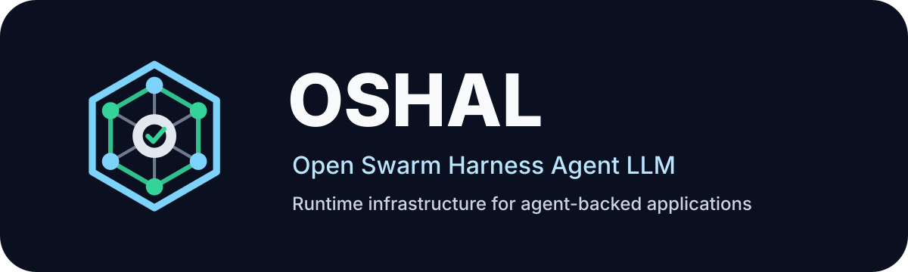
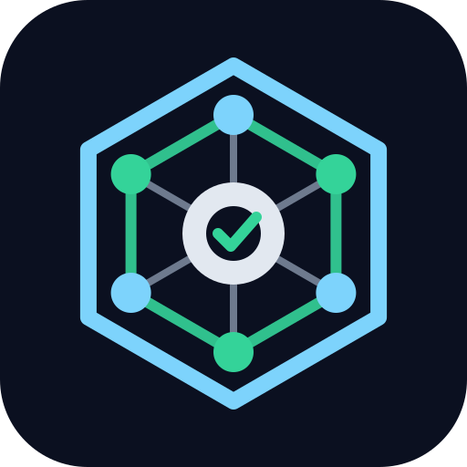

<!--
OSHAL Overview Deck (Marp).
Render:
  npx @marp-team/marp-cli docs/assets/oshal/OSHAL-overview-deck.md -o OSHAL-overview.pdf
  npx @marp-team/marp-cli docs/assets/oshal/OSHAL-overview-deck.md -o OSHAL-overview.pptx
  npx @marp-team/marp-cli docs/assets/oshal/OSHAL-overview-deck.md -o OSHAL-overview.html
Or: install the "Marp for VS Code" extension and open this file.
Diagrams are ASCII on purpose so they render everywhere (no mermaid plugin needed).
-->
---
marp: true
title: OSHAL — Open Swarm Harness Agent LLM
author: Emerald Coast Systems Group
paginate: true
size: 16:9
footer: 'OSHAL — Open Swarm Harness Agent LLM'
style: |
  section { background:#0B1020; color:#F8FAFC; font-family:'Inter','Segoe UI',system-ui,sans-serif; font-size:25px; padding:56px 68px; }
  h1 { color:#7DD3FC; font-size:50px; margin-bottom:.2em; }
  h2 { color:#7DD3FC; font-size:36px; border-bottom:2px solid #34D399; padding-bottom:.18em; }
  h3 { color:#BAE6FD; font-size:26px; }
  strong { color:#34D399; }
  em { color:#BAE6FD; font-style:normal; }
  a { color:#7DD3FC; }
  code { background:#111a33; color:#BAE6FD; padding:1px 6px; border-radius:4px; }
  pre { background:#070d1c; border:1px solid #1e293b; border-radius:10px; font-size:17px; line-height:1.35; }
  table { font-size:21px; }
  th { color:#7DD3FC; border-bottom:2px solid #34D399; }
  td,th { padding:5px 14px; }
  blockquote { border-left:4px solid #34D399; color:#CBD5E1; padding-left:.7em; }
  ul,ol { line-height:1.42; }
  footer { color:#475569; font-size:14px; }
  .muted { color:#94A3B8; font-size:20px; }
  .small { font-size:19px; line-height:1.4; }
  .cols { display:flex; gap:34px; }
  .cols > div { flex:1; }
  section.lead { text-align:center; justify-content:center; }
  section.lead h1 { font-size:62px; }
  section.lead h3 { color:#CBD5E1; }
  section.section { background:#06091a; justify-content:center; }
  section.section h1 { color:#34D399; font-size:52px; border:none; }
  section.section h2 { border:none; color:#7DD3FC; }
---

<!-- _class: lead -->
<!-- _paginate: false -->



# Open Swarm Harness Agent LLM

### Any harness. Any agent. Any LLM. One swarm.

<span class="muted">A live framework for building agent‑backed applications — where apps, tools, agents, workflows, and UI expand at runtime.</span>

<!--
Speaker: This is OSHAL. In one line — it's the control plane that runs agent swarms as application infrastructure, where every agent in the swarm can run a different vendor's runtime — which a hosted single-vendor product can't do. Today I'll tell the story, show the architecture, show two ways to build on it, and prove it with real apps and numbers.
-->

---

## The story in 30 seconds

- You don't ask OSHAL a question. You **hand it a ticket**.
- OSHAL spins up a **swarm of specialist bots** — each can be a *different* vendor's agent runtime on a *different* model.
- They collaborate over a **mesh**, share one workspace, and return a finished deliverable.
- Every call is **cost‑tracked, observable, and governed** by the platform.
- And you can **add new agents, tools, workflows, and whole apps while it's running** — no rebuild.

> The gap in agent systems was never prompting. The gap was **runtime**.

<!--
Speaker: Hold these five beats. Everything else in the deck is detail under one of them.
-->

---

<!-- _class: section -->
# Part 1 — The problem & the thesis

---

## Why most agent projects stall

A great demo is one prompt and one model. **Production** needs all of this at once:

<div class="cols">
<div>

- Multiple **specialized** agents
- **Per‑agent** tool permissions
- Runtime **observability** & cost
- Workflow **lifecycle** & gates
- Containerized **execution**

</div>
<div>

- App **packaging** & versioning
- **Repeatable** validation
- Vendor **flexibility** (not one model)
- A way to **grow** without redeploying

</div>
</div>

<br>

> Teams end up with either a single chatbot‑with‑tools, or a brittle pile of scripts. Neither survives contact with a real workload.

---

## The OSHAL thesis

### Treat agents as runtime infrastructure — not hardcoded helpers.

Three ideas make OSHAL different:

1. **Any harness, any provider, any model — per bot.** One ticket can cross OpenAI → Anthropic → Google, coordinated as one swarm.
2. **The persona *is* the swarm.** Each bot's persona embeds its own quality gate, so you don't need a separate reviewer agent by default.
3. **The platform is live.** Apps, tools, agents, and workflows register **at runtime** and show up in the swarm immediately.

<!--
Speaker: #1 is the core technical claim — harness-layer neutrality. #2 is the cost claim. #3 is the "framework not a starter repo" claim. We'll prove all three.
-->

---

<!-- _class: section -->
# Part 2 — What it is

---

## The big picture

```
   OPERATOR                                            DELIVERABLE
      │  ticket (build / incident / your-app type)          ▲
      ▼                                                     │
 ┌─────────────────── SWARM CONTROLLER ───────────────────────┐
 │  queue manager · phase routing · ticket lifecycle · cost    │
 │  NEVER calls an LLM — it orchestrates only                  │
 └───────────────┬──────────────────────────▲────────────────┘
        envelope │ (Redis mesh)              │ result + cost
                 ▼                           │
 ┌───── BOT NODES (one per specialist) ──────┴────────────────┐
 │  persona + handovers → harness → provider → model          │
 │  OWNS all LLM execution · heartbeats · per‑call telemetry  │
 └────────────────────────────────────────────────────────────┘
```

<span class="muted">One ticket → a coordinated swarm → a finished, costed result. The controller and the executors are cleanly separated.</span>

---

## Four layers, one image

<div class="cols">
<div>

**L4 · UI** — Cockpit (`:35457`) + code‑server workspace
**L3 · Swarm controller** — `BOT_RUNTIME=swarm`; queue manager, routing, mesh, ticketing. *Never calls an LLM.*
**L2 · Bot nodes** — `BOT_RUNTIME=bot-node`; own **all** execution
**L1 · Harnesses** — Cline · Codex CLI · Claude Code · Gemini CLI (+ `noop`)
**L0 · Providers** — 40+ (Anthropic, OpenAI, Google, Bedrock, Groq, Ollama…)

</div>
<div>

```
 ┌───────────────┐
 │  L4  Cockpit  │
 ├───────────────┤
 │  L3 Controller│  orchestrate
 ├───────────────┤
 │  L2 Bot nodes │  execute
 ├───────────────┤
 │  L1 Harnesses │  5 runtimes
 ├───────────────┤
 │  L0 Providers │  40+
 └───────────────┘
```
<span class="small">One Docker image. `bot-entrypoint.sh` reads `BOT_RUNTIME` to pick the role.</span>

</div>
</div>

---

## The differentiator: mix‑mode swarms

**Every bot independently picks its harness, provider, and model.** One ticket, many vendors:

```
ticket ─▶ code-developer   (codex-cli   · OpenAI    · gpt-5.x-codex)
       ─▶ code-reviewer    (claude-code · Anthropic · Sonnet 4.6)
       ─▶ research-bot     (gemini-cli  · Google    · Gemini 2.5 Pro)
       ─▶ test-engineer    (cline       · OpenAI)        ... all in one swarm
```

| | OSHAL | LangGraph | CrewAI | AutoGen |
|---|---|---|---|---|
| Agent runtimes (harnesses) | **4** | 1 | 1 | 2 |
| Mix‑mode swarm in one ticket | **Yes** | No | No | No |
| Per‑call cost w/ vendor attribution | **Yes** | partial | No | No |

<span class="muted">The dispatcher doesn't care who's on the other side — the persona file is the contract.</span>

---

## The persona IS the swarm

By default, **one workerBot per ticket type** — and its persona YAML carries the whole quality gate:

- **Mode A/B/C** output classification (answer vs artifact vs escalation)
- **Citation rules** (RAG `doc_id`, `web:` provenance)
- A required **artifact set** (e.g. `HANDOVER.md`, RCA reports, scripts)
- A 5‑section **escalation packet** when it can't self‑gate

> No external reviewer bot by default. The persona reviews itself — *reviewer‑grade output from one bot.*

<span class="muted">Manifests can still opt in to a separate reviewer (`reviewerBot` + `maxRevisions`) when a worker genuinely can't self‑gate.</span>

---

## How work actually flows (envelope lifecycle)

```
1  Queue manager polls approved tickets
2  Ticket is decomposed; agents are selected per phase
3  meshService.send() ─▶ Redis XADD  oshal:mesh:agent.{id}
4  Bot node's worker XREADGROUP picks up its envelope
5  Prompt assembled: persona layers + handovers + awareness
6  Harness spawns the CLI/provider; captures output + tokens + cost
7  Worker XACK; result written to work_items; cost to chat_tasks
8  Controller detects completion ─▶ advances to next phase
```

<span class="muted">Heartbeats at `oshal:runtime-agent:{id}` every 30s keep the registry live.</span>

---

## Two coordination paths

<div class="cols">
<div>

### Inside the swarm — Redis mesh
- `oshal:mesh:agent.{agentId}` (XADD / XREADGROUP)
- direct · alias · broadcast · capabilities channels
- low‑latency, no proxy bottleneck

</div>
<div>

### Across machines — A2A
- `src/shared/types/a2a.ts`
- transports: `headscale-http` · `http` · `sse` · `stdio`
- remote‑client MCP bridge for endpoint agents
- *gateway is in‑flight — see roadmap*

</div>
</div>

> In‑swarm bots talk over the mesh. External / remote agents join over A2A. Same swarm, two transports.

---

## Three tool tiers per bot

```
 ┌──────────────────────────────────────────────┐
 │ 3 · LLM‑embedded tools   (provider‑native,    │  emerging
 │     e.g. built‑in web search)                 │
 ├──────────────────────────────────────────────┤
 │ 2 · Native harness tools (Cline/Claude/Codex  │  built in
 │     file, shell, browser, etc.)               │
 ├──────────────────────────────────────────────┤
 │ 1 · Shared OSHAL tool registry  (cross‑harness│  governed
 │     · per‑agent auth: auto / ask / off)       │
 └──────────────────────────────────────────────┘
```

Tier 1 is the governed layer: **registry metadata → per‑agent switch → runtime executor** (built‑in, CLI, API, or MCP). Plus **RAG** (ChromaDB: infra runbooks) any bot can query.

---

## Built‑in workflows

<div class="cols">
<div>

### Build pipeline (`build`)
7‑phase, **complexity‑gated**:
`intake → planning → specialist → execution → testing → review → delivery`
<span class="small">Low‑complexity skips specialist/testing/review (4 phases). An optional Phase‑8 architecture pre‑round fires on high complexity.</span>

</div>
<div>

### Incident RCA (`incident`)
3‑phase single‑bot:
`worker → review → revision`
<span class="small">Deliverables: `RCA-REPORT.md`, `IMPACT-ASSESSMENT.md`, `REMEDIATION-STEPS.md`, plus `diagnose/remediate/rollback` scripts.</span>

</div>
</div>

<br>

> Your own apps add **new ticket types** with their own workflows — without touching the built‑ins.

---

<!-- _class: section -->
# Part 3 — Two ways to build on OSHAL

---

## The core idea: build‑in *or* generate

OSHAL grows two ways. **Both produce the same thing** — a registered swarm app.

<div class="cols">
<div>

### A · Build IN the framework
You **hand‑author** a swarm‑app manifest: declare bots, tools, UI, routes, workflow.
*You design the swarm.*
**Example: Little Monsters**

</div>
<div>

### B · Generate VIA packing
An OSHAL agent **interviews you** and **emits** a complete single‑purpose bot (persona + manifest + KB).
*The framework builds the swarm.*
**Examples: email‑summarizer, Federal Capture, job‑hunter**

</div>
</div>

<br>

> Hand‑craft when you want control over a multi‑bot product. Pack when you want one business process to *become* an agent — fast.

---

## Mode A — the swarm‑app manifest

A whole product is **configuration first**: one YAML in `swarm-apps/`.

```yaml
name: my-app
status: active
bots:                      # agent identities (upserted into the registry)
  - { name: my-worker, persona: ai-lab/bot-personas/my-worker.yaml,
      role: Worker, capabilities: [my-domain] }
ui:                        # cockpit ribbon surfaces
  static: [{ label: Dashboard, iframeUrl: /my-app/dashboard }]
routes: [/my-app]          # route ownership / gating
ticketType: my-type        # new workflow, doesn't touch build/incident
workflow: { pipeline: my-single-worker, workerBot: my-worker }
tools: [ ... ]             # app-owned executable tools
```

Hot‑load it: `POST /api/swarm/apps/load` → bots, UI, routes, and workflow go **live**.

---

## Mode A in the wild — Little Monsters

**A voice‑first ADHD study companion for K‑12 — built *in* the framework.**

<div class="cols">
<div>

- **Six education bots** (lecture‑scribe, tutor, quiz‑master, …)
- **Custom ribbon UI** + per‑class dynamic UI (one icon per active class)
- **`education` workflow** as a new ticket type
- **RAG‑grounded** Socratic tutor (each class's textbook)
- Toggling the app **activates/deactivates all six bots** + their ribbon — without stopping containers

</div>
<div>

```
little-monsters.yaml
  ├─ 6 bots
  ├─ ui.static  (ribbon)
  ├─ ui.dynamic (per class)
  ├─ routes: /education
  └─ workflow: education
```
<span class="small">One manifest = a full product surface inside OSHAL.</span>

</div>
</div>

<span class="muted">This is the "I want to design a multi‑bot app" path.</span>

---

## Mode B — packing: a process becomes a bot

`codex-packer` is itself a chat agent. It **interviews** an operator (~8 questions), then **emits three artifacts** and registers them live:

```
operator interview ─▶ codex-packer ─▶  ai-lab/bot-personas/<slug>.yaml   (the quality gate)
                                   ├─  swarm-apps/<slug>.yaml            (ticket type + UI)
                                   └─  scripts/packs/<slug>/kb/          (optional corpus)
                                          │
                                          ▼   POST /api/swarm/apps/load
                                   a new single‑purpose bot, live in the cockpit
```

> The business process *is* the agent — predefined inputs, baked‑in rules, correct by construction.

---

## Mode B in the wild

<div class="cols">
<div>

### email‑summarizer
*Literally emitted by codex‑packer.* Daily Gmail + Calendar digest for one Workspace account. **Read‑only by default**; one opt‑in label‑write via `DRY_RUN=false`.

### Federal Capture
Packs an entire gov‑contracting **capture → proposal** pipeline into **one** `capture-specialist` bot. Hand it an RFP → bid/no‑bid + full capture package. Honesty rules baked in.

</div>
<div>

### job‑hunter *(external productization)*
The same packing pattern, shipped as a **standalone product**: framework‑generated agents that ingest a résumé, build a skills profile, match postings, and tailor outputs — OSHAL is the *how*, invisible to the end user.

</div>
</div>

<span class="muted">Build‑in gives you Little Monsters. Packing gives you a fleet of focused, self‑contained bots.</span>

---

## Self‑registering deployments (the live expansion loop)

New capability enters a **running** swarm with no rebuild:

```
register tool ─▶ create agent ─▶ assign tool ─▶ generate persona
      └─▶ /api/agents/:id/launch ─▶ dynamic compose service
              └─▶ bot-node container ─▶ heartbeat ─▶ mesh subscribe ─▶ in registry
```

1. `POST /api/tools/runtime/register` — CLI / API / MCP executor
2. `POST /api/swarm/agents` — persona‑backed, routable agent
3. `POST /api/agents/:id/launch` — generated Docker Compose service, joins the `oshal` network

> This loop is the line between a *starter repo* and a *framework*.

---

## The swim lanes — apps already on OSHAL

One framework contract, reused across very different products:

| App | Mode | What it proves |
|---|---|---|
| `oshal-engineering` | build‑in | the build swarm + Workflow Studio UI |
| `issue-rca` | build‑in | domain RCA as a one‑and‑done ticket type |
| `little-monsters` | build‑in | 6 bots + custom & dynamic ribbon UI |
| `capture-crm` / `federal-capture` | packing | a full CRM pipeline packed into one bot |
| `email-summarizer` | packing | codex‑packer output, end‑to‑end |
| `codex-packer` | meta | the bot that builds the bots |

---

<!-- _class: section -->
# Part 4 — Proof, operations, deployment

---

## Proof #1 — the economics

**The persona‑as‑gate model is cheaper *and* simpler.**

| Approach | Cost per real incident RCA |
|---|---|
| 2‑bot worker→reviewer pipeline | **$4.05** |
| OSHAL single persona‑gated bot | **$1.30** |

### ≈ 68% lower cost — one bot, reviewer‑grade output.

<span class="muted">Source: PROMPT‑ITERATION‑LOG.md. Cost is read from the canonical `chat_tasks` table, not estimated.</span>

---

## Proof #2 — the live‑insertion benchmark

The aggressive validation pass, against the local Docker swarm:

<div class="cols">
<div>

- **18** runtime tools registered
- **18** dynamic agents created
- **18** bot containers launched
- all **healthy**, **heartbeating**, **registry‑visible**, **mesh‑subscribed**
- cleanup left **zero residue**

</div>
<div>

# ~52s
<span class="muted">API → Redis → Docker, end to end. Repeatable.</span>

</div>
</div>

> "We insert 18 new tool‑backed bot capacities into a live swarm in about 52 seconds — and prove it from API to Redis to Docker."

---

## Operations — the cockpit

- **Tickets** — submit, watch phase/state, drill into work items
- **Cost** — total + by‑bot (with provider column) + by‑model, per‑call
- **Mesh / queue / ops** dashboards — live lifecycle, heartbeats, routing
- **Workspace** — code‑server bridge to the shared workspace (`:8444`)
- **Apps** — install / activate / deactivate swarm apps; `?app=` is the single source of truth for the ribbon

<span class="muted">Auth is opt‑in per route (OIDC / Keycloak in prod, `MOCK_OIDC=true` for local). Anything touching workspaces, personas, or LLM execution is auth‑gated.</span>

---

## Deploy where you need it

<div class="cols">
<div>

### Platforms
- **Windows** (`oshal.bat`)
- **Docker Compose** (primary local path)
- **Kubernetes** (`ops/`, `docs/k8/`) — the scalable target; Headscale overlay for remote nodes

</div>
<div>

### Models — hosted *or* local
- 40+ providers (Anthropic, OpenAI, Google, Bedrock, Groq…)
- **Local / self‑hosted:** Ollama, LM Studio, LiteLLM
- Llama & Mistral run **fully local** via Ollama

</div>
</div>

> Same swarm, from a laptop to a cluster — and from frontier APIs to a self‑hosted open model.

---

<!-- _class: section -->
# Part 5 — Under the hood

<span class="muted">subsystems & metrics</span>

---

## OSHAL by the numbers

<div class="cols">
<div>

- **4** agent harnesses (+ `noop`)
- **40+** LLM providers (incl. local Ollama / LM Studio / LiteLLM)
- **26** swarm bots (+ **19** in the full registry)
- **68** persona definitions
- **31** standard tools · **16** categories

</div>
<div>

- **9** example swarm apps (the swim lanes)
- **2** built‑in pipelines (7‑phase build · 3‑phase incident)
- **~115** services in the full local swarm compose
- **18** bots inserted & discovered in **~52s**
- **$1.30 vs $4.05** per incident RCA (**−68%**)

</div>
</div>

<!-- Speaker: this is the "it's real and it's big" slide. Every number is from the repo. -->

---

## The ticketing system

```
create ─▶ ticket{ ticketType }            (cockpit · API · intake: Plane/GitHub)
   │
   ▼  structured lifecycle (ADR-031)
 in_process_discovery ─▶ approval_required ─▶ in_process_build
   │
   ▼  queue manager polls APPROVED tickets (15s dev / 60s prod)
 chooseDispatchPath(ticketType):
   • incident-rca       ─▶ single-bot RCA (+ optional reviewer)
   • manifest workerBot ─▶ packed app (one-and-done)
   • build / swarm      ─▶ decomposition pipeline
   • unregistered type  ─▶ defer to next poll (startup race guard)
```

<span class="muted">Per‑ticket cost is rolled up from the canonical `chat_tasks` table; lifecycle state is operator‑visible in the cockpit.</span>

---

## Bot self‑registration

<div class="cols">
<div>

### Static (26 registry bots)
- declared in `swarm-bot-registry.ts` + a compose service
- **one UUID** matched across compose · registry · Redis · Postgres

### Dynamic (runtime)
- `POST /api/swarm/agents` → persona YAML generated
- `POST /api/agents/:id/launch` → dynamic compose service (`oshal-bot` image, joins `oshal` net)

</div>
<div>

### Liveness & discovery
- heartbeat **every 30s** → `oshal:runtime-agent:{id}`
- **re‑register hourly** (TTL 2h)
- shows in `/api/swarm/bots/registry`
- subscribes **direct · alias · broadcast · capabilities** mesh channels

<span class="small">Live‑validated 2026‑05‑09 · 18 bots in ~52s · zero residue on cleanup.</span>

</div>
</div>

---

## Redis queues & the mesh

```
Transport: Redis Streams  (redis-mesh-transport.ts)
   XADD ─▶  oshal:mesh:agent.{id}   ◀─ XREADGROUP (consumer group) ─▶ XACK
   consumer groups: swarm-execution · swarm-workers   (at-least-once, horizontal)

Keys
   oshal:mesh:agent.{id}            direct / alias / broadcast / capabilities
   oshal:runtime-agent:{id}         heartbeat registry (TTL 2h)
   oshal:scheduler                  cron-scheduled runs
   oshal:subtask-registry:{parent}  decomposed work tracking
```

> Each bot consumes **its own** stream with a consumer group — no proxy bottleneck, and you scale a lane by adding consumers.

---

## Schedulers & self‑healing

<div class="cols">
<div>

### Cron scheduling (`features/scheduling`)
- `schedule-service.ts` → **cron‑parser** (`CronExpressionParser`)
- `schedule-runner.ts` poll loop · `redis-schedule-store` (`oshal:scheduler`)
- exposed as the **`agent-scheduler`** standard tool — bots schedule recurring runs

</div>
<div>

### Autonomous health
- heartbeats (30s) · hourly re‑register
- **stuck‑agent watchdog**
- **agent‑health‑monitor** poll
- stale mesh‑channel cleanup

</div>
</div>

> Recurring agent jobs **and** self‑healing recovery are first‑class, not bolted on.

---

## Standard tools (31 across 16 categories)

| Category | Tools |
|---|---|
| system / agent‑integration | shell · presentron · RAG ingest · RAG query |
| automation | **agent‑scheduler** |
| cloud / kubernetes | aws · gcloud · azure · kubectl · helm · argocd |
| infrastructure / security | terraform · ansible · vault |
| scm / containers / dev | git · gh · glab · docker · docker‑compose · uv |
| data / messaging / research | yq · graph‑db · opensearch · NATS · google‑search |
| workspace / finance | google‑workspace · import · report · analyze · budget |

<span class="muted">Every tool is per‑agent gated (**auto / ask / off**). Apps add their own; runtime executors + MCP extend the set without a rebuild.</span>

---

## Incident queue + simple extensibility

**Built‑in:** the `incident` pipeline — 3‑phase RCA, single persona‑gated bot, optional reviewer.

**Add a new incident type with one YAML — no code:**

```yaml
ticketType: db-incident
workflow: { name: Database RCA, pipeline: incident-rca, workerBot: rca-specialist }
```

```
swarm-apps/db-incident.yaml ─▶ POST /api/swarm/apps/load
   └─ WorkflowPipelineRegistry merges it with the built-ins ─▶ live ticket type
```

<span class="muted">Proof: `issue-rca` is exactly this. Built‑in `build`/`incident` cannot be overridden — apps extend, never clobber.</span>

---

## Deployment configs & scalability

<div class="cols">
<div>

### Profiles
- **core** — 11 services (laptop: cockpit/chat/API + Postgres/Redis/Chroma)
- **oshal‑local** — **~115 services** (full swarm: controller + all bot nodes)
- **swarm‑local** (53) · **incident‑lab** (50)
- **Kubernetes** — `ops/deployment/kubernetes` + `ops/any-bot-k8s` (kustomize, namespace, secrets, Headscale gateway)

</div>
<div>

### Scale levers
- **per‑bot containers** — independent workers
- **Stream consumer groups** — add consumers to a lane
- **one image, runtime switch** — same artifact, any role
- **K8s** for elastic scale; watchdogs for self‑heal
- **local → cloud**, laptop → cluster, frontier → self‑hosted

</div>
</div>

---

## Remote client & edge agent

A trusted daemon on a PC/Mac runs a **local MCP** (stdio JSON‑RPC), registers back over **Headscale** — and the channel is **bidirectional**:

<div class="cols">
<div>

### Mode 1 — talks *to* the swarm
`POST /api/remote-clients/:id/swarm/send` (direct or broadcast). Your desktop participates in the swarm.

</div>
<div>

### Mode 2 — *is* an agent of the swarm
Bot sends a mesh/A2A envelope → bridge → remote‑client queue → local MCP runs it → result returns as a **mesh reply**.
<span class="small">Intents: `mcp.initialize` · `list-tools` · `call-tool` · `shutdown` · `status.sync`. The `edge-agent` slice is the lightweight deployed‑as‑agent server.</span>

</div>
</div>

<span class="muted">Secured by private overlay + session/shared‑secret; MCP execution stays on the endpoint; only the configured command runs.</span>

---

<!-- _class: section -->
# Part 6 — Different, honest, ahead

---

## Why it's different

**OSHAL is not** a single chatbot · a wrapper around one model · a static workflow demo · a pile of untracked scripts.

**OSHAL is** a control plane · a runtime mesh · a configurable app framework · a bot‑node execution layer · a benchmarkable platform.

| Capability | OSHAL | Typical agent stack |
|---|---|---|
| Multi‑vendor runtimes in one swarm | **Yes** | No |
| Runtime app / tool / agent registration | **Yes** | Rebuild |
| Per‑bot, per‑call cost with vendor attribution | **Yes** | Rare |
| Persona‑as‑quality‑gate (no reviewer needed) | **Yes** | No |
| Pack a business process into one bot | **Yes** | No |

---

## Honest status

<div class="cols">
<div>

### Shipped
- Mix‑mode swarms, per‑bot harness/model
- Swarm‑app manifests + hot‑load
- Harness packing (codex‑packer)
- Dynamic tool/agent/bot insertion (Docker)
- Redis mesh, heartbeats, cost telemetry
- Build + incident pipelines
- Windows / Docker / K8s; local models

</div>
<div>

### In flight / planned
- Workflow Studio **compile‑to‑runtime** (today: design‑time canvas)
- **Agentic** Workflow Studio (describe → agent builds the canvas)
- **A2A gateway** for external agents (prod proof)
- One‑call **create‑and‑start** agent
- **Haven** persona‑fronted home as default entry
- Repeatable **local‑LLM swarm** profile

</div>
</div>

<span class="muted">Full detail: ROADMAP.md (today/target per item) and BACKLOG.md (done‑when).</span>

---

## Where it's going

- **Workflow Studio = the end state.** A canvas is the single representation of a workflow; you'll author it by hand *or* by describing it to an agent (the codex‑packer idea, applied to whole workflows). Compile‑to‑runtime makes the canvas executable.
- **A2A everywhere.** External and other‑vendor agents join swarms over the wire.
- **Self‑hosted swarms.** A documented all‑local profile (e.g. `gpt-oss` on Ollama) with benchmarks.
- **One‑and‑done ops.** Tighter create‑and‑launch, generic node‑pool hot‑loading.

> The direction is constant: *more agents, more workflows, more vendors — joining one swarm that gets broader as you grow it.*

---

## Who it's for & the strongest plays

<div class="cols">
<div>

### Audiences
- Platform teams building **internal agent apps**
- AI eng teams needing **multi‑agent execution + observability**
- Enterprises wanting **configurable** agents/tools, not hardcoded domains
- Teams making the **demo → production** jump

</div>
<div>

### Use cases
- **Engineering delivery** swarms
- **Incident response / RCA** (production‑proven)
- **Domain copilots** packed from a process
- **Education / workflow** apps (Little Monsters)
- **Capture / proposal** automation (Federal Capture)

</div>
</div>

---

## Summary — the story, one slide

1. **Problem:** agent demos die in production; the gap is *runtime*.
2. **Thesis:** treat agents as runtime infrastructure — any harness/agent/LLM in one swarm; the persona is the gate.
3. **How:** a 4‑layer platform — controller orchestrates, bot nodes execute, mesh connects, cost is tracked.
4. **Build two ways:** hand‑author in the framework (Little Monsters) or generate via packing (email‑summarizer, Federal Capture, job‑hunter).
5. **Live:** apps, tools, agents register at runtime — 18 bots in ~52s.
6. **Proven & honest:** 68% cheaper RCA; clear shipped‑vs‑roadmap.

---

<!-- _class: lead -->
<!-- _paginate: false -->



# OSHAL makes agent swarms operational.

### Any harness. Any agent. Any LLM. One swarm.

<span class="muted">Demo line: "Register 18 tools, create 18 agents, launch 18 bot containers — discovered live in ~52 seconds, API to Redis to Docker."</span>

<!--
Speaker: Close on the ask — benchmark OSHAL on a real task workload with valid model credentials, or pick a process and let codex-packer turn it into a live bot in front of you.
-->
