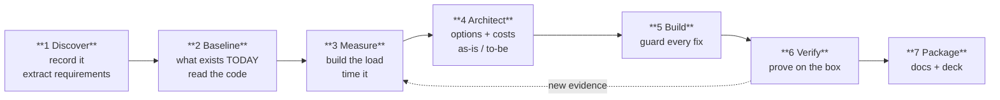

# The engagement method

How a client engagement is run end to end, from a recorded discovery call to a hand-over pack.
Written so the next one does not start from a blank page, and so the `delivery-*` bots have
something concrete to follow.

This is not an idealised process. It is what was actually done on a 2026-07 CRM engagement,
including the parts that went wrong — the mistakes are the reusable half.

**The bots that run it:**

| Step | Bot | Persona |
|---|---|---|
| 1-2 Discover · Baseline | `delivery-analyst` | [ai-lab/bot-personas/delivery-analyst.yaml](../../ai-lab/bot-personas/delivery-analyst.yaml) |
| 3 Measure | `delivery-sizer` | [ai-lab/bot-personas/delivery-sizer.yaml](../../ai-lab/bot-personas/delivery-sizer.yaml) |
| 4 Architect | `delivery-architect` | [ai-lab/bot-personas/delivery-architect.yaml](../../ai-lab/bot-personas/delivery-architect.yaml) |
| 5 Build | existing build swarm | — |
| 6-7 Verify · Package | `delivery-verifier` | [ai-lab/bot-personas/delivery-verifier.yaml](../../ai-lab/bot-personas/delivery-verifier.yaml) |

---

## The shape of it

---

## 1 · Discover

**Record the call — both legs.** A call captured mic-only loses the client's half of the
conversation, and requirements then have to be reconstructed from our side restating theirs.
RingCentral, Teams and Zoom all record both legs natively. Fix this before the call, not after.

**Transcribe locally when the audio is a customer's.** The `local-stt` provider gives
speaker-labelled transcription without the audio leaving the machine — which matters especially
when the thing being sold is self-hosting. See
[runbooks/local-transcription.md](../runbooks/local-transcription.md).

**Check the transcript is complete before reading it.** Compare its span against the file's real
duration. A decoder that processes 60 seconds of a 54-minute recording and returns a fluent,
confident transcript is the most expensive failure in this step, because nothing about the output
looks wrong.

**Extract requirements with evidence attached.** Every requirement carries the quote and
timestamp it came from, what the build does *today*, and a testable done-when. Mark each
`[client]`, `[ours]` or `[?]`. Anything that would change scope on the strength of *who* said it,
and cannot be attributed, becomes an open question — never a silent assumption.

**Write the scope boundary in their words.** *"We're not talking about the paperwork"* is worth
more than any amount of scope management later, because it is citable back to them.

---

## 2 · Baseline

**Read the code before claiming a gap.** On the reference engagement half the "missing" features
in the first requirements pass already existed. The other half were missing in ways nobody had
noticed — an audit table nothing wrote to, a migration that was never registered, a phone column
with no index.

**Check what is deployed, not what is in git.** They diverge. A parity check (hash every file on
the box against the working tree) found a demo environment twelve files behind the branch while
every test was green.

**Distinguish three states in writing:** already works · exists but is not wired up · genuinely
absent. The middle state is where the cheap wins are, and a requirements list written from a
transcript alone always misses it.

---

## 3 · Measure

**This is the step that gets skipped, and it is the one that pays.**

Build the projected dataset and time it. Twenty minutes of measurement on the reference
engagement produced:

- a caller-ID lookup doing a **434 ms sequential scan** on every inbound call
- an import that pulled **732,000 rows into application memory** every morning
- a connection pool running on a **library default of 10** against 15 users
- and the reassurance that mattered: **716-928 concurrent writes/sec** against ~10 needed

**Measure the concurrency question specifically.** "Lots of people banging on one table" is the
fear every client has, and arithmetic will not settle it. Concurrent writers equal to the user
count, realistic multi-statement transactions, a bulk import injected mid-run. Report throughput,
p50/p95/p99, and deadlocks.

**Correct your own numbers out loud.** A claimed "210x faster" turned out to be 23% once measured
on the right query shape. The correction went into the code comment, the change log and the sizing
document rather than being quietly restated.

**Drop the scratch data**, and verify it is gone.

---

## 4 · Architect

**Produce options, not a recommendation with alternatives listed for decoration.** Four
landscapes, each costed over five years, each with time-to-stand-up, upkeep hours, availability,
recovery time, skills needed, and its own risk and security table.

**Cost the security boundary explicitly.** It is the line item that makes cloud estimates wrong.
An outbound tunnel replaces a load balancer, a NAT gateway and a subnet split — that single
difference was the gap between a $100/month guess and a $187/month reality.

**Draw as-is and to-be.** Mermaid in Markdown renders in GitHub and in the cockpit, and diffs in
git — unlike a diagram trapped inside a slide.

**Write the decision tree, not just the answer.** The client's situation changes; the tree still
works when it does. Write a second tree for "what to do when it breaks", because they will need
that one more often.

**Say which controls are identical across every option.** Isolation, audit and authentication are
properties of the software, not the hosting. Naming that keeps the hosting decision honest.

---

## 5 · Build

**Guard per fix.** Every defect ships a regression guard in the same change, and the guard is
proven red against the old behaviour before it goes green against the new. Without the red proof
you have a test, not a guard.

**Fix the class, not the instance.** A drifted deploy became a parity checker. An unregistered
migration became a rule that fails the build. A missing audit became an append-only trigger.

**Whitelist at the boundary.** Report definitions, filter columns, sort directions, enumerated
types — the client sends a key, never SQL, and unknown keys are stripped rather than passed
through.

**Let the database enforce what matters.** One-open-role-per-type is a partial unique index.
Append-only audit is a trigger. A rule in application code is a rule only until someone writes a
second code path.

---

## 6 · Verify

**Prove it on the running box, not in the tree.** Deploy, hash every file against the working
tree, then run the suite against what is actually deployed.

**Drive the UI in a real browser.** Three defects on the reference engagement were invisible to
API tests and obvious in Chromium — a translucent panel the background bled through, a dropdown
that rebuilt itself on click, and a column that looked editable and did nothing. Assert on
computed styles, not source CSS.

**Watch for the failure that looks like success.** When a result is suspiciously clean, verify it
a second way. Zero rows is a result to distrust, not to celebrate.

**Never reseed to fix a display problem.** Fix the renderer. If the seed itself is wrong, change
the seed *and* apply the equivalent targeted update to the live tenant — reseeding a tenant that
holds real records destroys the client's work.

---

## 7 · Package

| Artifact | Answers |
|---|---|
| `REQUIREMENTS-DISCOVERY-*.md` | what they asked for, with evidence |
| `ARCHITECTURE-AS-IS-TO-BE.md` | where it runs, how to choose, what breaks |
| `DELIVERY-ARCHITECTURE.md` | cost, HA, backup, recovery per landscape |
| `SIZING.md` | how big, how fast, what degrades first |
| `DECISION-*.md` | why this engine, why this shape |
| `OPERATIONS.md` | how to deploy it and prove it |
| `FUNCTIONAL-SPEC` / `TECHNICAL-SPEC` | what it does, as built |
| deck → PDF + PPTX | the same argument in slides |

**Assert on the content of generated artifacts.** The PDF build fails if the cost table is
missing, not merely if the file is zero bytes. A deck that renders beautifully with the argument
missing is worse than one that fails loudly.

**Say what is not built.** Every spec ends with a "still not built" section. A specification read
as complete when it is not is how a client discovers a gap during a demo. Per the anti-drift rules
in [CLAUDE.md](../../CLAUDE.md), under-claiming shipped work costs the same credibility as
over-claiming it — sweep both directions, and generate counts rather than typing them.

---

## What went wrong, and what it cost

Kept because these are the reusable warnings.

| What happened | Cost | Now prevented by |
|---|---|---|
| Transcribed a 54-min call, got a confident 1-minute transcript | an hour | decode-limit guard: refuse rather than truncate |
| Ran a 2.5 GB job beside a 4 GB swarm on a 6.8 GB engine | **took the stack down** | measure peak RSS first; cap the container |
| Claimed "210x faster" from the wrong benchmark | credibility | measure the real query shape, correct in writing |
| Shipped a migration unregistered | a wrong "isolation works" reading | a build rule that fails on an unregistered migration |
| Deploy tool copied a client's call recording into a container | confidentiality | media refused on the walk *and* purged remotely |
| Reported record isolation working when the query was erroring | nearly shipped | zero rows is a result to distrust, not celebrate |

**The pattern in all six: the failure reported success.** That is the thing to build reflexes
against — a clean result from something that has not been proven is the least trustworthy state in
the whole process.
