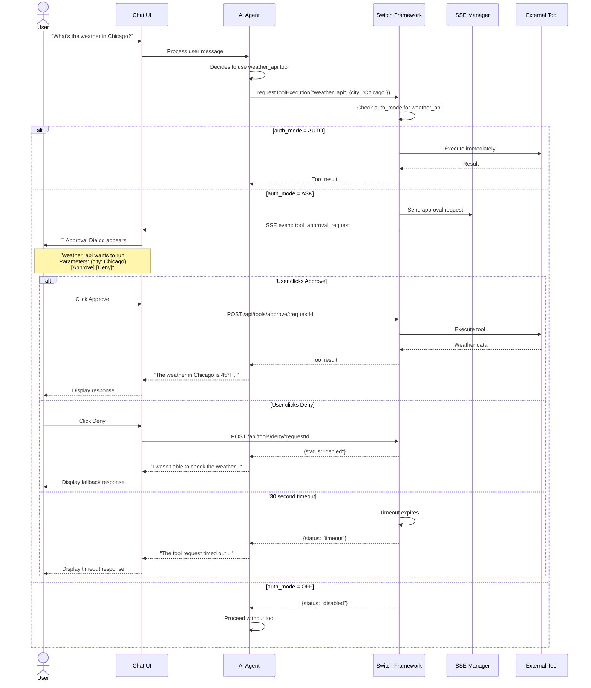
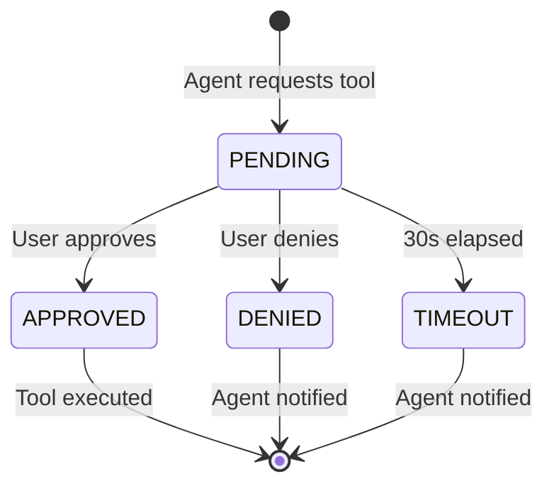

<!--
CHANGE LOG
-----------------------------------------------------------------------------
SEQ                 | AUTHOR                      | DESCRIPTION
-----------------------------------------------------------------------------
1 | maintainer@emeraldcoastsystemsgroup.com   | Initial approval workflow documentation
-->

# Tool Approval Workflow

## Overview

The tool approval workflow governs how AI agents request permission to use tools during chat sessions. When a tool's `auth_mode` is set to `ASK`, the user must explicitly approve or deny each tool invocation in real-time via the Chat UI.

## End-to-End Flow

## Approval Dialog UI

The approval dialog appears as an overlay in the Chat UI with:

1. **Tool name** and icon
2. **Description** of what the tool does
3. **Parameters** the agent wants to pass (sanitized)
4. **Approve** button (green) — executes the tool
5. **Deny** button (red) — blocks execution
6. **Timer** — 30-second countdown before auto-timeout

## Auth Mode Configuration

Admins configure auth modes on the **Agent Config** page (`agent-tools.html`):

| Mode | Behavior | Use Case |
|------|----------|----------|
| `AUTO` | Execute without asking | Trusted, low-risk tools (calculator, search) |
| `ASK` | Require user approval | Sensitive tools (email, file write, API calls) |
| `OFF` | Block entirely | Disabled or deprecated tools |

## Approval Request Lifecycle

All approval requests are stored in `tool_approval_requests` for audit purposes.