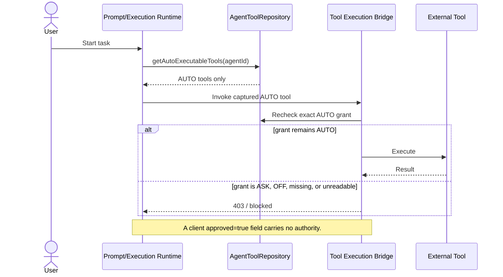
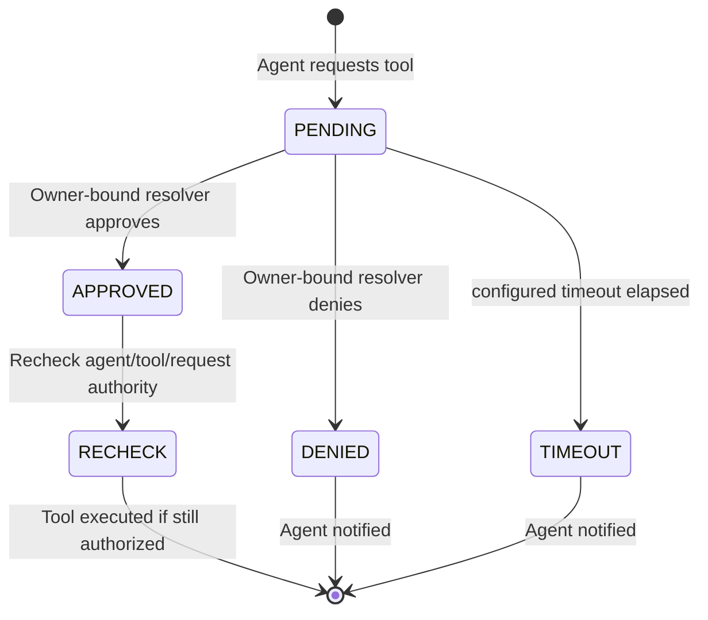

<!--
CHANGE LOG
-----------------------------------------------------------------------------
SEQ                 | AUTHOR                      | DESCRIPTION
-----------------------------------------------------------------------------
1 | maintainer@emeraldcoastsystemsgroup.com   | Initial approval workflow documentation
2 | maintainer@emeraldcoastsystemsgroup.com   | Reconciled ASK documentation with the shipped in-memory service and fail-closed runtime boundary
-->

# Tool Approval Workflow

## Overview

`ASK` means that a tool invocation is pending a new, exact human decision. It never means
"enabled for unattended execution." The kernel's prompt resolver and internal execution bridge use
the `AUTO`-only repository view, so `ASK`, `OFF`, and client-supplied `approved: true` values are
rejected before execution.

The codebase contains an in-memory `ApprovalWorkflowService` and Chat UI event/modal support.
However, no authenticated `/api/tools/approval` resolver route is currently registered in the
server. Therefore the generic production path is deliberately fail-closed: ASK tools are not
advertised to or executed by unattended runtimes. The UI assets and service are building blocks,
not evidence that a durable end-to-end approval rail is complete.

## End-to-End Flow

## Approval Dialog UI

When an owner-bound interactive resolver is wired, the existing approval dialog can display:

1. **Tool name** and icon
2. **Description** of what the tool does
3. **Parameters** the agent wants to pass (sanitized)
4. **Approve** button (green)
5. **Deny** button (red)
6. **Timer** — countdown before auto-denial

Today the frontend posts decisions to `/api/tools/approval`, but the kernel does not register that
HTTP route. Treat a hidden modal after a mocked frontend response as UI coverage only; it does not
authorize execution.

## Auth Mode Configuration

Admins configure auth modes on the **Agent Config** page (`agent-tools.html`):

| Mode | Behavior | Use Case |
|------|----------|----------|
| `AUTO` | Execute without asking | Trusted, low-risk tools (calculator, search) |
| `ASK` | Block unattended execution; requires a newly resolved exact request | Sensitive tools (email, file write, API calls) |
| `OFF` | Block entirely | Disabled or deprecated tools |

## Approval Request Lifecycle

The current `ApprovalWorkflowService` stores pending requests in a process-local `Map` and emits
SSE events. It does **not** persist requests to `tool_approval_requests`. Restart/cancel/timeout
resolves pending requests as denied. A complete durable rail must bind the decision to the exact
request ID, task, agent, tool, actor/owner, normalized input digest, expiry, and one-time use; then
recheck that captured authority immediately before execution.

## Security Invariants

- Only `AUTO` is valid for unattended prompt exposure or execution.
- `ASK` cannot be upgraded by request JSON, model output, task metadata, or editable agent profile
  metadata.
- Unknown/unreadable grants fail closed.
- Approval resolution must be owner-bound, one-time, expiring, and request-specific.
- Revocation or grant changes are rechecked at the execution boundary.
