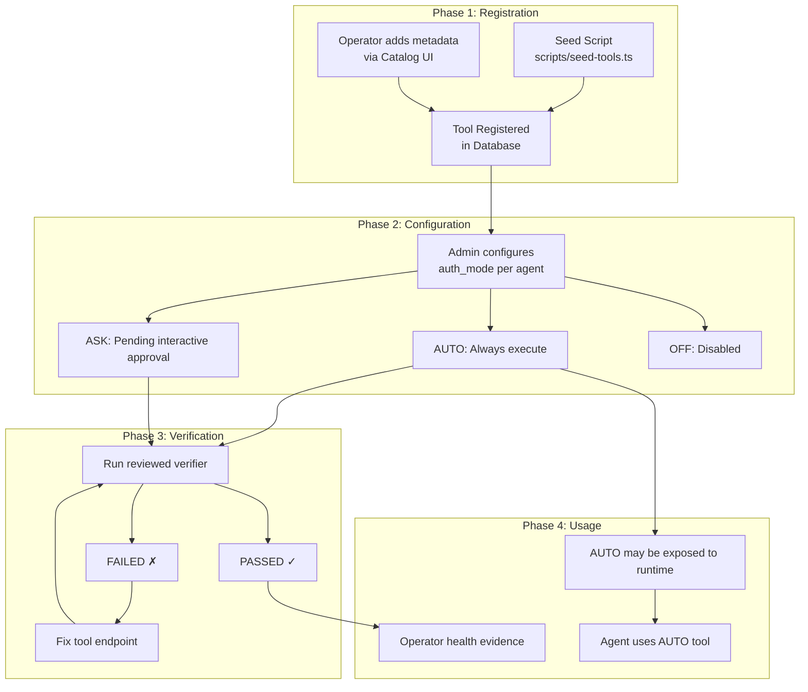
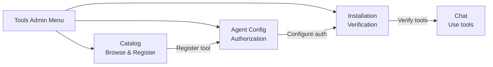

<!--
CHANGE LOG
-----------------------------------------------------------------------------
SEQ                 | AUTHOR                      | DESCRIPTION
-----------------------------------------------------------------------------
1 | maintainer@emeraldcoastsystemsgroup.com   | Initial tool management workflow documentation
2 | maintainer@emeraldcoastsystemsgroup.com   | Documented operator-only global management, AUTO-only unattended execution, reviewed-verifier/no-shell policy, and write-only tool configuration responses
-->

# Tool Management Workflow

## Overview

This document describes the secured OSHAL tool lifecycle. Catalog, runtime-executor,
verification, scheduler, and agent-grant state are global platform resources and require an exact
operator identity. Dynamic ribbon HTTP registration is also operator-only: the fleet service
secret authenticates a process but does not bind a bot identity or authorize replacement/deletion
of another bot's process-global ribbon entry. Manifest-owned ribbons continue to use the reviewed
in-process application loader.

## Complete Tool Lifecycle

## Step-by-Step Guide

> Security boundary: ordinary authenticated users receive `403` on every global tool mutation,
> verification/scheduler endpoint, and agent-tool grant route. Agent records do not yet have a
> durable owner field, so editable profile metadata is never accepted as ownership evidence.

### 1. Browse Tool Catalog

**Page:** Catalog (`/tools-admin/catalog.html`)

1. Open the Catalog page from the Tools Admin navigation
2. Browse tools by category (Search, Code, Communication, etc.)
3. Click on a tool card to see details (description, capabilities, version)
4. Tools already in the system show a "Registered" badge

### 2. Register New Tools (operator)

**Page:** Catalog (`/tools-admin/catalog.html`)

1. Click "Add Tool" button
2. Fill in tool metadata: name, display name, description, category
3. Define capabilities with input/output schemas
4. Set initial auth mode (default: OFF)
5. Click "Register" to add to the database

### 3. Configure Agent Authorization (operator)

**Page:** Agent Config (`/tools-admin/agent-tools.html`)

1. Select an agent from the dropdown
2. See all registered tools with current auth mode
3. Toggle auth mode per tool:
   - **AUTO** — Tool executes automatically when agent calls it
   - **ASK** — Pending an exact, server-owned interactive approval; it is not executable by
     unattended bridges, prompts, schedulers, or a client-supplied `approved` flag
   - **OFF** — Tool is not available to this agent
4. Changes save immediately

Tool runtime credentials are write-only. `GET /api/agents/:agentId/tools` returns only the
validated auth `type`/`enabled` controls plus `configured` booleans for the auth, environment,
endpoint, and metadata sections. It never echoes stored field names or values: opaque metadata,
authorization/cookie headers, environment variables, and URL components therefore cannot become
a read API by choosing an unexpected key name. Re-enter the complete runtime configuration when
changing write-only values; the configured-state response is not an editable credential copy.

### 4. Verify Tool Installation (operator)

**Page:** Installation (`/tools-admin/installation.html`)

1. View all tools with their verification status
2. Click "Verify" on individual tools to run its reviewed, code-owned verifier
3. Click "Verify All" to batch-check all enabled tools
4. View verification history via the history icon
5. Configure the operator-only scheduler for automatic periodic checks

Persisted `installSpec.verifyCommand`, install scripts, and cleanup commands are legacy metadata;
HTTP and scheduler paths never execute them. A tool with one of those free-form verification
commands records `SKIPPED`. At present, the only code-owned custom verifier is the RAG healthcheck.
Tools with an install method other than `none` must be provisioned through a reviewed out-of-band
process before a grant can be enabled.

### 5. Use Tools in Chat

**Page:** Chat (`/chat`)

1. Start a conversation with an agent
2. Unattended runtime resolution exposes only tools configured as **AUTO**
3. When agent invokes a tool:
   - **AUTO tools**: May execute after the execution boundary rechecks the captured grant
   - **ASK tools**: Remain blocked unless an owner-bound interactive workflow creates and resolves
     the exact request. The current generic HTTP resolver is not wired, so ASK fails closed.
4. Tool results are integrated into the agent's response

## Admin Navigation

## Quick Reference

| Task | Page | Action |
|------|------|--------|
| See available tools | Catalog | Browse/search |
| Add new tool | Catalog | Exact operator: click "Add Tool" |
| Set tool permissions | Agent Config | Exact operator: toggle auth mode |
| Check tool health | Installation | Exact operator: run reviewed verifier |
| Auto-check tools | Installation | Exact operator: start scheduler |
| View past checks | Installation | Click history icon |
| Use tools in chat | Chat | Send messages |
