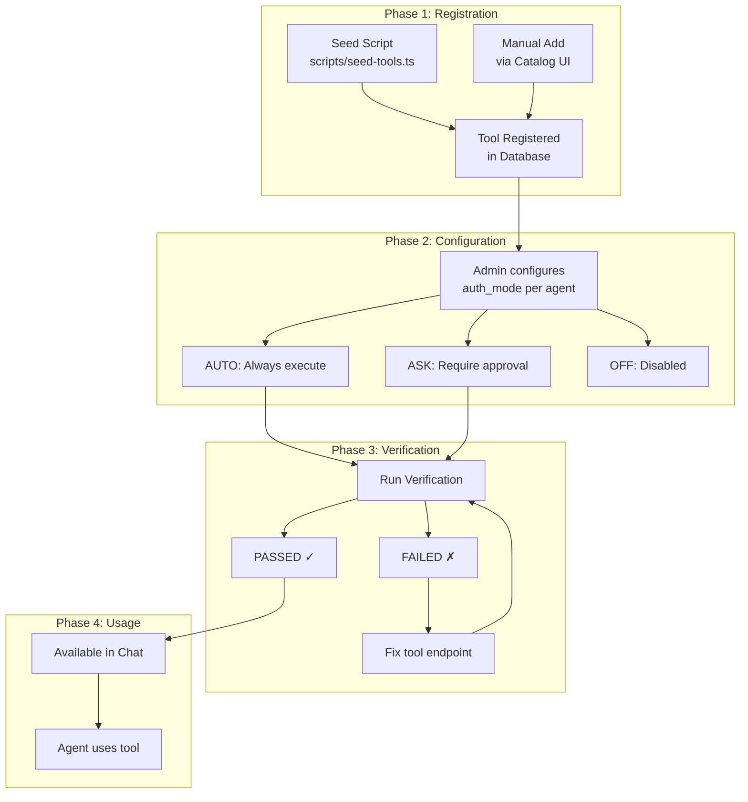
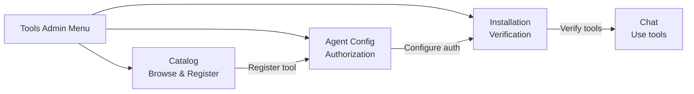

<!--
CHANGE LOG
-----------------------------------------------------------------------------
SEQ                 | AUTHOR                      | DESCRIPTION
-----------------------------------------------------------------------------
1 | maintainer@emeraldcoastsystemsgroup.com   | Initial tool management workflow documentation
-->

# Tool Management Workflow

## Overview

This document describes the end-to-end workflow for managing tools in OSHAL, from initial discovery through configuration, verification, and use in chat sessions.

## Complete Tool Lifecycle

## Step-by-Step Guide

### 1. Browse Tool Catalog

**Page:** Catalog (`/tools-admin/catalog.html`)

1. Open the Catalog page from the Tools Admin navigation
2. Browse tools by category (Search, Code, Communication, etc.)
3. Click on a tool card to see details (description, capabilities, version)
4. Tools already in the system show a "Registered" badge

### 2. Register New Tools

**Page:** Catalog (`/tools-admin/catalog.html`)

1. Click "Add Tool" button
2. Fill in tool metadata: name, display name, description, category
3. Define capabilities with input/output schemas
4. Set initial auth mode (default: OFF)
5. Click "Register" to add to the database

### 3. Configure Agent Authorization

**Page:** Agent Config (`/tools-admin/agent-tools.html`)

1. Select an agent from the dropdown
2. See all registered tools with current auth mode
3. Toggle auth mode per tool:
   - **AUTO** — Tool executes automatically when agent calls it
   - **ASK** — User sees approval dialog during chat
   - **OFF** — Tool is not available to this agent
4. Changes save immediately

### 4. Verify Tool Installation

**Page:** Installation (`/tools-admin/installation.html`)

1. View all tools with their verification status
2. Click "Verify" on individual tools to check they're working
3. Click "Verify All" to batch-check all enabled tools
4. View verification history via the history icon
5. Configure the scheduler for automatic periodic checks

### 5. Use Tools in Chat

**Page:** Chat (`/chat`)

1. Start a conversation with an agent
2. Agent automatically has access to tools configured as AUTO or ASK
3. When agent invokes a tool:
   - **AUTO tools**: Execute silently, result included in response
   - **ASK tools**: Approval dialog appears, user approves/denies
4. Tool results are integrated into the agent's response

## Admin Navigation

## Quick Reference

| Task | Page | Action |
|------|------|--------|
| See available tools | Catalog | Browse/search |
| Add new tool | Catalog | Click "Add Tool" |
| Set tool permissions | Agent Config | Toggle auth mode |
| Check tool health | Installation | Click "Verify" |
| Auto-check tools | Installation | Start scheduler |
| View past checks | Installation | Click history icon |
| Use tools in chat | Chat | Send messages |