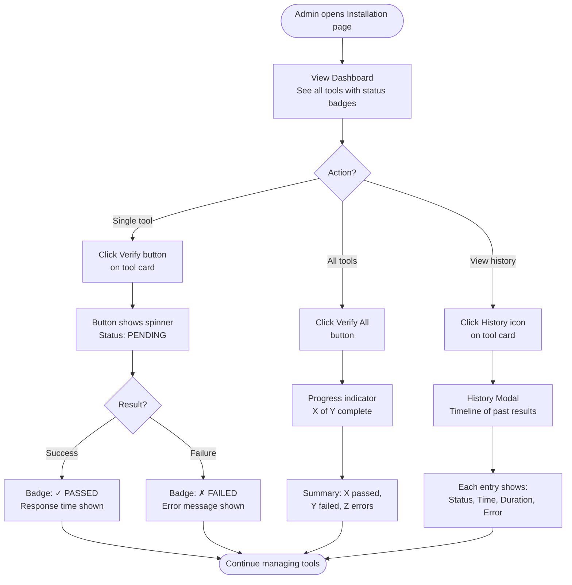
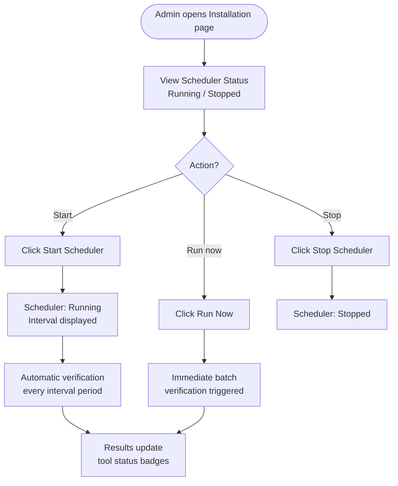

<!--
CHANGE LOG
-----------------------------------------------------------------------------
SEQ                 | AUTHOR                      | DESCRIPTION
-----------------------------------------------------------------------------
1 | maintainer@emeraldcoastsystemsgroup.com   | Initial verification workflow documentation
2 | maintainer@emeraldcoastsystemsgroup.com   | Documented the operator-only reviewed-verifier boundary and disabled persisted shell commands
-->

# Tool Verification Workflow

## Overview

The tool verification workflow lets exact operators run reviewed, code-owned health checks and
inspect their results. Every verification read, execution, history, and scheduler route is
operator-only. Persisted catalog strings are data and never become programs.

## Execution Boundary

- `installSpec.verifyCommand` is legacy free-form metadata. It is never passed to a shell or child
  process, whether verification is manual, batched, or scheduled.
- The RAG verifier is an immutable server-owned implementation and may perform its configured
  healthcheck.
- A tool without a reviewed verifier records `SKIPPED`; a legacy free-form command also records
  `SKIPPED` with an explicit disabled-command reason.
- Verification does not grant execution authority. Runtime authority is derived separately from
  the agent's exact `AUTO` grant.

## User Journey: Manual Verification

## User Journey: Scheduler Management

## Verification States

| State | Badge | Meaning |
|-------|-------|---------|
| `PASSED` | 🟢 Green | Tool responded successfully |
| `FAILED` | 🔴 Red | Tool responded with error |
| `ERROR` | 🟠 Orange | Verification process error (network, timeout) |
| `SKIPPED` | ⚪ Gray | No reviewed verifier exists, or a legacy free-form command was disabled |
| `PENDING` | 🔵 Blue | Verification in progress |

## Troubleshooting

| Issue | Cause | Resolution |
|-------|-------|------------|
| All tools show FAILED | Database connection issue | Check PostgreSQL is running |
| Single tool FAILED | Reviewed healthcheck reported unhealthy | Check the named service status |
| Tool is SKIPPED | No reviewed verifier, or legacy `verifyCommand` metadata | Add a code-owned verifier; do not add a shell string |
| Scheduler won't start | `ENABLE_VERIFICATION_SCHEDULER=false` | Set to `true` in `.env` |
| History shows no entries | No verifications run yet | Click "Verify All" first |
| Timeout errors | Tool slow to respond | Check tool service performance |
